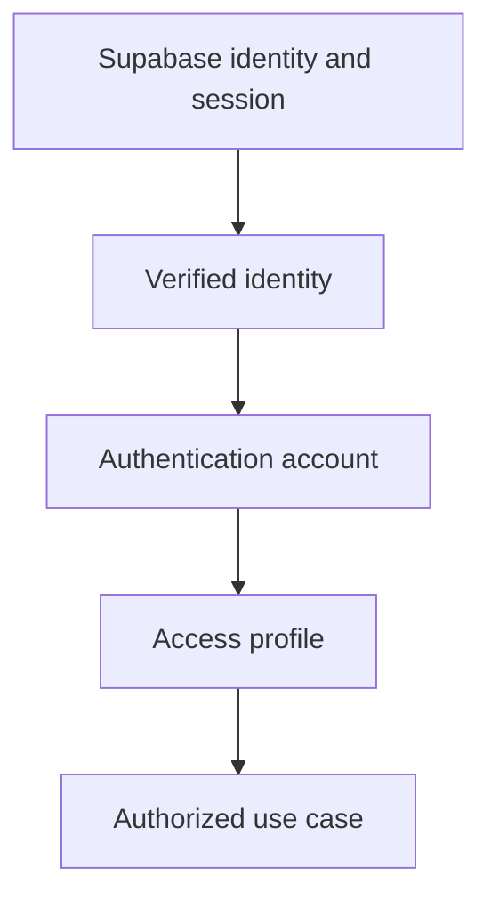

# Technical Specification - Backend Authentication

> **Normative PRD:** [Authentication](../../../docs/prd/auth.md)
>
> This document defines implementation. The PRD remains authoritative for
> account, credential, session, and audit behavior.

**Product:** Colibri Hub  
**Capability:** Authentication  
**Type:** Technical Specification - Backend  
**Complementary specifications:** [Frontend Authentication](../../../frontend/docs/features/authentication.md), [Backend Access Control](access-control.md)

## 1. Executive Summary

Supabase Auth is the identity, credential, token, and session provider. Colibri
Hub stores only the application account state needed for its own policies and
coordinates that account with an Access Control profile.

The design deliberately avoids a parallel application session registry.
Supabase owns session creation, persistence, refresh, time-boxing, and
revocation. Colibri Hub validates provider tokens and checks current local
account and Access Control state on every protected request.



Provisioning is exposed as one administrative Authentication operation. It
creates the provider identity and coordinates Access Control profile creation
and initial role assignment. Roles and permissions are never stored in provider
metadata or treated as authentication claims.

## 2. Related Documents and Authority

- [Authentication PRD](../../../docs/prd/auth.md) - normative account and session rules.
- [Access Control PRD](../../../docs/prd/access-control.md) - normative authorization rules.
- [Backend Access Control](access-control.md) - profile and authorization contracts.
- [Backend Architecture Overview](../architecture/overview.md) - architectural baseline.
- [API Conventions](../api/conventions.md) - shared HTTP conventions.
- [Error Contract](../api/errors.md) - shared error envelope.
- [Migration Strategy](../database/migrations.md) - database migration rules.
- [Supabase Auth users](https://supabase.com/docs/guides/auth/users) - provider identity model.
- [Supabase Auth sessions](https://supabase.com/docs/guides/auth/sessions) - provider session behavior.

When documents conflict:

1. The Authentication PRD prevails for account, credential, and session behavior.
2. The Access Control PRD prevails for roles and authorization.
3. This specification prevails for backend implementation details.

## 3. Objectives

### 3.1 Functional Objectives

- Authenticate through organizational email and password.
- Prevent public registration.
- Provision accounts only through an authenticated System Administrator.
- Require replacement of every provisional password before protected access.
- Enforce the eight-hour session policy through Supabase Auth configuration.
- Terminate provider sessions on logout, administrative reset, and disablement.
- Coordinate account, profile, and initial role creation as one administrative operation.
- Preserve established identities and history.
- Provide account administration and redacted authentication audit queries.
- Establish the initial System Administrator through controlled initialization.

### 3.2 Technical Objectives

- Keep Supabase-specific behavior behind infrastructure adapters.
- Expose a provider-neutral trusted identity to Access Control and business use cases.
- Never persist passwords, password hashes, access tokens, or refresh tokens in application tables, logs, audits, or errors.
- Validate bearer tokens server-side before trusting their subject.
- Check provider session age, the local Authentication account, and the Access Control profile on every protected request.
- Use Supabase session capabilities instead of duplicating session storage.
- Keep administrative provider credentials server-side.
- Make cross-provider and cross-context failure behavior safe and retryable.

## 4. Scope

### 4.1 Included

- Supabase Auth email/password integration.
- Server-side administrative provider operations.
- JWT validation and trusted identity mapping.
- Application-owned Authentication account state.
- Mandatory password replacement.
- Unified account and Access Control provisioning.
- Administrative password reset, disablement, and enablement.
- Provider-session revocation for logout and administrative actions.
- Authentication audit query.
- Initial System Administrator initialization.

### 4.2 Excluded

- Ownership of roles, permissions, scopes, presets, or authorization.
- Public sign-up.
- Magic links, OTP, OAuth, SSO, passkeys, phone login, anonymous login, or MFA.
- Automated email invitations or provisional-password delivery.
- User-initiated recovery or voluntary password change.
- Administratively configurable session duration.
- Mailbox administration.
- Physical deletion of an established account.
- An application-owned session registry.
- Direct browser access to application tables through the Supabase Data API.

## 5. Provider Responsibilities and Configuration

### 5.1 Supabase Auth Responsibilities

Supabase Auth owns:

- provider user identifiers;
- normalized email identity and uniqueness;
- password hashing, verification, and strength policy;
- access and refresh token issuance;
- refresh-token rotation;
- provider session persistence and revocation;
- the maximum eight-hour session time-box;
- provider-side user ban state; and
- provider authentication evidence.

Colibri Hub does not read or write password hashes and does not copy business
roles into `user_metadata`, `app_metadata`, or custom JWT claims.

### 5.2 Required Configuration

Local and hosted environments must agree on these behaviors:

- email/password authentication enabled;
- public signup disabled;
- anonymous authentication disabled;
- email confirmation not required for administrator-created organizational accounts;
- refresh-token rotation enabled;
- short-lived access tokens;
- session time-box set to eight hours; and
- unsupported providers disabled.

Provider configuration is deployment configuration, not a domain invariant.
The application must not implement a second session lifetime mechanism merely
to reproduce provider functionality.

Supabase applies its native session time-box during token refresh. To satisfy
the PRD's exact maximum even while an already issued access token remains
cryptographically valid, the backend also resolves the verified `session_id`
against provider-owned session state and rejects requests at eight hours from
the provider session start. This is a validation of Supabase's session record,
not a second application session registry. Every request also checks the local
account and Access Control state, which makes disablement effective without
waiting for token expiration.

A successful provider login with a provisional password creates the same
provider-owned session used by an established login. Its eight-hour maximum
begins at that login. While the local account remains
`awaiting_password_change`, the request pipeline restricts that session to
`GET /api/v1/auth/me`, `POST /api/v1/auth/password-change`, and
`DELETE /api/v1/auth/session`. Successful mandatory replacement activates the
account but does not restart or extend the provider session.

### 5.3 Secrets and Public Configuration

Backend configuration includes:

- `SUPABASE_URL`;
- `SUPABASE_SERVICE_ROLE_KEY` for server-only administrative operations;
- expected JWT issuer and audience; and
- the provider JWKS endpoint or equivalent trusted validation mechanism.

The service-role key is never exposed to the frontend, returned by an endpoint,
or included in logs. Startup fails clearly when required Authentication
configuration is absent.

## 6. Authentication Model

### 6.1 Trusted Identity

```python
@dataclass(frozen=True)
class AuthenticatedIdentity:
    subject: str
    session_id: str | None
```

`subject` is the stable Supabase user identifier from the verified `sub` claim.
`session_id`, when present, comes from the verified token and is useful for
provider revocation and audit correlation. Neither value is accepted from a
request body, query parameter, or arbitrary client header.

### 6.2 Account States

```python
class AuthenticationAccountStatus(StrEnum):
    AWAITING_PASSWORD_CHANGE = "awaiting_password_change"
    ACTIVE = "active"
    DISABLED = "disabled"
```

`AWAITING_PASSWORD_CHANGE` is an enabled identity that may use only
Authentication endpoints required to replace the provisional password, inspect
its state, or log out. `ACTIVE` may proceed to Access Control. `DISABLED` is
denied regardless of token validity.

Incomplete provisioning may be quarantined internally, but no additional
business state is exposed. It must never create usable access.

## 7. Hexagonal Architecture

### 7.1 Layer Responsibilities

The Authentication module follows hexagonal architecture with inward dependency
direction. File organization, naming, and splitting decisions follow the
project's architecture documentation and DDD conventions rather than this
specification.

**Domain** owns account transitions, mandatory-password-change state, normalized
email semantics, preservation of established accounts, and the invariant that a
System Administrator remains available. It does not parse JWTs, hash passwords,
call Supabase, or evaluate permissions.

**Application** provides one use case per business operation, coordinating
provider operations, local account and audit persistence, Access Control
application services, transaction boundaries, safe failure ordering, and typed
errors. Use cases accept typed command objects and are composed via a typed
container that replaces stringly-typed provider patterns.

**Ports** define the contracts the application layer requires from
infrastructure. Each port is a Protocol that uses domain types exclusively.

**Adapters** implement ports with concrete infrastructure: HTTP endpoints (split
by actor: self-service vs administrative), identity provider operations, ORM
persistence, and the initial-administrator deployment command.

**Composition root** wires adapters to ports per request, sharing a single
database session scope between Authentication and Access Control adapters to
guarantee transactional consistency without an auth-owned transaction port.

### 7.2 Ports

| Responsibility | Contract |
| --- | --- |
| Account persistence | Resolve and persist application-owned authentication account state |
| Audit persistence | Append and query redacted application-owned authentication audits |
| Identity provider | Create identities, update credentials, ban or unban users, revoke sessions, and resolve provider-owned session state |
| Access provisioning | Create, activate, or deactivate the associated profile and assign roles through Access application services |
| Clock | Supply timestamps |
| Identity generation | Generate internal identifiers and coordinated `operation_id` values |

Supabase request and response types do not cross the identity provider port.

The shared kernel provides `AuthenticatedIdentity` as a cross-context value
object. Shared infrastructure adapters satisfy the clock and identity generation
contracts via structural typing without importing bounded-context ports.

## 8. Request Authentication Pipeline

Protected requests carry:

```http
Authorization: Bearer <access-token>
```

The HTTP adapter:

1. Rejects missing, malformed, or duplicate bearer credentials.
2. Validates signature, allowed algorithm, issuer, audience, expiration, `sub`, and supported session claims.
3. Resolves the verified `session_id` through the provider adapter and rejects an ended session or one whose provider start time is eight hours old.
4. Resolves `sub` to exactly one Authentication account.
5. Denies a disabled account even when the JWT remains cryptographically valid.
6. Restricts an awaiting-password-change account to its permitted Authentication endpoints.
7. Resolves the associated active Access Control profile for ordinary protected operations.
8. Exposes `AuthenticatedIdentity` to application services, never the raw token.

Signing keys are cached with bounded lifetime and refreshed on an unknown key
identifier. An unverified token decode or a frontend user object is never
trusted as identity.

## 9. Application Use Cases

### 9.1 Authenticated User Commands

- Get current authentication returns the account state and required next step for a verified provider identity.
- Change required password rejects equal provisional and replacement values, updates the provider credential, moves the account to `active`, records the local transition, and preserves the original provider-session start time.
- Record logout requests revocation of the current provider session when supported, records the local logout operation, and remains idempotent when the provider session has already ended.

Ordinary credential validation, session persistence, and refresh belong to the
Supabase client used by the frontend, not to a backend login endpoint.
Mandatory password replacement does not create a second application session or
restart the provider session's eight-hour maximum.

### 9.2 Administrative Commands and Queries

- Provision account creates the provider identity and coordinates the Access profile and initial roles.
- List accounts and get account return account and profile summaries.
- Reset password sets a new provisional password, revokes provider sessions, and moves the account to `awaiting_password_change`.
- Disable account establishes local denial, deactivates the Access profile, bans provider login, and revokes provider sessions.
- Enable account sets a new provisional password, validates Access configuration, unbans the provider identity, and moves the account to `awaiting_password_change`.
- List audits returns paginated, redacted evidence.

Administrative operations require an active System Administrator authorized by
Access Control's `manage_access` permission.

## 10. Unified Provisioning

The public account-creation endpoint belongs to Authentication because it
coordinates credentials and access. Access Control's profile-creation command
remains an internal application service, not a second account-creation endpoint.

```json
{
  "email": "example.user@organization.example",
  "provisional_password": "temporary-secret",
  "user_code": "USR-014",
  "display_name": "Example User",
  "role_codes": ["operator"],
  "reason": "Provision access for the assigned responsibility."
}
```

The provisional password is write-only and never appears in responses, logs,
traces, audit snapshots, or validation echoes.

Safe orchestration:

1. Authenticate and authorize the acting System Administrator.
2. Generate one `operation_id` for the coordinated administrative operation.
3. Normalize the email and validate local uniqueness, a non-empty set of distinct active `role_codes`, and the applicable invariants.
4. Create the provider identity without sending email.
5. In one PostgreSQL transaction, create the Authentication account in `awaiting_password_change`, invoke the internal Access Control provisioning service with the same `operation_id`, create the Access profile, assign the initial roles, and append the correlated application audits.
6. Return only non-secret identifiers and summaries.

Provisioning rejects an empty `role_codes` collection, duplicate role codes,
inactive roles, and roles that violate Access Control assignment rules.

If provider creation succeeds but application persistence fails, the newly
created, never-established provider identity may be removed as compensation. If
compensation fails, it is quarantined with all Colibri Hub access denied and the
operation becomes safely retryable. Established identities are never deleted by
ordinary account administration.

## 11. API Contract

All routes use `/api/v1`, strict JSON validation, the shared error envelope,
UUID identifiers, ISO 8601 timestamps, and paginated list responses.

### 11.1 Authenticated User Endpoints

| Capability | Method | Path | Authentication |
| --- | --- | --- | --- |
| Inspect Authentication state | `GET` | `/api/v1/auth/me` | Verified provider session |
| Replace provisional password | `POST` | `/api/v1/auth/password-change` | Awaiting-password-change identity |
| Record and terminate logout | `DELETE` | `/api/v1/auth/session` | Verified provider session |

Password-change request:

```json
{
  "current_password": "temporary-secret",
  "new_password": "replacement-secret"
}
```

Both fields are write-only. The backend compares them in memory, updates the
credential through the provider adapter, and activates the local account only
after provider success.

`GET /auth/me` returns a non-secret next step:

```json
{
  "account_id": "16a4f369-510e-47a9-a99c-6678f858afe0",
  "email": "example.user@organization.example",
  "display_name": "Example User",
  "status": "awaiting_password_change",
  "next_step": "change_password"
}
```

`next_step` is `change_password` or `load_access`.

### 11.2 Administrative Endpoints

| Capability | Method | Path |
| --- | --- | --- |
| List accounts | `GET` | `/api/v1/auth/accounts` |
| Provision account and access | `POST` | `/api/v1/auth/accounts` |
| Get account | `GET` | `/api/v1/auth/accounts/{account_id}` |
| Reset password | `POST` | `/api/v1/auth/accounts/{account_id}/password-reset` |
| Disable account | `POST` | `/api/v1/auth/accounts/{account_id}/disable` |
| Enable account | `POST` | `/api/v1/auth/accounts/{account_id}/enable` |
| Query Authentication audits | `GET` | `/api/v1/auth/audits` |

Administrative account-detail responses expose the current optimistic-concurrency
version:

```json
{
  "account_id": "16a4f369-510e-47a9-a99c-6678f858afe0",
  "email": "example.user@organization.example",
  "display_name": "Example User",
  "user_code": "USR-014",
  "status": "active",
  "version": 4
}
```

The frontend must use the `version` obtained from the latest account-detail
response as `expected_version` in the next administrative mutation.

Password-reset request:

```json
{
  "provisional_password": "temporary-secret",
  "reason": "Administrative reset requested.",
  "expected_version": 4
}
```

Disablement request:

```json
{
  "reason": "The person no longer requires access.",
  "expected_version": 4
}
```

Enablement request:

```json
{
  "provisional_password": "temporary-secret",
  "reason": "Access has been restored.",
  "expected_version": 5
}
```

`expected_version` is required for all three mutations. The command compares it
with `authentication_accounts.version` inside the write transaction. A stale
value returns `409 authentication_version_conflict` without modifying provider,
Authentication, or Access Control state.

`provisional_password` is write-only. `reason` is required and stored only in
redacted administrative audit evidence.

Provider subjects, token claims, ban values, password flags, and private
metadata are not exposed in ordinary administrative responses.

## 12. Data Model

### 12.1 Provider-Owned Identity, Sessions, and Authentication Evidence

Supabase Auth owns `auth.users`, credentials, provider sessions, and native
Authentication audit entries. Application migrations do not alter provider
tables, write password hashes, store roles in metadata, or create a parallel
`authentication_sessions` table.

The backend uses a server-only, least-privileged provider adapter to:

- resolve the verified token `session_id` against `auth.sessions`;
- derive the session start from the corresponding provider session record;
- verify termination and enforce the exact eight-hour boundary; and
- read the required redacted evidence from `auth.audit_log_entries`.

Neither `auth.sessions` nor `auth.audit_log_entries` is exposed to the browser or
accessed with an end-user token. The adapter may use a restricted PostgreSQL
connection or an equivalently restricted server-side function, but its public
port returns provider-neutral session and audit DTOs.

The Supabase user UUID is the Authentication `identity_subject`. Established
provider identities are disabled, not physically deleted.

### 12.2 `authentication_accounts`

| Column | Type | Rules |
| --- | --- | --- |
| `authentication_account_id` | UUID | Primary key |
| `identity_subject` | UUID | Unique and immutable provider identifier |
| `normalized_email` | TEXT | Immutable lowercase comparison form; unique |
| `display_name` | TEXT | Human-readable display name |
| `user_code` | VARCHAR(40) | Unique stable administrative code |
| `status` | TEXT | `awaiting_password_change`, `active`, or `disabled` |
| `version` | BIGINT | Positive optimistic-concurrency version |
| `created_at` | TIMESTAMPTZ | Required system timestamp |
| `updated_at` | TIMESTAMPTZ | Required system timestamp |

The status represents the mandatory-change rule; no second boolean may
contradict it.

### 12.3 `authentication_audits`

| Column | Type | Rules |
| --- | --- | --- |
| `authentication_audit_id` | UUID | Primary key |
| `operation_id` | UUID | Required identifier that correlates coordinated Authentication and Access Control application audits |
| `event_type` | TEXT | Checked known application event |
| `outcome` | TEXT | `succeeded` or `failed` |
| `actor_identity_subject` | UUID | Nullable only when no authenticated actor exists |
| `affected_account_id` | UUID | Nullable only when no account can safely be resolved |
| `provider_session_id` | UUID | Optional provider-session correlation value; not an application session record |
| `reason` | TEXT | Required for administrative mutations |
| `details` | JSONB | Explicitly allow-listed, redacted metadata |
| `occurred_at` | TIMESTAMPTZ | Required timestamp |

Audits are append-only and never contain passwords, tokens, authorization
headers, cookies, provider secrets, or raw credential request bodies.

### 12.4 Database Security

- Migrations use the repository migration workflow.
- Constraints and indexes are named explicitly.
- RLS is enabled.
- Browser roles receive no direct table access.
- Application records are disabled, never ordinarily deleted.

## 13. Transaction and Failure Rules

Application-owned Authentication and Access changes share a single database
session scope provided by the composition root. Provider administration cannot
participate in the database transaction, so use cases use safe ordering:

- provisioning keeps an identity unusable until application persistence succeeds;
- disablement establishes local and Access Control denial before completing provider ban and revocation;
- reset establishes local password-change-required denial before provider credential replacement and revocation;
- enablement keeps local denial until provider update and Access validation succeed.

Provider failure never restores access implicitly. Commands return typed,
retryable failures and persist redacted synchronization evidence when possible.
Optimistic concurrency prevents administrative mutations from silently
overwriting a concurrent state transition.

Before disablement or administrative password reset, Authentication asks Access
Control whether the resulting account state would leave at least one operational
System Administrator. The same Access Control invariant covers profile
inactivation, role replacement, and assignment removal.

A rejected operation returns `409 last_system_administrator_required` before
changing provider credentials, revoking sessions, or persisting account state.
Authentication consumes the policy result but does not reproduce role semantics.

## 14. Initial System Administrator

Initialization is a controlled deployment command, not a public route and not a
migration containing credentials. It receives the initial email, provisional
password, user code, and display name from protected deployment input, creates
or resolves the provider identity, creates the Authentication account in
`awaiting_password_change`, invokes Access Control bootstrap, and writes
redacted audits.

The command is idempotent for the same identifiers and fails closed on
conflicting partial initialization. It returns no password and stores no
credential.

## 15. Error Handling

| HTTP | Code | Scenario |
| --- | --- | --- |
| `401` | `authentication_failed` | Provider login cannot establish an enabled identity; frontend presents a generic message |
| `401` | `authentication_required` | Bearer token absent, invalid, or expired |
| `403` | `password_change_required` | Protected operation attempted before mandatory replacement |
| `403` | `access_denied` | Identity lacks required authorization |
| `404` | `authentication_account_not_found` | Administrative target does not exist |
| `409` | `duplicate_authentication_email` | Email already exists |
| `409` | `authentication_version_conflict` | Expected version is stale |
| `409` | `last_system_administrator_required` | Mutation would remove the last enabled administrator |
| `409` | `authentication_account_state_conflict` | Transition is invalid from the current account state |
| `409` | `authentication_identity_conflict` | Provider subject maps inconsistently |
| `422` | `replacement_password_must_differ` | Replacement equals provisional password |
| `422` | `weak_password` | Provider password policy rejects the value |
| `422` | `authentication_change_reason_required` | Administrative reason is absent |
| `503` | `authentication_provider_unavailable` | Provider operation failed safely and may be retried |

Provider messages, enumeration details, SQL, claims, and stack traces are not
exposed.

## 16. Audit, Observability, and Security

Authentication evidence has two authoritative sources:

- Supabase Auth audit evidence covers provider-observed login success, failed login, token refresh, provider logout, and provider credential operations.
- `authentication_audits` covers application-owned provisioning, account-state transitions, mandatory password replacement, administrative reset, disablement, enablement, controlled initialization, and coordinated session termination.
- `access_change_audits` remains authoritative for profile, role, assignment, permission, preset, and scope changes.

`GET /api/v1/auth/audits` returns a paginated, redacted, provider-neutral view of
the applicable Supabase and application-owned evidence. Every item identifies
its source. Provider entries are not duplicated into `authentication_audits`;
coordinated application-owned Authentication and Access Control entries are
correlated by `operation_id`.

- Failed login evidence never reveals account existence to the caller.
- Authorization headers, credential bodies, token responses, and provider secrets are explicitly redacted.
- Metrics contain no identity or credential values.
- Administrative provider operations execute only on the backend.
- Public signup and unsupported providers remain disabled.
- JWT validation allow-lists algorithms and never trusts an unverified decode.
- Every protected request checks provider session age, local account state, and Access Control state.
- Credential endpoints use secret-aware request models and logging rules.
- Rate limiting applies to authentication attempts without changing generic denial semantics.
- Roles and scopes are not copied to Supabase metadata or JWT claims.

## 17. Testing Strategy

### 17.1 Domain and Application Tests

- Account transitions and last-administrator invariant.
- Mandatory replacement rejects equal values and activates only after provider success.
- Provisioning coordinates identity, profile, roles, and audits without usable partial access.
- Reset, disablement, and enablement preserve safe denial during provider failure.
- Secrets are absent from exceptions, audits, and test doubles.

### 17.2 API and Token Tests

- Missing, malformed, expired, wrong-issuer, wrong-audience, and unsupported-algorithm tokens are rejected.
- Awaiting-password-change identities reach only permitted Authentication endpoints.
- Administrative endpoints reject unauthorized users.
- Requests never echo credentials.
- CORS allows the configured origin, Authorization header, and documented methods.
- Supabase errors map to stable application errors without message matching.

### 17.3 Persistence and End-to-End Tests

- Email and provider-subject uniqueness match application errors.
- RLS and privileges block browser access to Authentication tables.
- Controlled initial-administrator setup is idempotent.
- Unified provisioning proceeds through mandatory password replacement.
- Refresh remains within the provider-configured time-box, and backend validation rejects the session at the exact eight-hour boundary.
- Logout, reset, and disablement revoke provider sessions and deny protected requests.
- Re-enablement requires a new provisional password.

## 18. Completion Criteria

1. Supabase public signup and unsupported providers are disabled.
2. Supabase Auth enforces the configured time-box and the backend rejects requests at the exact eight-hour boundary using provider-owned session state.
3. The backend produces trusted identities from verified tokens.
4. Every protected request checks current Authentication and Access Control state.
5. Unified provisioning creates identity, profile, and roles without usable partial access.
6. Provisional passwords require replacement before protected access.
7. Logout, reset, and disablement revoke affected provider sessions.
8. No application session registry duplicates Supabase session storage.
9. No application table, audit, log, error, or response exposes credentials or provider secrets.
10. Established identities are preserved rather than physically deleted.
11. Initial System Administrator initialization is controlled and idempotent.
12. Unit, API, adapter, persistence, and end-to-end tests pass.
