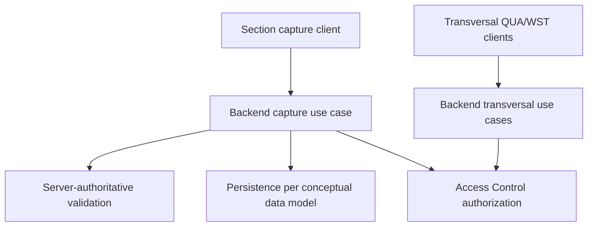

# Technical Specification - Backend Yarn Spinning

> **Normative PRD:** [Yarn Spinning](../../../docs/prd/operation/yarn-spinning.md)
>
> This document specifies how the backend implements the Yarn Spinning
> operational-records capability. The PRD remains authoritative for business
> rules and acceptance criteria.

**Product:** Colibri Hub
**Context:** Operation
**Capability:** Yarn Spinning
**Type:** Technical Specification - Backend
**Complementary specifications:** [Frontend Yarn Spinning](../../../frontend/docs/features/yarn-spinning.md), [Backend Access Control](access-control.md)

---

## 1. Executive Summary

The backend captures, reads, and corrects Yarn Spinning operational records. A
shift-close section capture submits the families that the section records
(Production Discharge, Progress, and Skeining where applicable) as one atomic
operation. Process Quality and Waste are separate transversal captures. Around
capture, the backend exposes unified record reads, per-section and consolidated
metrics, and an in-place correction path with append-only audit.

The backend is the sole owner of business-rule enforcement (net-weight truth,
reconciliation tolerance, spindle sampling, continuity). It persists according to
the conceptual data model and delegates authorization to the Access Control
capability. Numeric weights travel as strings end-to-end; the backend validates
and operates on scaled integers.



## 2. Related Documents and Authority

- [Yarn Spinning PRD](../../../docs/prd/operation/yarn-spinning.md) — normative business rules and acceptance criteria.
- [Frontend Yarn Spinning](../../../frontend/docs/features/yarn-spinning.md) — UI/UX architecture and payload contract.
- [Catalogs conceptual data model](../../../docs/data-models/conceptual/catalogs-dictionary.md) — `yarn_counts` identity.
- [Yarn Production conceptual data model](../../../docs/data-models/conceptual/yarn-production-dictionary.md) — operational record tables.
- [Backend Access Control](access-control.md) — authorization scopes and policy.
- [Backend Architecture Overview](../architecture/overview.md) — module boundaries.
- [API Conventions](../api/conventions.md) — shared HTTP conventions.
- [Error Contract](../api/errors.md) — shared error envelope.
- [Migration Strategy](../database/migrations.md) — migration workflow.
- [Testing Strategy](../testing/strategy.md) — test organization.

When documents conflict: the PRD prevails for business behavior; Access Control
prevails for authorization; this specification prevails for the backend
implementation described here.

## 3. Objectives

### 3.1 Functional Objectives

- Capture a section's production atomically for one continuity key (section, business date, shift).
- Capture Process Quality and Waste as independent transversal operations.
- Expose unified record reads scoped by family.
- Provide per-section and consolidated metrics.
- Correct an existing record in place with append-only audit evidence.
- Keep yarn count characteristics resolved from the shared catalog identity.

### 3.2 Technical Objectives

- Enforce every business rule server-side; the client validates format and completeness only.
- Carry weights and quantities as decimal strings; never parse or emit floating-point.
- Reference `yarn_count_id` and resolve display attributes from the catalog.
- Delegate authorization to Access Control through the trusted identity contract.
- Preserve hexagonal dependency direction; keep infrastructure behind ports.
- Make corrections attributable and replayable through append-only audit.

## 4. Scope

### 4.1 Included

- Section production capture (Production Discharge, Progress; Skeining for the skeining section).
- Process Quality capture.
- Waste capture.
- Unified record read.
- Per-section and consolidated metrics.
- In-place correction with audit.
- Server-authoritative validation and reconciliation.
- Persistence following the conceptual data model.

### 4.2 Excluded

- Authorization model, scopes, and permission semantics (Access Control owns these).
- Definition of the `yarn_counts` catalog and its characteristics (Catalogs owns these).
- UI composition, navigation, and frontend validation (Frontend spec owns these).
- Business-rule rationale and acceptance criteria (PRD owns these).
- Operational-parameter administration such as reconciliation tolerance limits and quality sampling plans (consumed as configured reference data).

## 5. Hexagonal Architecture

The Yarn Spinning module follows hexagonal architecture with inward dependency
direction. File organization, naming, and splitting decisions follow the
project's architecture documentation and DDD conventions rather than this
specification.

**Domain** owns net-weight and reconciliation calculations, spindle-sampling
rules, continuity-key invariants, and the correction audit policy. It does not
parse HTTP, persist directly, or evaluate authorization.

**Application** provides one use case per business operation, coordinating
validation, persistence through ports, Access Control authorization, transaction
boundaries, and typed errors.

**Ports** define the contracts the application requires from infrastructure:
operational-record persistence, catalog resolution, correction audit, clock, and
identity generation. Supabase and ORM types do not cross the application
boundary.

**Adapters** implement ports with concrete infrastructure: HTTP endpoints, ORM
persistence, and catalog/reference-data access.

**Composition root** wires adapters to ports per request and supplies the
authenticated actor context.

## 6. API Contract

All routes use `/api/v1`, strict JSON validation, the shared error envelope,
stable identifiers, ISO 8601 timestamps, and the pagination conventions in the
shared API documentation. Exact path shapes and versioning follow the shared API
conventions; the resource grouping below reflects the capture families.

| Capability | Method | Path |
| --- | --- | --- |
| Capture section production | `POST` | `/api/v1/spinning/sections/{section}/production` |
| Capture process quality | `POST` | `/api/v1/spinning/process-quality` |
| Capture waste | `POST` | `/api/v1/spinning/waste` |
| Read records | `GET` | `/api/v1/spinning/records` |
| Section metrics | `GET` | `/api/v1/spinning/sections/{section}/metrics` |
| Consolidated metrics | `GET` | `/api/v1/spinning/consolidated/metrics` |
| Correct a record | `PATCH` | `/api/v1/spinning/{family}/{record_id}` |

The section production body is the continuity key plus the families the section
records. Families absent for a section are omitted, not sent as empty arrays.
Field-level shapes follow the conceptual data model; the illustrative payload
below is not an exhaustive attribute list:

```json
{
  "section": "ring_spinning",
  "business_date": "2026-05-13",
  "shift_code": "A",
  "supervisor_user_id": "emp_rogelio",
  "foreman_user_id": "emp_pablo",
  "discharges": [
    {
      "yarn_count_id": "453254",
      "gross_weight_kg": "82.440",
      "spindle_tare_weight_g": "40.0",
      "operative_spindle_count": 200,
      "cart_weight_kg": "9.000",
      "roving_count": 8,
      "observations": null
    }
  ],
  "progress": [
    {
      "yarn_count_id": "453254",
      "input_weight_kg": "0.000",
      "in_machine_net_weight_kg": "53.650",
      "discharged_weight_kg": "52.000",
      "output_weight_kg": "14.200",
      "worked_hours": "8.0",
      "reconciliation_note": null
    }
  ]
}
```

Every weight and quantity value is a decimal string. The backend calculates net
and estimated weights; clients never submit them. Correction sends changed
fields, a required reason, and the optimistic-concurrency token obtained from
the latest record read.

## 7. Data Model (Reference)

Persistence follows the conceptual data model; this specification does not
redefine columns. The authoritative column sets live in:

- `docs/data-models/conceptual/catalogs-dictionary.md` — `yarn_counts` identity (`notation_spinning`, `notation_lot`, `material_type`, `dtex`).
- `docs/data-models/conceptual/yarn-production-dictionary.md` — operational tables: `production_discharges`, `skein_records`, `progress_records`, `process_quality_records`, `waste_records`, and `yarn_production_record_corrections`.

Operational records reference `yarn_count_id` and never duplicate yarn-count
characteristics. Correction history is append-only in
`yarn_production_record_corrections`. Schema changes are delivered through the
repository migration workflow; SQLAlchemy mappings mirror the conceptual model.

## 8. Transaction and Correction Rules

A section production capture commits all its families in one transaction. If any
family fails validation, the entire capture is rejected; no partial family is
persisted.

Correction updates the current business record in place and appends one audit
row carrying before and after values in the same transaction. The audit row is
immutable. Correction requires the optimistic-concurrency token from the latest
read; a stale token returns a conflict without modifying state. Correction
authorization and the correction window follow Access Control and the owning
PRD, not rules defined here.

## 9. Authorization Integration

Authorization is owned by Backend Access Control. This specification only
consumes the scopes defined there (access-control.md §6). The relevant scope
codes are:

- `yarn_spinning.section.<section>` for section capture, reads, metrics, and corrections;
- `yarn_spinning.process_quality` for Process Quality capture and corrections;
- `yarn_spinning.waste` for Waste capture and corrections;
- `transversal.consolidated_dashboard` for consolidated metrics.

The backend derives the actual scope from the route and the loaded resource; it
never accepts an authoritative scope from the client. This document does not
define actions, scopes, or permission semantics.

## 10. Error Handling

All failures use the shared error envelope. The backend returns field-level
`422` for malformed or out-of-contract payloads, `409` for optimistic-concurrency
conflicts and continuity-key collisions, and `403` when Access Control denies
the required permission. Domain calculation failures (for example, a
reconciliation difference beyond tolerance) are returned as typed validation
errors, not as raw exceptions. Internal SQL, stack traces, and calculation
internals are never exposed.

## 11. Testing Strategy

### 11.1 Domain and Application Tests

- Net-weight and estimated-weight calculations.
- Reconciliation tolerance and mandatory consistency note.
- Spindle-sampling inputs and aggregates.
- Continuity-key uniqueness and atomic capture rollback.
- Correction audit append-only behavior and optimistic-concurrency conflict.

### 11.2 API Tests

- Decimal-string validation and rejection of non-decimal or floating-point input.
- Omitted families are not persisted as empty arrays.
- Authorization denial before mutation.
- Correction requires reason and valid token.

### 11.3 Persistence and Integration Tests

- Operational tables match the conceptual data model after migrations.
- Correction audit rows are immutable and correlated to the corrected record.
- RLS and privilege policy match the migration workflow.

## 12. Completion Criteria

1. Section production capture is atomic per continuity key.
2. Process Quality and Waste are independent transversal captures.
3. Weights and quantities travel as decimal strings; net and estimated weights are server-calculated.
4. Unified record reads and both metrics endpoints work.
5. Correction updates in place with append-only audit and optimistic concurrency.
6. Authorization is delegated to Access Control; no scope or permission is defined here.
7. Persistence matches the conceptual data model after migrations.
8. Unit, API, and integration tests pass.
