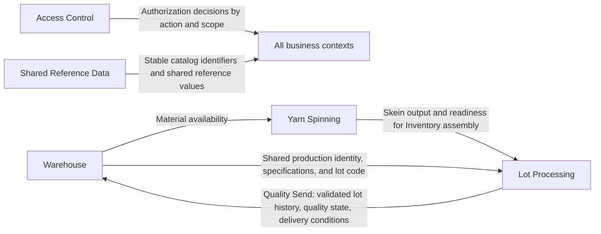

# Colibri Hub — Context Map

Bounded context ownership, aggregate families, inter-context dependencies, and handoff contracts.

---

## 1. Bounded Contexts

| Context | Core Responsibility | Boundary |
| --- | --- | --- |
| **Warehouse** | Physical custody and documentary control of raw material, finished product, and production supplies; production identity definition | Stops at warehouse-issued identity and warehouse-managed stock lifecycle |
| **Yarn Spinning** | Continuous spinning production records before Inventory assembles a lot | Stops at skein output and section/shift/machine records |
| **Lot Processing** | Operational stage history appended after Inventory assembles the lot | Stops when Quality Send hands the lot back to Warehouse |
| **Access Control** | Authorization policy, scopes, and configurable permissions | Does not own business workflow semantics |
| **Shared Reference Data** | Canonical shared yarn-count catalog | Does not own operational records |

> **Design note:** Yarn Spinning and Lot Processing are separate contexts inside the broader Operation Unit. They have different identities, timelines, and record semantics — they must not be collapsed into a single "Operation" model.

---

## 2. Context Responsibilities

### 2.1 Warehouse

- Manages raw-material batch shipment grouping and independent bale identity, custody, and lifecycle.
- Owns the receiving application action, production identity definition, delivery to Production, finished-product reception, warehouse availability/disposition, physical presentation, stock movements, and stock balances.
- Does **not** own: spinning production records, lot-stage progression, process quality execution, lot-stage waste, or final production-stage decisions inside Operation.

### 2.2 Yarn Spinning

- Records production discharges, section progress, process quality in spinning sections, spinning waste, and skein output from Madejeras (Skeining).
- Does **not** own: warehouse stock, production identity assignment rules, Inventory assembly, lot timeline, or final finished-product reception.

### 2.3 Lot Processing

- Owns lot stage records, lot timeline, lot-stage notes/exceptions, stage waste, final quality documentation for delivery, and handoff back to Warehouse.
- Does **not** own: warehouse stock balances, warehouse availability/disposition, spinning-section records, permission policy, or reference catalog governance.

### 2.4 Access Control

- Owns roles, permissions, scopes, exceptions, and auditability of permission changes.
- Acts as a **policy context** — it decides who can record a stage but must not redefine what the stage is, and must not freeze current job-role mappings into the domain model.
- Does **not** own: who is operationally responsible in the business sense, record semantics, workflow state, or domain invariants.

### 2.5 Shared Reference Data

- Owns the canonical yarn-count catalog.
- Acts as a **support context** — operational meaning stays in the owning business context.
- Does **not** own: users, transactional records, lot timelines, stock balances, or permission decisions.

---

## 3. Aggregate Families per Context

| Aggregate / Record Family | Owning Context |
| --- | --- |
| Raw-material batch registration and bale identity | Warehouse |
| Bale custody and delivery (independent lifecycle, In Warehouse → Delivered) | Warehouse |
| Lot identity definition (production identity before assembly) | Warehouse |
| MP emission to production (stock movement + handoff) | Warehouse |
| Warehouse supply movement | Warehouse |
| PT reception from Operation | Warehouse |
| PT availability / disposition | Warehouse |
| PT physical presentation | Warehouse |
| PT sale / transfer / return | Warehouse |
| Spinning production discharge (machine/shift/yarn-count) | Yarn Spinning |
| Spinning progress (section summary) | Yarn Spinning |
| Spinning process quality (section/machine quality) | Yarn Spinning |
| Spinning waste (continuous-process) | Yarn Spinning |
| Skein output availability (output contract for lot assembly) | Yarn Spinning |
| Lot stage record (unified history across stages) | Lot Processing |
| Lot-stage note / inconvenience | Lot Processing |
| Lot-stage waste | Lot Processing |
| Final lot quality state and send | Lot Processing |
| Permission policy and scope rules | Access Control |
| Canonical users and technical roles | Access Control |
| Yarn counts (canonical references) | Shared Reference Data |

---

## 4. Dependencies

### 4.1 Inbound Dependencies (what each context consumes)

| Context | Depends On | What It Consumes |
| --- | --- | --- |
| Warehouse | Access Control | Authorization decisions by action and scope |
| Warehouse | Shared Reference Data | Yarn-count identifiers and values |
| Warehouse | Lot Processing | Quality Send documentation (validated lot history, quality state, delivery conditions) |
| Yarn Spinning | Access Control | Authorization decisions |
| Yarn Spinning | Shared Reference Data | Yarn-count identifiers and values |
| Yarn Spinning | Warehouse | Material availability (bale delivery information) |
| Lot Processing | Access Control | Authorization decisions |
| Lot Processing | Shared Reference Data | Yarn-count identifiers and values |
| Lot Processing | Warehouse | Production identity, specifications, and lot code |
| Lot Processing | Yarn Spinning | Skein output and readiness for assembly |

### 4.2 Upstream / Downstream Relationships

```text
┌─────────────────────────────────────────────────────────┐
│ UPSTREAM (defines identity and material)                 │
│                                                         │
│   Warehouse ─── material availability ──►                │
│       │                                                 │
│       │                                                 │
│       ▼                                                 │
│   Yarn Spinning ─── skein output ──►                    │
│       │                                                 │
│       ▼                                                 │
│   Lot Processing ─── Quality Send ──►  Warehouse        │
│                                                         │
│ DOWNSTREAM (receives and acts on)                       │
└─────────────────────────────────────────────────────────┘

┌─────────────────────────────────────────────────────────┐
│ CROSS-CUTTING SUPPLIERS                                 │
│                                                         │
│   Access Control ──── authorization ──► All contexts    │
│   Shared Reference Data ── catalog ids ──► All contexts │
└─────────────────────────────────────────────────────────┘
```

---

## 5. Inter-Context Handoffs

### 5.1 Handoff Table

| From | To | What Crosses the Boundary | Semantics |
| --- | --- | --- | --- |
| Warehouse | Yarn Spinning | Material availability | Yarn Spinning references warehouse-issued material for planning/execution |
| Yarn Spinning | Lot Processing | Skein output and readiness for Inventory assembly | Lot Processing starts when Inventory assembles skeins into a lot |
| Warehouse | Lot Processing | Shared production identity, specifications, and lot code | Lot Processing appends stage history to the same lot Warehouse defined |
| Lot Processing | Warehouse | Quality Send: validated lot history, quality state, and delivery conditions | Warehouse accepts the same lot through its own receipt after physical verification |
| Access Control | All | Authorization decisions by action and scope | Policy only — never redefines business semantics |
| Shared Reference Data | All | Stable catalog identifiers and shared reference values | Read-only consumption by all business contexts |

### 5.2 Handoff Flow



### 5.3 Handoff Invariants

- No handoff changes ownership retroactively. A receiving context may reference prior data, but writes only its own part.
- Lot Processing owns the operational stage history; Warehouse owns the warehouse-side records that continue the same business identity.
- The lot history delivered back to Warehouse belongs to a cross-context traceability chain — not a new warehouse-only record detached from production.
- Single lot identity: Warehouse defines the lot through the production identity and visible lot code; Inventory records assembled weight/skein count; each Lot Processing stage appends history to that same lot.

---

## 6. Shared Identifiers Across Boundaries

| Identifier | Defined By | Consumed By | Purpose |
| --- | --- | --- | --- |
| Production identity | Warehouse | Lot Processing | Unique lot identity across the production chain |
| Lot code (visible) | Warehouse | Lot Processing | Human-readable lot reference |
| Yarn count ID | Shared Reference Data | Warehouse, Yarn Spinning, Lot Processing | Canonical product classification |
| Shipment number | Warehouse | — (internal) | Globally unique batch identification |
| Bale number | Warehouse | — (internal) | Unique within a raw-material batch |

---
