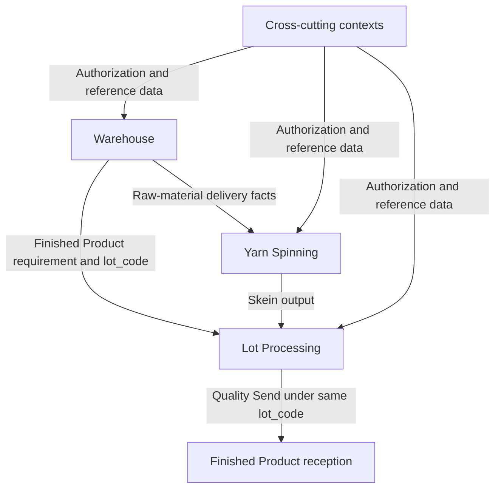

# Colibri Hub - Context Map

Bounded-context ownership, aggregate families, dependencies, and handoff
contracts for Colibri Hub.

---

## 1. Bounded Contexts

| Context | Core Responsibility | Boundary |
| --- | --- | --- |
| **Warehouse** | Raw-material custody, Finished Product lifecycle, and production-supplies inventory | Owns the Finished Product from requirement definition through Warehouse reception, availability, custody, dispatch, and possible return; does not own productive processing records |
| **Yarn Spinning** | Continuous spinning production across five productive sections | Owns section, machine, shift, quality, waste, progress, and skein-output facts before physical lot assembly |
| **Lot Processing** | Operation representation and sequential history of one business lot | Owns Production Identity, physical assembly, six-stage interventions, stage waste, Operation quality, and Quality Send; stops at the handoff pending Warehouse acceptance |
| **Access Control** | Configurable authorization policy | Owns roles, actions, scopes, exceptions, and permission-change audit; does not own business workflow semantics |
| **Shared Reference Data** | Canonical shared catalogs | Owns stable reference values such as yarn counts; does not own operational records |

> **Design note:** Yarn Spinning and Lot Processing are separate bounded
> contexts inside the broader Operation Unit. They have different identities,
> timelines, and record semantics and must not be collapsed into one Operation
> domain model.

---

## 2. Context Responsibilities

### 2.1 Warehouse

- Manages raw-material batch registration, independent bale identity, physical
  custody, inventory consultation, and whole-bale delivery to Production.
- Owns the Finished Product from requirement definition, including the unique
  `lot_code`, target title, color, client or destination, classification, and
  applicable specifications.
- Consults the authorized transversal phase while Operation processes the
  requirement.
- Records physical Finished Product reception after Quality Send and manages
  availability, presentation, stock, dispatch, and returns.
- Manages production-supplies receipts, issues, adjustments, balances, and
  consultations.
- Does **not** own Production Identity, Yarn Spinning records, Lot Processing
  stages, Operation waste, Operation quality decisions, or permission policy.

### 2.2 Yarn Spinning

- Records production discharges and progress for Preparation, Ring Frames,
  Winding, Twisting, and Skeining.
- Records spinning process quality and continuous-process waste in their owning
  scopes.
- Produces skein-output facts that Lot Processing may consume for Inventory
  assembly.
- Does **not** own Warehouse inventory, Finished Product requirements,
  Production Identity, physical lot assembly, lot-stage history, or final
  Warehouse reception.

### 2.3 Lot Processing

- Creates or resolves exactly one Operation `Production Identity` for an
  existing Warehouse Finished Product requirement.
- Preserves the Warehouse-assigned `lot_code` and the `1:1` relationship between
  both contextual representations.
- Owns Inventory assembly and the sequential history for Inventory, Dyeing,
  Drying, Winding or Ball Winding, Bagging, and Quality.
- Owns lot-stage notes, incidents, stage waste, Operation quality state, and the
  single Quality Send act.
- Exposes permission-sensitive dashboard, queue, and contextual detail
  projections without transferring ownership of source records.
- Does **not** own Warehouse requirement fields, Warehouse stock or disposition,
  Yarn Spinning source records, permission policy, or shared-catalog governance.

### 2.4 Access Control

- Owns configurable roles, permissions, actions, scopes, exceptions, and
  permission-change audit.
- Acts as a policy context: it decides whether a user may execute an action in a
  scope but does not redefine business stages or record meaning.
- Combines permissions from all assigned roles and deduplicates the effective
  result.
- Does **not** infer authority from actor name, organizational position, shift,
  record ownership, or page visibility.

### 2.5 Shared Reference Data

- Owns the canonical yarn-count catalog and other explicitly approved shared
  reference values.
- Acts as a support context. Operational meaning remains in the consuming
  business context.
- Does **not** own users, transactions, lot timelines, stock balances, or
  authorization decisions.

---

## 3. Aggregate and Record Families

| Aggregate or Record Family | Owning Context |
| --- | --- |
| Raw-material batch registration and bale identity | Warehouse |
| Bale custody, inventory state, and delivery to Production | Warehouse |
| Finished Product requirement and unique `lot_code` | Warehouse |
| Finished Product reception and physical verification | Warehouse |
| Finished Product availability, presentation, stock, dispatch, and return | Warehouse |
| Production-supplies receipts, issues, adjustments, and balances | Warehouse |
| Spinning production discharge | Yarn Spinning |
| Spinning section progress | Yarn Spinning |
| Spinning process quality | Yarn Spinning |
| Spinning waste | Yarn Spinning |
| Skein output for physical lot assembly | Yarn Spinning |
| Production Identity | Lot Processing |
| Inventory physical assembly record | Lot Processing |
| Lot-stage intervention record | Lot Processing |
| Lot-stage note, incident, and waste | Lot Processing |
| Operation quality state and Quality Send | Lot Processing |
| Permission policy, roles, actions, and scopes | Access Control |
| Canonical users and technical role assignments | Access Control |
| Yarn counts and approved shared catalogs | Shared Reference Data |

The Warehouse Finished Product and Lot Processing Production Identity are
different aggregate representations of the same business lot. They have a
`1:1` mapping and share one `lot_code`, but each context writes only its own
records.

---

## 4. Dependencies

### 4.1 Inbound Dependencies

| Context | Depends On | What It Consumes |
| --- | --- | --- |
| Warehouse | Access Control | Authorization decisions by action and scope |
| Warehouse | Shared Reference Data | Yarn-count identifiers and values |
| Warehouse | Lot Processing | Authorized lifecycle phase, Quality Send, Operation quality state, and delivery conditions |
| Yarn Spinning | Access Control | Authorization decisions by action and scope |
| Yarn Spinning | Shared Reference Data | Yarn-count identifiers and values |
| Yarn Spinning | Warehouse | Authorized raw-material availability and delivery facts |
| Lot Processing | Access Control | Authorization decisions by action and scope |
| Lot Processing | Shared Reference Data | Yarn-count identifiers and values |
| Lot Processing | Warehouse | Finished Product requirement, Warehouse reference, unique `lot_code`, title, color, client or destination, and specifications |
| Lot Processing | Yarn Spinning | Skein output and readiness data for Inventory assembly |

### 4.2 Upstream and Downstream Relationships

```text
Warehouse raw materials -> Yarn Spinning -> skein output -> Lot Processing

Warehouse Finished Product requirement -> Lot Processing Production Identity
                                      1:1, same lot_code

Lot Processing Quality Send -> Warehouse Finished Product reception
                            same lot_code

Access Control and Shared Reference Data support all business contexts.
```

---

## 5. Inter-Context Handoffs

### 5.1 Handoff Table

| From | To | What Crosses the Boundary | Semantics |
| --- | --- | --- | --- |
| Warehouse | Yarn Spinning | Authorized raw-material availability and delivery facts | Yarn Spinning may use the material information needed for execution; no bale-to-lot relationship is created |
| Warehouse | Lot Processing | Finished Product requirement reference, unique `lot_code`, title, color, client or destination, classification, and applicable specifications | Lot Processing creates or resolves one Production Identity for the same business lot and preserves the code |
| Yarn Spinning | Lot Processing | Skein output and readiness for Inventory assembly | Inventory selects and assembles skeins under an existing Production Identity and `lot_code` |
| Lot Processing | Warehouse | Quality Send, Operation quality state, delivery conditions, and authorized completion facts | Warehouse receives the same Finished Product under the original `lot_code`; reception completes the pending handoff |
| Access Control | All business contexts | Authorization decisions by action and scope | Policy only; authorization never redefines domain semantics |
| Shared Reference Data | All consuming contexts | Stable catalog identifiers and values | Read-only reference consumption; source governance remains in Shared Reference Data |

### 5.2 Handoff Flow



### 5.3 Handoff Invariants

1. A handoff does not transfer source-record ownership retroactively.
2. Warehouse defines the Finished Product requirement and unique `lot_code`.
3. Lot Processing creates or resolves exactly one Production Identity for that
   requirement and keeps the same `lot_code`.
4. The Finished Product and Production Identity have a `1:1` relationship and
   represent one business and physical lot.
5. Inventory assembly starts stage history under the existing identity; it does
   not create another business lot or code.
6. Quality Send occurs at most once for the completed operational handoff.
7. Warehouse reception completes the handoff for the same Finished Product and
   `lot_code`; notes do not count as acceptance.
8. Cross-context projections include only information allowed by the caller's
   effective `Read` permissions.
9. Bale delivery does not associate individual bales with a Finished Product,
   Production Identity, or `lot_code` under the current model.

---

## 6. Shared and Context-Local Identifiers

| Identifier | Defined By | Consumed By | Purpose |
| --- | --- | --- | --- |
| `lot_code` | Warehouse Finished Product | Warehouse and Lot Processing | Globally unique, human-readable identity for one business lot across contexts |
| Finished Product identifier | Warehouse | Warehouse; referenced by Lot Processing handoff as needed | Context-local identity of the Warehouse aggregate |
| Production Identity identifier | Lot Processing | Lot Processing; referenced by Warehouse projections as needed | Context-local identity of the Operation aggregate |
| Yarn count ID | Shared Reference Data | Warehouse, Yarn Spinning, and Lot Processing | Canonical product classification |
| Shipment number | Warehouse | Warehouse | Globally unique raw-material batch identifier |
| Bale number | Warehouse | Warehouse | Identifier unique within a raw-material batch |

The context-local identifiers do not compete with `lot_code`. The code is the
shared business reference, while local identifiers support persistence and
aggregate ownership inside each context.

---

## 7. Authorization Across Context Boundaries

- Inter-context availability does not imply user authorization.
- `Read`, `Write`, `Edit`, `Edit Outside the Operational Window`, and `Manage
  Access` remain independent actions.
- A user receives the union of permissions from all assigned roles.
- A general Lot Processing `Read` may expose transversal lot fields. Technical
  fields for a stage require the corresponding effective scope permission.
- The backend omits unauthorized fields from cross-context projections. Hiding
  components only in the frontend is not a security boundary.
- A context validates both business invariants and the effective permission
  before accepting a command.

---

## 8. References

- [ADR-003: Single Business Lot with Context-Owned Representations](./decisions/003-single-production-identity.md)
- [Product overview](../prd/product-overview.md)
- [Warehouse overview](../prd/warehouse/overview.md)
- [Warehouse Finished Product PRD](../prd/warehouse/finished-product.md)
- [Bale Management PRD](../prd/warehouse/bale-management.md)
- [Operation overview](../prd/operation/overview.md)
- [Lot Processing PRD](../prd/operation/lot-processing.md)
- [Lot Processing Records](../prd/operation/lot-processing-records.md)
- [Access Control](../prd/access-control.md)
