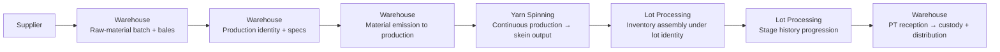
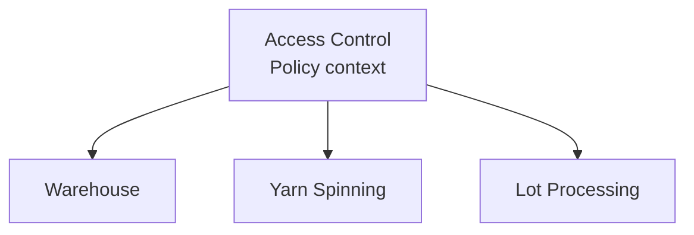

# System Overview

Production-management system for the **Production Directorate** of a textile plant. Colibri Hub supports two organizational units — Warehouse and Operations — collaborating on a shared production flow from raw-material reception through finished-product distribution.

---

## System Components

| Component | Role |
|-----------|------|
| **Backend (FastAPI)** | Domain logic, persistence, and HTTP API for all bounded contexts |
| **Frontend (React + Mantine)** | Operator-facing UI for warehouse, production, and administrative workflows |
| **Database (Supabase/PostgreSQL)** | Transactional store with RLS-enabled schema managed by Supabase migrations |
| **Supabase Platform** | Auth, storage, and realtime infrastructure services |

---

## Bounded Contexts

The system decomposes the production domain into five bounded contexts, each owning distinct identities, records, and lifecycle semantics:

| Context | Code Alias | Responsibility |
|---------|------------|----------------|
| **Warehouse** | `warehouse` | Custody, stock movements, production identity, PT reception, distribution |
| **Yarn Spinning** | `yarn-production` | Continuous production records by section, machine, shift, and yarn count |
| **Lot Processing** | `batch-processing` | Inventory assembly, stage-by-stage lot history, and delivery to Warehouse |
| **Access Control** | `access` | Configurable RBAC policy, scopes, permissions, and audit |
| **Shared Reference Data** | `catalogs` | Canonical catalogs and controlled vocabularies shared across contexts |

> Boundaries follow business meaning, not organizational chart shortcuts. Warehouse, Yarn Spinning, and Lot Processing remain separate because they own different identities, timelines, and record semantics.

---

## Principal Flows

### Cross-Context Production Lifecycle

### Key Handoffs

| From | To | What Crosses |
|------|----|--------------|
| Warehouse | Yarn Spinning | Production identity and material availability |
| Yarn Spinning | Lot Processing | Skein output ready for inventory assembly |
| Warehouse | Lot Processing | Shared production identity, specifications, lot code |
| Lot Processing | Warehouse | Quality Send — validated lot awaiting Warehouse receipt |
| Access Control | All contexts | Authorization decisions by action and scope |
| Shared Reference Data | All contexts | Shared IDs, catalogs, and controlled vocabularies |

### Authorization Flow

Access Control governs all business contexts through configurable RBAC. Organizational roles do not map rigidly to system permissions.

---

## Architectural Principles

1. **PRDs are authoritative** — architecture follows product decisions; technical design does not redefine business ownership.
2. **Boundaries follow meaning** — contexts stay separate because they own different identities, records, and timelines.
3. **Single lot identity** — Warehouse defines `production_identity_id` and `lot_code`; downstream contexts append their facts to that same identity.
4. **Controlled edits with audit trail** — critical records support scoped edits within the correction window; full audit preserved.
5. **Persistence shape ≠ aggregates** — normalized storage does not imply one-to-one aggregate mapping.

---

## Related Documents

| Document | Scope |
|----------|-------|
| [Context Map](./context-map.md) | Context ownership, dependencies, aggregate families, and handoffs |
| [Technology Baseline](./technology-baseline.md) | Verified technology stack — implemented, partial, and planned |
| [Architecture Decisions](./decisions/) | Durable ADR records |
| [Backend Architecture](../../backend/docs/architecture/overview.md) | Backend component internals, patterns, and composition |
| [Frontend Architecture](../../frontend/docs/architecture/overview.md) | Frontend component structure, state management, and design system |
| [Product Overview](../prd/product-overview.md) | Master product vision and capability map |

---

## What This Document Does Not Cover

- **Context ownership matrices and aggregate families** → see [Context Map](./context-map.md)
- **Backend internals** (class design, module composition, ports/adapters) → see Backend Architecture
- **Frontend internals** (component tree, routing, state) → see Frontend Architecture
- **Database schema** → see `backend/docs/database/`
- **Endpoint contracts** → see `backend/docs/api/`
