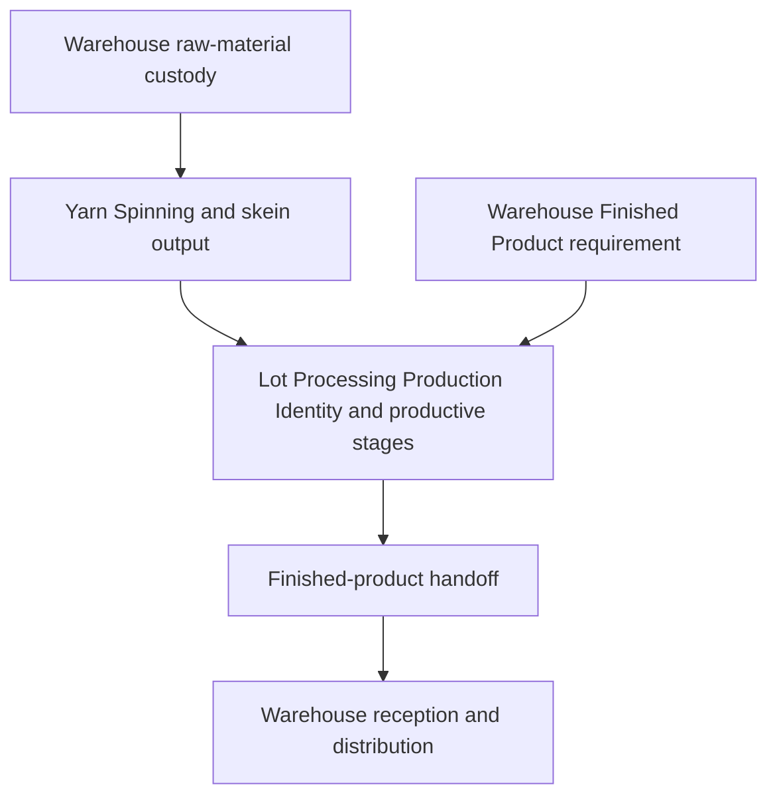

# System Overview

Colibri Hub supports the Production Directorate of a textile plant. Warehouse
and the Operation Unit collaborate across a continuous business flow from
raw-material reception through Finished Product distribution, while each
bounded context owns its own records and lifecycle decisions.

## Bounded Contexts

| Context | Responsibility |
| --- | --- |
| Warehouse | Raw-material custody, Finished Product lifecycle, production supplies, stock, dispatch, and returns |
| Yarn Spinning | Continuous production records by productive section, machine, shift, and yarn count |
| Lot Processing | Operation Production Identity, physical lot assembly, sequential productive history, Operation quality, and the finished-product handoff |
| Access Control | Configurable authorization policy, business scopes, permissions, and permission-change audit |
| Shared Reference Data | Stable catalogs and controlled business references shared across contexts |

Warehouse, Yarn Spinning, and Lot Processing remain separate even though they
belong to one enterprise production flow. They own different identities,
timelines, records, and decisions.

## Principal Production Flow

Warehouse defines the Finished Product requirement and unique lot code. Lot
Processing creates or resolves one Production Identity for that requirement.
The two representations refer to one business and physical lot, have a
one-to-one relationship, and retain the same lot code.

The Warehouse requirement becomes available to Operation when it is completed.
There is no separate approval or acceptance at this boundary. Inside Lot
Processing, completion of a productive stage makes the lot available to the next
stage without an approval step.

## Finished-Product Handoff

After productive completion, Operation performs release for reception. The
business act is named independently from the section or position currently
responsible for performing it.

Warehouse verifies the physical product against the authorized information. If
the product and information agree, Warehouse records reception. If they do not,
Warehouse records a handoff issue and Operation records an issue response after
correcting, remedying, or clarifying the situation. The same handoff returns to
pending verification and the cycle may repeat.

The handoff has no rejection or non-approval outcome because delivery to
Warehouse is mandatory. Reception is the only act that completes the handoff
and transfers custody to Warehouse.

## Cross-Context Handoffs

| From | To | Business information or act |
| --- | --- | --- |
| Warehouse | Yarn Spinning | Authorized raw-material availability and delivery facts |
| Yarn Spinning | Lot Processing | Skein output and readiness for physical lot assembly |
| Warehouse | Lot Processing | Finished Product requirement, unique lot code, and production specifications |
| Lot Processing | Warehouse | Release for reception, Operation quality state, delivery conditions, completion facts, and issue responses |
| Warehouse | Lot Processing | Handoff issues requiring correction, remedy, or clarification before reception |
| Access Control | Business contexts | Authorization decisions by action and business scope |
| Shared Reference Data | Consuming contexts | Stable catalog values and identifiers |

## Architectural Principles

1. Product requirements are the authority for business rules.
2. Bounded-context ownership follows business meaning rather than organizational
   shortcuts.
3. One business lot is represented by a Warehouse Finished Product and an
   Operation Production Identity under one lot code.
4. Each context writes only its own source records.
5. Authorization states whether an actor may perform a business act; it does not
   rename or redefine that act.
6. Business terminology does not depend on the staff position currently assigned
   to a responsibility.
7. Cross-context consultation reveals only authorized information and does not
   transfer source-record ownership.
8. Corrections preserve actor, time, reason, prior information, and resulting
   information.

## Related Documents

| Document | Scope |
| --- | --- |
| [Context Map](./context-map.md) | Context ownership, dependencies, record families, and handoffs |
| [Technology Baseline](./technology-baseline.md) | Technical platform and implementation status |
| [Architecture Decisions](./decisions/) | Durable architectural decisions |
| [Product Overview](../prd/product-overview.md) | Product vision and capability map |
| [UI Requirements](../prd/ui-requirements.md) | Navigation, screens, interactions, and permission-sensitive presentation |

## Documentation Boundary

This document describes business architecture. Technical structure, interfaces,
storage, implementation components, and technology choices belong in the
Technology Baseline and the corresponding technical specifications.
