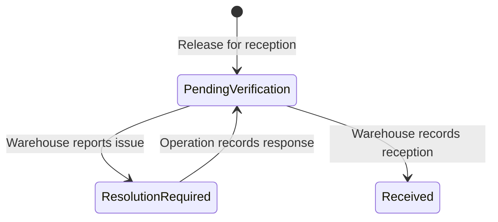

# Lot Processing Domain Map

## Purpose

Lot Processing is the Operation bounded context responsible for representing
and tracing one business lot from physical skein assembly through final quality
inspection and the finished-product handoff to Warehouse.

Warehouse and Lot Processing represent the same business and physical lot from
different context boundaries:

| Context | Representation | Responsibility |
| --- | --- | --- |
| Warehouse | Finished Product | Defines the requirement and lot code; later manages reception, custody, availability, dispatch, and returns |
| Lot Processing | Production Identity | Anchors physical assembly, productive stage history, Operation quality, and the finished-product handoff |

The two representations have a one-to-one relationship and retain one lot code.
Each context writes only its own records.

## Authority

Lot Processing owns:

- the Operation Production Identity created or resolved from an existing
  Warehouse Finished Product requirement;
- physical lot assembly in the Inventory stage;
- the sequential productive history through Inventory, Dyeing, Drying, Winding
  or Ball Winding, Bagging, and Quality;
- stage observations, incidents, waste, and controlled corrections;
- Operation quality state and delivery conditions;
- release for reception;
- Operation responses to handoff issues reported by Warehouse.

Lot Processing does not own:

- the Warehouse Finished Product requirement or its lot code;
- raw-material custody or bale delivery;
- Yarn Spinning production records;
- Warehouse physical reception, stock, availability, dispatch, or returns;
- permission policy or shared reference-data governance.

## Core Concepts

| Concept | Meaning in Lot Processing |
| --- | --- |
| Production Identity | Operation representation of the same business lot defined by the Warehouse Finished Product requirement |
| Lot code | Globally unique business reference shared with Warehouse and preserved throughout the lifecycle |
| Physical lot assembly | Selection and grouping of eligible skeins under the existing Production Identity |
| Stage intervention | Business record of work performed in one productive stage |
| Stage completion | Condition that makes the lot available to the following stage |
| Stage observation | Categorized issue or incident recorded within productive work |
| Operation quality state | Final Operation description of product quality and delivery conditions |
| Release for reception | Operation act that starts the finished-product handoff after productive completion |
| Handoff issue | Warehouse record of a discrepancy found before physical reception |
| Issue response | Operation record of the correction, remedy, or clarification applied to a handoff issue |

## Productive Stages

| Order | Stage | Business purpose |
| --- | --- | --- |
| 1 | Inventory | Assemble the physical lot from eligible skeins under the existing Production Identity |
| 2 | Dyeing | Apply the required color and record applicable process facts |
| 3 | Drying | Remove moisture and document the condition after dyeing |
| 4 | Winding or Ball Winding | Convert skeins into the required final format |
| 5 | Bagging | Package the resulting units and document presentation-related incidents |
| 6 | Quality | Inspect the completed lot and document quality state, defects, nomenclature, and delivery conditions |

The stages describe the physical process and remain stable even if the staff
assignment for a stage changes.

## Productive Progression

1. Warehouse completes a Finished Product requirement.
2. The requirement becomes available to Operation without a separate approval
   or acceptance step.
3. Operation creates or resolves one Production Identity for that requirement.
4. Inventory assembles the physical lot under the existing identity and lot
   code.
5. Each stage records its intervention and completion.
6. Completion makes the lot available to the next stage automatically; there
   is no independent advancement approval between stages.
7. Quality completes the productive history by documenting the final Operation
   quality state and delivery conditions.
8. An authorized Operation actor performs release for reception.

## Finished-Product Handoff

Release for reception starts one cross-context handoff. It does not depend on
the permanent assignment of that responsibility to Quality Control or any other
position.

The handoff follows this cycle:

### Pending verification

Warehouse must compare the physical product with the authorized Finished
Product requirement, productive completion, quality state, delivery conditions,
and applicable quantities.

### Resolution required

When a discrepancy exists, Warehouse records a handoff issue instead of
reception. The issue does not reject the lot or end the mandatory delivery.
Operation remains responsible for correcting, remedying, or clarifying the
situation.

### Issue response

Operation records how the issue was addressed. The response returns the same
handoff to pending verification but does not itself confirm resolution.
Warehouse verifies again and either records reception or records another issue.

### Reception

Warehouse reception completes the handoff and places the Finished Product under
Warehouse custody. Reception does not change the Operation quality state or
rewrite productive history.

## Handoff History

Every release, handoff issue, issue response, and reception retains:

- the same Finished Product, Production Identity relationship, and lot code;
- the responsible individual actor;
- the exact occurrence time;
- the business description and applicable evidence;
- chronological, append-only visibility.

Issues and responses may repeat. They do not create another release, another
Production Identity, another Finished Product, or another lot.

## Business Rules

1. Productive work cannot start without an existing Finished Product requirement
   and one resolved Production Identity.
2. Physical assembly does not create a new identity or lot code.
3. A later productive stage requires completion of the preceding stage.
4. Stage completion automatically makes the lot available to the next stage.
5. There is no acceptance, approval, or rejection between productive stages.
6. Each stage writes only its own business facts and never overwrites a prior
   stage's source records.
7. Corrections preserve the prior information, resulting information, reason,
   actor, and time under the applicable authorization policy.
8. Quality documents the product condition but does not decide Warehouse
   availability or prevent mandatory delivery.
9. Release for reception occurs once after productive completion.
10. A handoff issue is not rejection and does not return the productive
    lifecycle to Quality.
11. An issue response returns the existing handoff to pending verification.
12. Warehouse reception is the only act that completes the handoff.
13. Current business actors do not define fixed system roles or canonical names
    for business acts.
14. Authorized consultation may combine context-owned information without
    transferring ownership of source records.

## Boundaries and Non-Goals

- Lot Processing does not model a generic approval workflow.
- The finished-product handoff is not a chat or independent messaging domain;
  it is a chronological history of issues and responses attached to one handoff.
- Handoff issues do not reopen or reverse productive stages.
- Warehouse availability classification begins only after reception and remains
  outside this context.
- This map does not prescribe interfaces, storage, functions, classes,
  components, or implementation technology.

## References

- [Lot Processing PRD](../../prd/operation/lot-processing.md)
- [Lot Processing Records](../../prd/operation/lot-processing-records.md)
- [Warehouse Finished Product PRD](../../prd/warehouse/finished-product.md)
- [Context Map](../../architecture/context-map.md)
- [ADR-003](../../architecture/decisions/003-single-production-identity.md)
- [ADR-006](../../architecture/decisions/006-role-neutral-business-language.md)
