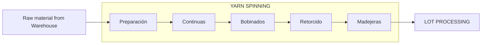

# Domain Model: Yarn Spinning

> **Part of:** Operation Unit — Colibri Hub
> **Source:** `docs/prd/operation/yarn-spinning.md`
> **Related:** `docs/domain/operation/lot-processing.md` (downstream), `docs/domain/warehouse.md` (upstream)

---

## 1. Bounded Context

Yarn Spinning is a subdomain within **Operation**. It transforms raw material bales into yarn of a specific count through 5 sections in a continuous flow.

Raw material leaves Warehouse and is received by Inventory in the Spinning Plant. The final product (skeins) leaves the Spinning Plant toward Lot Processing.

The per-section records are Production (discharge), Advance (process control), Process Quality, and Waste. See [Section 2](#2-what-is-recorded) and [Section 3](#3-what-is-recorded-per-section).

---

## 2. What Is Recorded

### 2.1 Production Discharge (Descarga de Producción)

This is the record of each discharge made by a machine. Applies to sections that work with **spindles**: Preparación (FIN only), Continuas, Bobinados, and Retorcido.

**What is recorded per discharge:**

| Field | Description |
|---|---|
| Machine | Which machine produced the discharge |
| Shift | A, B, or C |
| Date | Production date |
| Yarn count | Yarn count, maintained as shared reference data; no value or notation form is fixed in this capability |
| Type | Variety of the count, from the yarn-count-variant catalog (shared reference data) |
| Supervisor | Shift supervisor |
| Recorded by | Attribution from the authenticated session |
| Gross weight | Weight of the full cart/tub with product (kg) |
| No. of spindles | Number of operational spindles that produced this discharge |
| Tare per spindle | Weight of the bobbin/cop per spindle (grams) |
| Cart weight | Weight of the empty cart/tub (kg) |
| Net weight | Calculated: Gross − (SpindleTare × Spindles / 1000) − CartWeight |
| Observations | Free text |

**Rules:**
- A machine may have several discharges in a shift (same or different count)
- It may have no discharge in a shift
- Net weight is calculated by the system, not entered manually

### 2.2 Skeining Production (Producción de Madejeras)

This is the production record for Skeining (Madejeras). It does not use spindles; it uses **skeins**.

**What is recorded per discharge:**

| Field | Description |
|---|---|
| Machine | Machine that produced the skeins |
| Shift | A, B, or C |
| Date | Production date |
| Yarn count | Yarn count |
| Type | Variety of the count, from the yarn-count-variant catalog (shared reference data) |
| Supervisor | Shift supervisor |
| Recorded by | Attribution from the authenticated session |
| No. of skeins | Quantity of skeins produced |
| Unit weight | Weight per skein entered at capture for this record; reflects the physical presentation produced and is neither a fixed value nor an application-maintained parameter (see PRD SKN-03) |
| Net weight | Calculated: No. of skeins × UnitWeight / 1000 |
| Operator | Operator name (free text, not an employee reference) |
| Observations | Free text |

**Rules:**
- No spindles, spindle tare, or cart weight
- The operator is informational — production is operator-dependent, not machine-cycle-dependent

### 2.3 Advance Tracking (Registro de Avance)

This is a per-machine summary at shift end. It consolidates the shift's work: material that entered (inherited from the previous shift), material present in the machine (calculated by sampling one spindle), material that leaves, and the accumulated net discharge of the shift.

**Applies to:** Preparación (PSJ only), Continuas, Retorcido.
**Does not apply to:** Bobinados, Madejeras.

**What is recorded per advance:**

| Field | Description |
|---|---|
| Machine | Machine being controlled |
| Shift | A, B, or C |
| Date | Date |
| Yarn count | Yarn count |
| Type | Variety of the count |
| Supervisor | Shift supervisor |
| Recorded by | Attribution from the authenticated session |
| Sample gross weight | Gross weight of a sample cop/spindle at shift start (grams) |
| Sample tare | Tare of that sample cop/spindle (grams) |
| No. of spindles | Total operational spindles of the machine |
| Input weight | Material that entered the section (what the previous shift left as output, kg) |
| Output weight | Material present in the machine calculated by material balance (kg) |
| Discharged weight | Sum of net weights of all production discharges in the shift (kg) |
| Hours worked | Hours the machine operated |

**Relationship with Production Discharge:**
- `Discharged weight` is the sum of `Net weight` of all production discharges of that machine/shift
- If there are no discharges in the shift, `Discharged weight` is zero
- The `Input weight` of a shift is the `Output weight` recorded by the previous shift for that machine

**Purpose:**
- Validate that the sum of discharges is coherent with process control
- Calculate yield loss: Input vs Output
- Measure productivity: kg/hour per machine

### 2.4 Process Quality Control (Control de Calidad de Proceso)

Process quality control applies to every section. The method varies by section.

**What is recorded per control:**

| Field | Description |
|---|---|
| Section | Section evaluated |
| Machine | Machine evaluated |
| Shift | Shift |
| Date | Date |
| Yarn count | Yarn count evaluated |
| Type | Variety of the evaluated yarn count, from the yarn-count-variant catalog (shared reference data) |
| Inspector | Employee performing the control |
| Method | Control method from the method catalog (shared reference data); bound to the section per the quality-method matrix |

**Depending on the method, different data is recorded:**

*Sample method (Preparación, Continuas)*
- Number of samples taken, following the configured sampling plan for the section (see PRD QUA-03; no fixed count embedded in capture)
- Individual values of each sample
- CV%, tenacity, elongation (calculated)

*MachineRegister method (Bobinados)*
- Body (imperfections per unit length)
- Kilometers processed
- Cuts per cone

*Random method (Retorcido, Madejeras)*
- Variable results depending on the test

**Note:** The special nomenclatures (-AT, -FT, -VARR, -D, etc.) are assigned to the lot in Lot Processing, not to the machine in Yarn Spinning.

### 2.5 Waste Record (Registro de Desperdicio)

Waste is recorded for all sections. It is weighed by **machine group**, not by individual machine.

**What is recorded per waste control:**

| Field | Description |
|---|---|
| Section | Section where it was generated |
| Machine group | Group of machines weighed together |
| Shift | Shift |
| Date | Date |
| Weight | Waste weight (kg) |
| Type | Real (material-loss capture) or Accumulated (retained under plant policy) |
| Recorded by | Attribution from the authenticated session |

**Rules:**
- Theoretical waste is Real + Accumulated (not stored, calculated)
- Skeining: skeins out of specification are NOT recorded as waste — they return to an earlier stage for reprocessing

---

## 3. What Is Recorded per Section

| Section | Production Discharge | Skeining Production | Advance Tracking | Process Quality | Waste Record |
|---|---|---|---|---|---|
| **Preparación** | FIN only | — | PSJ only | ✓ | ✓ |
| **Continuas** | ✓ | — | ✓ | ✓ | ✓ |
| **Bobinados** | ✓ | — | — | ✓ | ✓ |
| **Retorcido** | ✓ | — | ✓ | ✓ | ✓ |
| **Madejeras** | — | ✓ | — | ✓ | ✓ |

*Capture responsibility for every family is determined by Access Control policy; this model records only which families apply per section.*

---

## 4. Shared Catalogs

Master data shared with other Operation contexts:

| Catalog | Description |
|---|---|
| **Employee** | Plant employees referenced by capture attribution; functional responsibilities are assigned via Access Control. |
| **Shift** | Fixed shifts: A (morning), B (afternoon), C (night) |
| **YarnCount** | Yarn counts maintained as shared reference data. Notation is context-specific and may use ply variants (e.g. 1/N, 2/N, 3/N and beyond); this capability fixes no count values or notation forms. Each context applies its own label to the same underlying yarn. |
| **Section** | The 5 spinning sections: Preparación, Continuas, Bobinados, Retorcido, Madejeras |
| **Machine** | Machines per section, identified by codes from the machine catalog (shared reference data); types include PSJ and FIN |
| **MachineGroup** | Grouping of machines for waste weighing |

---

## 5. Business Rules

1. **Only FIN produces in Preparación.** PSJ only records advance.
2. **Bobbin Winding records production discharge.** Its quality control uses the Machine register method; capture responsibility follows Access Control policy.
3. **Production is granular per discharge.** Multiple discharges per machine/shift are valid. Zero too.
4. **Count and type may change within a shift.** Each discharge carries its own.
5. **Net weight is always system-calculated.** Never entered directly.
6. **Advance validates production.** The discharged weight in advance must match the sum of discharges.
7. **Skeining is structurally different.** No spindles, tare, or cart. Uses skein count and unit weight.
8. **Waste by machine group.** Not by individual machine.
9. **Skeins out of specification are NOT waste.** They return to an earlier stage for reprocessing.
10. **Records are editable under policy.** Corrections within the operational window preserve actor, timestamp, reason, and before/after values. The correction history is append-only.
11. **Capture-session integrity.** A shift-close capture session persists completely or not at all across every record family it touches (PRD DIS-07).
12. **Affirmative zero.** A completed capture session records an explicit zero outcome for every in-scope machine that produced nothing; absence of records never represents a declared zero (PRD DIS-08).
13. **Optimistic concurrency.** When two capture attempts target the same continuity key, the first save prevails and the second is rejected with the current stored state; silent overwriting never occurs (PRD §4).
14. **Late-capture window.** First-time capture after shift close is allowed only within an administrative window whose duration is an operational parameter; capture beyond it follows the override authority (PRD §4, §9).
15. **Configurable reconciliation tolerance.** Progress discharged weight reconciles with discharge totals within a configured tolerance; inside it is accepted with a mandatory consistency note, outside it is rejected. The tolerance is an operational parameter (PRD PRG-06).
16. **Configured tolerance limits.** Measured-property tolerance limits are configured reference data, not embedded in capture; an out-of-tolerance result is flagged (PRD QUA-06).

---

## 6. Related Documents

- `docs/prd/operation/yarn-spinning.md` — Source PRD
- `docs/prd/operation/overview.md` — Operation unit PRD
- `docs/domain/operation/lot-processing.md` — Downstream domain (Lot Processing)
- `docs/domain/warehouse.md` — Upstream domain (Warehouse)
