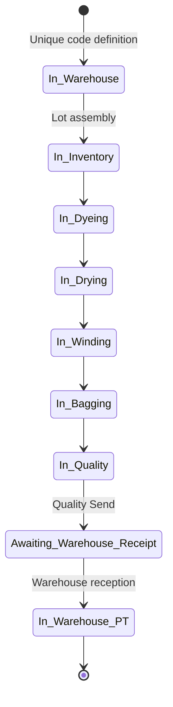

# PRD: Lot Processing

> **Part of:** Operation Unit — Colibri Hub
> **Dependencies:** `docs/prd/operation/overview.md` (Operation PRD), `docs/prd/warehouse/overview.md` (Warehouse PRD)
> **Related documents:** `docs/prd/operation/yarn-spinning.md`
> **Next:** `docs/domain/operation/lot-processing.md` (Domain Model)

---

## 1. Purpose and Scope

### 1.1 Purpose

Define the transformation process that converts skeins from Yarn Spinning into Finished Product (PT) ready for physical verification, through a sequential flow of 6 stages with individual traceability per lot.

### 1.2 Lot lifecycle in the system

The lot traverses three domains during its life in the system. This PRD covers the Operation segment:

```
WAREHOUSE                      OPERATION (Lot Processing)                WAREHOUSE
   │                                │                                       │
   ├── Assigns unique lot code     │                                       │
   ├── Defines: yarn count, color, │                                       │
   │   customer, specifications    │                                       │
   └── Issues to Operation ────────►│                                       │
                                    │                                       │
                                    ├── Inventory (assembles physical lot)  │
                                    ├── Dyeing (applies color)              │
                                    ├── Drying                              │
                                    ├── Winding / Ball Winding              │
                                    ├── Bagging                             │
                                    └── Quality (evaluates and documents)   │
                                         │                                  │
                                         └── Delivery to Warehouse ────────►│
                                       (with quality documentation)         │
                                                                             ├── Physical verification
                                                                             └── Classification and disposition
```

Warehouse defines the sole lot identity through the production identity and its visible lot code; both are maintained throughout this entire process. Operation does not generate any other identity or new codes. Inventory records the assembly of the set of skeins that will be processed under that identity. The system is the source of all this information; any physical backup (form, label) is merely a printed representation of the system data.

### 1.3 System boundaries

| Boundary        | Detail                                                                                                                                                                                                                                                                                                                                                        |
| --------------- | ------------------------------------------------------------------------------------------------------------------------------------------------------------------------------------------------------------------------------------------------------------------------------------------------------------------------------------------------------------- |
| **Input**       | The production identity defined by Warehouse (production identity, lot code, yarn count, color, customer or destination, and order specifications) and the skeins produced in Madejeras (Skeining). Inventory receives that information digitally and records the physical assembly under the same identity, according to the yarn count and weight specified. |
| **Output**      | Processed lot, inspected by Quality with complete documentation, delivered to Warehouse for physical verification and disposition.                                                                                                                                                                                                                             |
| **Not included** | Assignment of the lot code, enrichment with order data, or raw-material issuance (documented in `docs/prd/warehouse/overview.md`). Final physical verification of PT, its classification in Warehouse, or its storage/distribution (documented in `docs/prd/warehouse/overview.md`). Yarn production in the 5 sections of Yarn Spinning (documented in `docs/prd/operation/yarn-spinning.md`). |

### 1.4 Dependencies

- **Yarn Spinning:** Madejeras (Skeining) produces the raw skeins that Inventory uses to assemble physical lots. Without production in Madejeras (Skeining) there are no lots.
- **Warehouse:** Defines the production identity, lot code, and order specifications (yarn count, color, customer or destination) in the system. That information guides the physical assembly and the production process.
- **Operation roles:** Inventory, Dyeing personnel, Bagging, and Quality are the actors that record data in the system throughout the process.

---

## 2. The 6 Process Stages

Each lot goes through the following stages in strict sequential order. A stage cannot be recorded if the previous one is not completed.

The process usually lasts approximately one to two days, and a lot may physically cross multiple shifts. Each intervention records only the work actually performed at that moment. A lot may have multiple legitimate records in the same stage, business date, or shift, including records by different users or at different times. Business date, shift, actors, and system timestamps describe process history; they do not define uniqueness. The use-case/domain layer rejects a later-stage intervention until the prior stage is complete; this cross-table invariant is not a DBML constraint. Controlled edits remain subject to the existing audit policy.

### 2.1 Inventory — Lot assembly

The lot formally enters the process when Inventory physically assembles the set of skeins under the unique identity previously defined by Warehouse (production identity and lot code, yarn count, color, customer or destination, and order specifications). Inventory queries that information, searches among the available raw skeins (produced by Madejeras (Skeining)), and records the physical assembly according to the **yarn count** and **weight** specified. Color is the responsibility of Warehouse and Dyeing, not Inventory.

| Aspect                    | Description                                                                                                                                                                                                                        |
| ------------------------- | ---------------------------------------------------------------------------------------------------------------------------------------------------------------------------------------------------------------------------------- |
| **Who**                   | Inventory                                                                                                                                                                                                                          |
| **When**                  | When the identity defined by Warehouse exists and skeins of the required yarn count are available |
| **What is recorded**      | — Production identity and lot code (defined by Warehouse)<br>— Assembly date and shift<br>— Person who assembled the lot<br>— Supervisor in charge<br>— Yarn count<br>— Number of skeins composing the lot<br>— Total lot weight |
| **Possible issues**       | — Insufficient skeins of the required yarn count<br>— Weight outside the specified range<br>— Incomplete issuance data                                                                                                            |
| **Result**                | The assembled lot moves to Dyeing                                                                                                                                                                                                  |

### 2.2 Dyeing — Color application

The skeins of the lot enter the vats to be dyed according to the color specified by Warehouse in the system.

| Aspect                    | Description                                                                                                                                                                                                                                                             |
| ------------------------- | ----------------------------------------------------------------------------------------------------------------------------------------------------------------------------------------------------------------------------------------------------------------------- |
| **Who**                   | Dyeing personnel                                                                                                                                                                                                                                                        |
| **When**                  | When the skeins enter the vats                                                                                                                                                                                                                                          |
| **What is recorded**      | — Entry date and shift<br>— Person who receives the lot<br>— Supervisor in charge<br>— Number of skeins received<br>— Net lot weight at entry<br>— Vat number used<br>— Process temperature<br>— Categorized observations if applicable |
| **Possible issues**       | — Re-dyeing (non-conforming color, requires a second bath)<br>— Temperature out of range<br>— Incorrect or contaminated vat<br>— Material (fiber type) does not match the process                                                                                      |
| **Result**                | The dyed lot moves to Drying                                                                                                                                                                                                                                            |

### 2.3 Drying — Moisture removal

The dyed skeins go through the drying process to eliminate residual moisture.

| Aspect                    | Description                                                                                                                                                    |
| ------------------------- | -------------------------------------------------------------------------------------------------------------------------------------------------------------- |
| **Who**                   | Dyeing personnel                                                                                                                                               |
| **When**                  | When the skeins come out of the dyeing process                                                                                                                 |
| **What is recorded**      | — Entry date and shift<br>— Person who receives the lot<br>— Supervisor in charge<br>— Number of skeins entered<br>— Total lot weight at entry |
| **Possible issues**       | — Lot does not come from Dyeing (sequence control)<br>— Inconsistently high weight (excess moisture)                                                           |
| **Result**                | The dried lot moves to Winding or Ball Winding                                                                                                                 |

### 2.4 Winding / Ball Winding — Conversion to final format

The dried skeins are converted to the final format according to the product destination. These are two variants of the same type of process:

| Variant           | Destination                      | Product         |
| ----------------- | -------------------------------- | --------------- |
| **Winding**       | Industrial customer              | Yarn cones      |
| **Ball Winding**  | Direct sale / Retail             | Yarn balls      |

| Aspect                    | Description                                                                                                                                                                                                      |
| ------------------------- | ---------------------------------------------------------------------------------------------------------------------------------------------------------------------------------------------------------------- |
| **Who**                   | Operative responsible assigned to Winding/Ball Winding according to current policy. Today this may coincide with the same person handling Bagging.                                                               |
| **When**                  | When the dried skeins are ready for processing                                                                                                                                                                   |
| **What is recorded**      | — Process date and shift<br>— Person who receives the lot<br>— Supervisor in charge<br>— Number of skeins processed<br>— Number of cones or balls produced<br>— Waste generated during conversion, recorded in the lot history |
| **Possible issues**       | — Damaged cones<br>— Incorrect yarn count<br>— Equipment not calibrated for the yarn count<br>— Excessive waste                                                                                                 |
| **Result**                | The lot in cones or balls moves to Bagging                                                                                                                                                                       |

### 2.5 Bagging — Final product packaging

The cones or balls are packed into bags with their corresponding labels and data sheets.

| Aspect                    | Description                                                                                                                                                                                   |
| ------------------------- | --------------------------------------------------------------------------------------------------------------------------------------------------------------------------------------------- |
| **Who**                   | Bagging                                                                                                                                                                                       |
| **When**                  | When the cones or balls are ready for packaging                                                                                                                                               |
| **What is recorded**      | — Packaging date and shift<br>— Person who receives the lot<br>— Supervisor in charge<br>— Number of bags used<br>— Number of cones or balls per bag<br>— Waste generated in Bagging, recorded in the lot history |
| **Possible issues**       | — Damaged bags<br>— Incorrect label or data sheet<br>— Damaged cones detected during packaging<br>— Cone count does not match what was recorded in Winding                                   |
| **Result**                | The packaged lot moves to Quality Control                                                                                                                                                     |

### 2.6 Quality — Final inspection and classification

Quality inspects the complete lot, verifies parameters, documents defects, and records the **quality state** in which the lot will be delivered to Warehouse, including special nomenclatures if applicable. If the lot does not meet minimum parameters, it is **flagged** and within Operation all viable resolution options must be exhausted before reporting its delivery conditions to Warehouse. The lot leaves Operation toward Warehouse with its complete quality history.

| Aspect              | Description                                                                                                                                                                                                                                                                                                                                                                                                         |
| ------------------- | ------------------------------------------------------------------------------------------------------------------------------------------------------------------------------------------------------------------------------------------------------------------------------------------------------------------------------------------------------------------------------------------------------------------- |
| **Who**             | Quality Control                                                                                                                                                                                                                                                                                                                                                                                                      |
| **When**            | Before delivering the lot to Warehouse                                                                                                                                                                                                                                                                                                                                                                               |
| **What is recorded** | — Inspection date and shift<br>— Person who inspects<br>— Supervisor in charge<br>— Visual defects detected (double tone, staining, rod marks, nicked skeins, tails, slubs, low/high twist, blend)<br>— Internal defects detected (purging, paraffining, data sheet, double strand, bad ties, tie count, contamination, etc.)<br>— Special nomenclature if applicable<br>— Lot quality state at the time of delivery<br>— Delivery conditions if applicable |
| **Result**          | The lot leaves Operation toward Warehouse with its complete quality documentation and the state in which it is delivered                                                                                                                                                                                                                                                                                              |

---

## 3. Issues and Documentation

### 3.1 Categorized observations

Each stage can report issues through a predefined set of categories. This allows filtering, reporting, and analyzing problems without resorting to ambiguous free text.

The category is selected from a specific list for each stage. If none applies, none is selected.

| Stage                 | Issue categories                                                                                                                                                                              |
| --------------------- | --------------------------------------------------------------------------------------------------------------------------------------------------------------------------------------------- |
| **Inventory**         | Insufficient skeins of the required yarn count / Weight out of range / Incomplete issuance data                                                                                               |
| **Dyeing**            | Re-dyeing (non-conforming color) / Temperature out of range / Contaminated vat / Incorrect material                                                                                           |
| **Drying**            | Weight out of range / Excessive moisture                                                                                                                                                      |
| **Winding/Ball Winding** | Damaged cones / Incorrect yarn count / Equipment not calibrated / Excessive waste                                                                                                          |
| **Bagging**           | Damaged bags / Incorrect label / Count does not match                                                                                                                                         |
| **Quality**           | Double tone / Staining / Rod marks / Nicked skeins / Tails / Slubs / Low twist / High twist / Blend / Purging / Paraffining / Data sheet / Double strand / Bad ties / Contamination           |

In addition to the category, an optional **details** field in free text may be included for additional context (e.g., "vat T-03 had residues from the previous lot").

### 3.2 History recording

Each intervention preserves business date, shift, applicable persons responsible, and system timestamps. Pairs of physical entry/exit timestamps are not persisted in the current model. Physical duration per stage is deferred until the business defines what event starts and ends that measurement, how it will be captured, and what decisions will use it.

This allows maintaining responsibility and recording traceability, even when the lot crosses multiple shifts, without inferring a physical duration that the business has not yet defined.

The lot advances when it **physically** changes stage. No formal intermediate states exist outside these stages; if the lot is in Dyeing waiting for a decision about re-dyeing, it remains in Dyeing until it moves to Drying. Delays, observations, or pending decisions are recorded as part of the current stage.

---

## 4. Lot Lifecycle and States

### 4.1 State diagram



### 4.2 States

| State            | Meaning                                                                                     |
| ---------------- | ------------------------------------------------------------------------------------------- |
| **In_Warehouse**    | Lot registered by Warehouse, with assigned code. Pending issuance to Operation. |
| **In_Inventory** | Lot assembled by Inventory, first record in the Operation system.                           |
| **In_Dyeing**    | Lot in dyeing process.                                                                      |
| **In_Drying**    | Lot in drying process.                                                                      |
| **In_Winding**   | Lot in winding or ball winding process.                                                     |
| **In_Bagging**   | Lot in packaging process.                                                                   |
| **In_Quality**   | Lot in final inspection.                                                                    |
| **Awaiting_Warehouse_Receipt** | Quality performed the single permitted send; the lot awaits Warehouse validation and reception. Brief coordination notes are neither acceptance nor another send. |
| **In_Warehouse_PT** | Warehouse registered reception of the lot after physical validation. |

### 4.3 Transition rules

1. **Mandatory sequential:** A stage cannot be recorded if the lot has not completed the previous one. To record in Winding, the current state must be `In_Drying`.
2. **No rollback:** Once the lot advances to the next stage, it does not go back. The lot always moves forward in the flow.
3. **Controlled edit with audit:** Data from a stage may be corrected if there was a data-entry error, but every edit must leave complete traceability of who edited, when, what changed, and why.
4. **Operational correction window:** Editing may be allowed during a defined window after the shift or stage closure (for example 24 or 48 hours, according to current policy).
5. **Restricted editing outside the window:** Once the operational window expires, only the **SysAdmin** role may edit stage records, maintaining the same mandatory traceability.
6. **Single Quality Send:** Every lot that completes the 6 stages may perform a single Quality Send toward Warehouse with its complete documentation, including defects and delivery conditions if any. The send places the lot in awaiting Warehouse receipt; it is not repeated nor does it occur concurrently for the same identity.
7. **Warehouse reception:** Acceptance is evidenced only when Warehouse registers reception for the same lot identity. Brief notes during the wait are neither acceptance nor another send.

### 4.4 Quality classification

Quality documents the quality state of the lot at the time of delivery. That information allows Warehouse to verify what was received and then separately define its operational availability, disposition, and physical presentation as appropriate. The lot is always delivered to Warehouse, even when it arrives with observations or special conditions.

| Classification         | Meaning                                                                                     | Usage example                                                                |
| ---------------------- | ------------------------------------------------------------------------------------------- | ---------------------------------------------------------------------------- |
| **Standard**           | PT without defects or with minor defects within tolerance                                   | Lot that meets specifications                                                |
| **With nomenclature**  | PT with special characteristics that modify its classification or value                     | Lot with a special designation defined by Quality according to current policy |
| **Flagged**            | PT with documented defects or conditions that require decisions within Operation or reporting delivery conditions to Warehouse | Double tone, staining, damaged cones, defects that require defining disposition |

---

## 5. Business Rules

### 5.1 Multi-shift traceability

The complete lot process may last between 1 and 2 days, crossing multiple shifts. Each stage record captures:

- The business date and shift of the intervention
- The person who receives, delivers, or executes, as applicable to the stage
- The supervisor in charge
- System registration and correction timestamps

This allows answering who did what and in which shift. The physical duration of each stage is not calculated or inferred until an approved business definition exists.

### 5.2 Weight per stage

The lot weight is measured at the beginning of each stage to calculate accumulated waste. The difference between consecutive stages reveals material losses during the process.

### 5.3 Record correction

The records of each stage (dates, persons responsible, technical data) may be corrected if there was a data-entry error, but every correction must leave complete audit: editing user, date/time, previous values, new values, and reason for the change. Operational editing may be allowed within a defined window; outside that window, only **SysAdmin** may edit.

### 5.4 Validation before advancing

Before recording a stage, the system verifies:

- That the lot exists and has a valid code
- That the previous stage is completed
- That mandatory data is present (shift, supervisor, person responsible, weight/quantity)

### 5.5 Closure of the lot cycle in Operation

The Operation segment concludes when Quality completes its inspection and performs the single Quality Send. The lot remains in awaiting Warehouse receipt until Warehouse registers its reception. From that acceptance onward, Warehouse verifies what was received, classifies the PT state, and decides its disposition. That decision belongs to the Warehouse domain, not to Operation.

---

## 6. Visibility by Role

The following visibility describes the current expected operation. The exact permissions policy may change according to RBAC. Each role sees the information necessary for its work, plus the immediately preceding stage for consistency validation. Quality sees the lot history and its quality characteristics; Supervisor can see information from both processes for operational consolidation.

| Role                          | Sees own data          | Sees (read-only)                                 |
| ----------------------------- | ---------------------- | ------------------------------------------------ |
| **Inventory**                 | Inventory (assembly and tracking)   | Warehouse information: code, yarn count, customer |
| **Dyeing personnel**          | Dyeing, Drying         | Inventory: skeins, total weight                  |
| **Winding/Ball Winding operative** | Winding/Ball Winding   | Drying: skeins, total weight                     |
| **Bagging**                   | Bagging                | Winding/Ball Winding: cones, waste               |
| **Quality**                   | Quality                | Lot history and its recorded characteristics     |
| **Supervisor**                | All (read-only)        | All (read-only). Does not record as a general rule; supervises and consolidates. |
| **Production Manager**        | Consolidated dashboard | All stages of all active lots                    |
| **Warehouse**                 | Own movements          | Lot production data (read-only)                  |

---

## 7. Glossary

| Term                          | Definition                                                                                                                                |
| ----------------------------- | ----------------------------------------------------------------------------------------------------------------------------------------- |
| **Lot**                       | Physical set of skeins sharing yarn count, color, and destination, assembled in this process and identified by the code defined by Warehouse |
| **Lot code**                  | Unique identifier assigned by Warehouse when defining the order. Its format may be redesigned later                                       |
| **Lot specifications**        | Information defined by Warehouse in the system: lot code, yarn count, color, customer, and order data                                     |
| **Lot assembly**              | Process by which Inventory selects raw skeins produced in Madejeras (Skeining) to form a lot according to the yarn count and weight specified |
| **Quality classification**    | Category assigned by Quality to the PT (standard, with nomenclature, or flagged) documenting its quality state at the time of delivery    |
| **Nomenclature**              | Special designation assigned by Quality to the PT that modifies its classification according to current policy                             |
| **Waste**                     | Weight difference between consecutive stages revealing material loss                                                                      |
| **Winding**                   | Conversion of skeins into cones (format for industrial customer)                                                                          |
| **Ball Winding**              | Conversion of skeins into yarn balls (format for direct sale)                                                                             |
