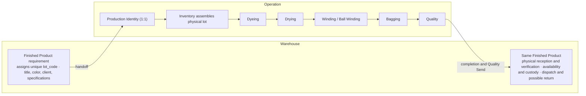
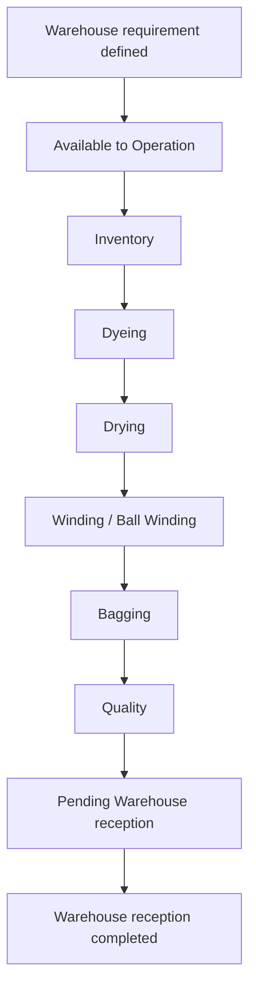

# PRD: Lot Processing

> **Part of:** Operation Unit - Colibri Hub
> **Dependencies:** [Operation Overview](./overview.md), [Warehouse Overview](../warehouse/overview.md), and [Access Control](../access-control.md)
> **Functional records:** [Lot Processing Records](./lot-processing-records.md)
> **Related document:** [Yarn Spinning](./yarn-spinning.md)
> **Next:** `docs/domain/operation/lot-processing.md` (Domain Model)

---

## 1. Purpose and Scope

### 1.1 Purpose

Lot Processing records the Operation segment of the lifecycle that transforms
skeins from Yarn Spinning into the physical Finished Product requested by
Warehouse. It provides sequential traceability for six productive stages while
preserving one business lot and one unique `lot_code` across Warehouse and
Operation.

### 1.2 Contextual identity

Warehouse owns the `Finished Product` from the definition of its production
requirement. That requirement contains the unique `lot_code`, target title,
required color, client or destination, and applicable specifications.

When the requirement becomes available to Operation, Operation creates or
resolves a contextual representation named `Production Identity`. Its rules
are:

1. It maps one to one to the Warehouse Finished Product.
2. It uses the same globally unique `lot_code`.
3. It does not represent another physical product, another order, or another
   inventory item.
4. It allows Operation to own and protect its processing records without
   overwriting Warehouse data.
5. Operation must not generate a parallel business identity or replace the
   `lot_code` supplied by Warehouse.

### 1.3 Lifecycle across contexts

Warehouse creates the business requirement before the physical set of skeins is
assembled. Inventory later assembles that physical set under the already
existing Production Identity and `lot_code`. Physical assembly therefore starts
the productive stage history; it does not create another business lot or code.

The system is the source of this information. Any physical form, route sheet,
or label is a representation of system data and does not establish a separate
identity.

### 1.4 Boundaries

| Boundary | Detail |
| --- | --- |
| **Input** | Warehouse Finished Product requirement represented in Operation by one Production Identity, plus skeins produced in Skeining and available for assembly. |
| **Output** | Completed lot inspected by Quality and sent to Warehouse under the same `lot_code`, with complete Operation-owned processing and quality history. |
| **Owned by Operation** | Production Identity, stage interventions, stage sequence, Operation waste facts, quality state at handoff, and Quality Send. |
| **Not included** | Creation or modification of the Warehouse Finished Product requirement; assignment of another `lot_code`; raw-material issuance; Warehouse physical reception, availability classification, stock, dispatch, or returns; Yarn Spinning production in its five sections. |

### 1.5 Dependencies

- **Warehouse:** Defines the Finished Product requirement and unique `lot_code`.
  Operation consumes authorized requirement data through its Production
  Identity representation.
- **Yarn Spinning:** Skeining produces the skeins that Inventory uses to
  assemble the physical lot.
- **Access Control:** Determines which users may consult, record, or correct
  information in the general Lot Processing and stage-specific scopes.
- **Current business actors:** Inventory, Dyeing Personnel, Packaging, Quality,
  and Supervisor participate according to operational responsibility, but
  those names do not grant permission by themselves.

---

## 2. Lot Processing Workspace

### 2.1 Navigation

The main Lot Processing destination contains:

- **Dashboard**
- **Lot queue**

`Lot detail` is a contextual view opened from a queue row, search result, or
traceability link. It is not a standalone sidebar destination because it
requires a selected lot.

The six process stages are parts of the same lot lifecycle and must not be
presented as six unrelated main-navigation modules.

### 2.2 Dashboard

The dashboard supports authorized consultation and filters such as:

- current phase or stage;
- business date;
- shift;
- target title;
- color;
- lots pending, in process, awaiting Warehouse reception, or completed;
- other indicators validated by the domain.

Filters refine a permitted query. They are not actions, permissions, or scopes.
Labels such as Shift Summary or Daily Summary describe filtered dashboard states
and are not independent capabilities or pages.

### 2.3 Lot queue

The queue provides the transversal information needed to identify and follow a
lot, subject to `Read` in the general Lot Processing scope. Its minimum fields
are:

- `lot_code`;
- target title;
- transversal lifecycle phase or current stage;
- current business actor or responsible area, when applicable;
- last update date and time;
- authorized filters and search criteria.

Stage-specific technical fields are added only when the user has the required
effective `Read` permission for their owning scope. The backend must omit
unauthorized technical data; hiding a component in the frontend is not a
security control.

### 2.4 Lot detail

The contextual detail presents one continuous, permission-sensitive history:

- Warehouse requirement fields needed by Operation;
- the six-stage timeline;
- multiple legitimate interventions in a stage;
- authorized actors, business dates, shifts, timestamps, technical data,
  observations, waste, and correction history;
- applicable registration or correction controls.

When a user lacks `Read` for a stage-specific scope, the system may show only
the transversal state needed to follow the lot. It must not return that stage's
internal technical fields.

### 2.5 Effective permissions

| Effective permission | Functional result |
| --- | --- |
| `Read` in general Lot Processing scope | Consult dashboard, queue, lot detail, and transversal lifecycle data. |
| `Read` in a stage-specific scope | Consult the technical fields owned by that stage in addition to transversal data. |
| `Write` in a stage-specific scope | Register an authorized intervention or domain act for that stage. |
| `Edit` in a stage-specific scope | Correct an authorized record within its operational window. |
| `Edit Outside the Operational Window` in a stage-specific scope | Perform an exceptional correction after the ordinary window closes. |

The exact scope identifiers are defined in the Access Control catalog and
derived specifications. Actions are independent: `Write` does not imply `Read`.
Effective permissions are the union of all active roles assigned to the user.
Role names, shifts, actor fields, and page visibility do not authorize access.

---

## 3. The Six Process Stages

Each lot goes through the stages in strict sequential order. A later-stage
intervention is rejected until the previous stage is complete.

The process usually lasts approximately one to two days and may cross multiple
shifts. Each intervention records only the work actually performed at that
moment. A stage may contain multiple legitimate interventions on the same
business date or shift, including records by different users or at different
times. Business date, shift, actors, and timestamps are history attributes, not
uniqueness keys.

Cross-stage sequence is enforced by the use-case or domain layer. It is not a
cross-table DBML constraint. Corrections remain subject to the audit and
operational-window policy.

### 3.1 Inventory - Physical lot assembly

Inventory resolves the Warehouse Finished Product requirement as the Operation
Production Identity, queries the required title and specifications, selects
available skeins produced by Skeining, and assembles the physical set under the
existing `lot_code`. Color is requirement data used by Dyeing; it is not chosen
by Inventory.

| Aspect | Description |
| --- | --- |
| **Current business actor** | Inventory |
| **When** | When the requirement is available to Operation and sufficient skeins of the required title are available. |
| **Records** | Production Identity and `lot_code`; assembly business date and shift; individual actor; supervisor in charge; target title; number of skeins assembled; total assembled weight. |
| **Possible issues** | Insufficient skeins; weight outside the specified range; incomplete requirement or handoff data. |
| **Result** | The physical lot is assembled under the existing identity and advances to Dyeing. |

### 3.2 Dyeing - Color application

The assembled skeins enter the vats to receive the color specified by the
Warehouse requirement.

| Aspect | Description |
| --- | --- |
| **Current business actor** | Dyeing Personnel |
| **When** | When the assembled lot enters the vats. |
| **Records** | Business date and shift; individual actor; supervisor; quantity received; inherited or actually measured entry weight; vat number; process temperature; re-dyeing fact; categorized observations. |
| **Possible issues** | Non-conforming color; temperature out of range; incorrect or contaminated vat; material mismatch. |
| **Result** | The dyed lot advances to Drying. |

The record must distinguish inherited values from local measurements. If
Dyeing does not have a scale, it must not simulate or claim a weight
measurement.

### 3.3 Drying - Moisture removal

| Aspect | Description |
| --- | --- |
| **Current business actor** | Dyeing Personnel |
| **When** | When the lot leaves Dyeing and enters drying. |
| **Records** | Business date and shift; individual actor; supervisor; quantity received; actual entry weight only when measured; observations and incidents. |
| **Possible issues** | Sequence violation; inconsistent weight; excessive moisture. |
| **Result** | The dried lot advances to Winding or Ball Winding. |

### 3.4 Winding or Ball Winding - Conversion to final format

| Variant | Destination | Product |
| --- | --- | --- |
| **Winding** | Industrial customer | Yarn cones |
| **Ball Winding** | Direct sale or retail | Yarn balls |

| Aspect | Description |
| --- | --- |
| **Current business actor** | Person assigned to Winding or Ball Winding under current policy; this may currently coincide with Packaging. |
| **When** | When the dried skeins are ready for conversion. |
| **Records** | Business date and shift; individual actor; supervisor; variant; input skeins; cones or balls produced; waste and observations. |
| **Possible issues** | Damaged cones; incorrect title; equipment not calibrated; excessive waste. |
| **Result** | The converted lot advances to Bagging. |

### 3.5 Bagging - Final product packaging

| Aspect | Description |
| --- | --- |
| **Current business actor** | Packaging |
| **When** | When cones or balls are ready for packaging. |
| **Records** | Business date and shift; individual actor; supervisor; bags used; cones or balls per bag; waste; observations and label incidents. |
| **Possible issues** | Damaged bags; incorrect label or data sheet; damaged units; count differences. |
| **Result** | The packaged lot advances to Quality. |

### 3.6 Quality - Final inspection and handoff

Quality inspects the complete lot, documents its quality state and defects, and
records the single Quality Send that places the lot in the pending Warehouse
reception phase.

| Aspect | Description |
| --- | --- |
| **Current business actor** | Quality Control |
| **When** | After Bagging and before Warehouse reception. |
| **Records** | Inspection business date and shift; individual actor; supervisor; visible and internal defects; special nomenclature when applicable; quality state; delivery conditions; exact Quality Send timestamp and actor. |
| **Result** | The lot leaves Operation under the same `lot_code` and awaits Warehouse acceptance. |

If the lot does not meet minimum parameters, it is flagged and Operation must
exhaust viable internal resolution options before documenting the conditions in
which it is sent to Warehouse. Quality documents the state at handoff; it does
not determine Warehouse availability or commercial disposition.

---

## 4. Issues, Waste, and History

### 4.1 Categorized observations

Each stage may report issues through an applicable predefined catalog. An
optional free-text detail may add context without replacing the category.

| Stage | Example categories |
| --- | --- |
| **Inventory** | Insufficient skeins; weight out of range; incomplete requirement or handoff data. |
| **Dyeing** | Re-dyeing; temperature out of range; contaminated vat; incorrect material. |
| **Drying** | Weight out of range; excessive moisture. |
| **Winding or Ball Winding** | Damaged cones; incorrect title; equipment not calibrated; excessive waste. |
| **Bagging** | Damaged bags; incorrect label; count mismatch. |
| **Quality** | Double tone; staining; rod marks; nicked skeins; tails; slubs; low or high twist; blend; purging; paraffining; incorrect data sheet; double strand; bad ties; contamination. |

### 4.2 History recording

Each intervention preserves:

- business date;
- shift;
- applicable individual actors;
- system registration timestamp;
- inherited and locally verified data;
- generated technical data;
- observations, waste, and exit condition;
- correction history when applicable.

The current model does not persist physical entry-and-exit timestamp pairs for
each stage. Physical duration is deferred until the business defines which
events start and end the measurement, how they are captured, and what decisions
will use it.

### 4.3 Waste

When the process actually measures weight at consecutive stages, differences
may support waste analysis. The system must not infer a measurement that did not
occur. Each stage retains its own waste record, and authorized transversal
consultation may consolidate those facts without transferring ownership of the
source records.

---

## 5. Lifecycle and Transitions

### 5.1 Business phases

These phases describe business behavior. They are not automatically a canonical
persistence enum.

### 5.2 Transition rules

1. **Existing requirement:** Productive processing requires the Warehouse
   Finished Product requirement and its unique `lot_code`.
2. **Contextual resolution:** Operation must resolve exactly one Production
   Identity for the requirement.
3. **Mandatory sequence:** A later-stage intervention requires completion of
   the prior stage.
4. **Forward movement:** Physical movement proceeds forward through the six
   stages. A correction changes recorded data; it does not silently reverse the
   physical lifecycle.
5. **Multiple interventions:** A stage may have more than one legitimate record.
   Stage completion, not the existence of exactly one row, governs advancement.
6. **Controlled correction:** Every correction preserves the acting user,
   timestamp, prior values, resulting values, and reason.
7. **Operational window:** Ordinary correction requires `Edit` in the owning
   scope and compliance with the current operational window.
8. **Exceptional correction:** Correction after that window requires `Edit
   Outside the Operational Window` in the owning scope.
9. **Single Quality Send:** One send is permitted after Quality completes its
   validation. It records an exact timestamp and actor and places the lot in the
   pending Warehouse reception phase.
10. **Warehouse acceptance:** Only Warehouse reception for the same Finished
    Product and `lot_code` completes the handoff. Coordination notes are not
    acceptance and do not create another send.

### 5.3 Quality state at handoff

| Quality state | Meaning |
| --- | --- |
| **Standard** | Product meets specifications or has only minor conditions within tolerance. |
| **With nomenclature** | Product carries a special designation defined by Quality under current policy. |
| **Flagged** | Product has documented defects or conditions requiring internal resolution or explicit delivery conditions. |

The Quality state is owned by Operation. Warehouse later records a separate
availability or disposition decision; it must not overwrite the Quality state.

---

## 6. Business Rules

1. A lot may cross multiple shifts and business dates without changing its
   identity.
2. Shift is operational and audit context, not an authorization dimension.
3. Warehouse Finished Product and Operation Production Identity maintain a 1:1
   relationship and one `lot_code`.
4. Inventory physical assembly does not create another business lot.
5. Each context writes only the facts it owns.
6. The lot queue and detail may assemble an authorized continuous history
   without exposing unauthorized stage-specific fields.
7. The backend enforces data visibility. Frontend hiding alone is insufficient.
8. Business actors describe current responsibility but do not define fixed
   permissions.
9. `Read`, `Write`, `Edit`, and `Edit Outside the Operational Window` are
   independent actions.
10. Record ownership and actor fields do not expand a user's effective
    permissions.
11. Dashboard filters do not grant or restrict authorization.
12. Operation concludes its productive responsibility with Quality Send, but
    the cross-context handoff remains pending until Warehouse accepts the same
    Finished Product.

---

## 7. Acceptance Criteria

| ID | Criterion |
| --- | --- |
| AC-LP-01 | Operation cannot start Lot Processing without an existing Warehouse Finished Product requirement and unique `lot_code`. |
| AC-LP-02 | Operation creates or resolves exactly one Production Identity for that requirement and retains the same `lot_code`. |
| AC-LP-03 | Inventory can assemble the physical lot without creating another business identity. |
| AC-LP-04 | A later-stage intervention is rejected until the previous stage is complete. |
| AC-LP-05 | Multiple legitimate interventions may be recorded in the same stage, date, or shift. |
| AC-LP-06 | Inherited values are distinguishable from local measurements and verifications. |
| AC-LP-07 | Quality Send can occur only once after Quality completion and records the exact actor and timestamp. |
| AC-LP-08 | Warehouse reception completes the handoff for the same Finished Product and `lot_code`; notes do not count as acceptance. |
| AC-LP-09 | `Read` in general Lot Processing scope provides the dashboard, queue, detail, and authorized transversal information. |
| AC-LP-10 | Stage-specific technical data is returned only when the user has the corresponding effective `Read`. |
| AC-LP-11 | Unauthorized technical data is omitted by the backend, not merely hidden in the UI. |
| AC-LP-12 | `Write` does not grant `Read`, and role names or shifts do not grant access. |
| AC-LP-13 | Every correction retains a complete audit trail and complies with the applicable correction permission and window. |
| AC-LP-14 | Shift Summary and Daily Summary can be produced through filters without becoming independent capabilities or permission scopes. |

---

## 8. Glossary

| Term | Definition |
| --- | --- |
| **Business lot** | The object called Lote by the enterprise throughout the complete Warehouse and Operation lifecycle. |
| **Finished Product** | Warehouse representation of the lot from requirement definition through reception, custody, dispatch, and possible return. |
| **Production Identity** | Operation representation created or resolved one to one from the Warehouse Finished Product requirement under the same `lot_code`. |
| **Lot code** | Globally unique business identifier assigned with the Warehouse requirement and preserved across contexts. |
| **Lot specifications** | Title, color, client or destination, and other production requirements defined by Warehouse. |
| **Physical lot assembly** | Selection and grouping by Inventory of skeins under the existing Production Identity and `lot_code`. |
| **Quality Send** | Single Operation act that records completed Quality validation and places the lot pending Warehouse reception. |
| **Quality state** | Operation-owned description of product quality at handoff. |
| **Warehouse availability** | Separate Warehouse-owned disposition recorded after physical reception. |
| **Winding** | Conversion of skeins into cones for an industrial destination. |
| **Ball Winding** | Conversion of skeins into yarn balls for direct sale or retail. |

## References

- [Operation Overview](./overview.md)
- [Lot Processing Records](./lot-processing-records.md)
- [Warehouse Finished Product](../warehouse/finished-product.md)
- [Access Control](../access-control.md)
