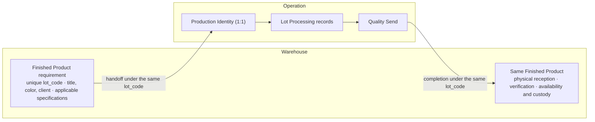

# Operation Unit - Area Overview

> **Area PRD** for the Operation Unit within the Production Directorate.
>
> This document defines the scope, actors, capabilities, and relationships of
> the Operation area. Detailed business rules live in their own PRDs:
>
> - [Yarn Spinning](./yarn-spinning.md) - five productive sections
> - [Lot Processing](./lot-processing.md) - per-lot lifecycle from assembly through delivery

---

## 1. Scope

The Operation Unit transforms raw material received from Warehouse into the
physical Finished Product requested by Warehouse. Operation records productive
facts without assuming custody of Warehouse inventory or redefining the
Finished Product requirement.

For lot-based production, Warehouse creates a Finished Product requirement and
assigns its unique `lot_code`. When that requirement crosses into Operation,
Operation creates or resolves a one-to-one contextual representation named
`Production Identity`. Both representations refer to the same business lot and
retain the same `lot_code` throughout the lifecycle.

| Process | Nature | Granularity |
| --- | --- | --- |
| **Yarn Spinning** | Continuous sequential flow | Machine x shift x yarn title |
| **Lot Processing** | Independent per-lot lifecycle | Lot |
| **Process Quality** | Cross-cutting quality control | All sections and machines |
| **Waste** | Cross-cutting waste registration | Machine group x section or lot stage, as applicable |

### Boundaries

| Boundary | Detail |
| --- | --- |
| **Inputs** | Raw-material bales delivered by Warehouse; Finished Product requirement containing the unique `lot_code`, title, color, client or destination, and applicable specifications; skeins produced by Yarn Spinning for physical lot assembly. |
| **Owned representation** | Operation `Production Identity`, created or resolved one to one from the Warehouse Finished Product requirement under the same `lot_code`. |
| **Outputs** | Completed lots inspected by Quality and sent to Warehouse under the same identity and `lot_code`, with Operation-owned processing and quality records. |
| **Excluded** | Raw-material, Finished Product, and supplies inventory management; Warehouse reception, availability, dispatch, and returns; valuation, costing, and accounting closes. |

---

## 2. Actors

Operational responsibilities and staff assignments are organized per shift.
Each shift has its own Supervisor and dependent staff. Shift identifies
operational and audit context; it does not grant, restrict, or widen
authorization. Users assigned to different shifts may share the same
configurable Access Control role.

| Actor | Reports to | Business responsibility |
| --- | --- | --- |
| **Supervisor** | Production Manager | Coordinates raw-material processing during the shift and consolidates operational records. Does not become a direct registrar unless enabled by access policy. |
| **Quality Control** | Supervisor | Performs quality work across plant sections, documents the lot quality state, and records Quality Send to Warehouse. Currently also registers production and progress for Preparation and Ring Spinning. |
| **Inventory** | Supervisor | Resolves the Warehouse requirement in Operation, assembles the physical lot under the corresponding Production Identity, and tracks it through delivery. Currently registers production and progress for Twisting and Skeining, records real waste across sections, and receives daily raw material from Warehouse. |
| **Dyeing Personnel** | Supervisor | Performs and records the dyeing and drying work within the lot lifecycle. |
| **Packaging** | Supervisor | Coordinates and records winding, ball winding, and bagging operations. |

These names describe current business actors and responsibilities. They are not
mandatory technical roles and do not create a hardcoded role hierarchy. The
organization may use configurable roles or presets inspired by positions such
as Manager, Director, Unit Head, Section Responsible, and Secretary.

A Machine Operator is the person who manipulates production equipment and is
not currently a direct system user. This actor must not be confused with an
RBAC role or preset.

Authorization is assigned through permissions that combine a general action
with an explicit business scope. Organizational responsibility, shift, and
participation in a record do not authorize a user by themselves. See
[Access Control](../access-control.md).

---

## 3. Capabilities

### 3.1 Yarn Spinning

Yarn Spinning transforms raw material through five sequential sections:

1. Preparation
2. Ring Spinning (Continuas)
3. Winding (Bobinados)
4. Twisting (Retorcido)
5. Skeining (Madejeras)

Each section provides its own dashboard and query views for authorized readers,
as well as production-discharge and progress registration according to the
user's effective actions. Detailed rules are defined in
[yarn-spinning.md](./yarn-spinning.md).

### 3.2 Lot Processing

Lot Processing receives the Warehouse Finished Product requirement through the
Operation Production Identity and processes the same business lot through:

1. Inventory - physical lot assembly
2. Dyeing (Tintoreria)
3. Drying (Secado)
4. Winding or Ball Winding (Devanado)
5. Bagging (Embolsado)
6. Quality - final inspection and send to Warehouse

Operation does not assign another `lot_code` or create another business lot.
The Production Identity is an Operation-owned representation used to record
productive facts for the Finished Product requested by Warehouse.

The Lot Processing workspace includes:

- a dashboard for authorized summary and filtered consultation;
- a lot queue containing authorized transversal information;
- a contextual lot detail opened from the queue or another traceability link;
- stage-specific data and controls only when permitted by the user's effective
  actions and scopes.

`Lot detail` is not an independent main-navigation destination because it
requires a selected lot. The six stages are parts of one lifecycle, not six
independent modules in the sidebar.

Detailed rules are defined in [lot-processing.md](./lot-processing.md) and
[lot-processing-records.md](./lot-processing-records.md).

### 3.3 Process Quality

Quality Control performs testing across all plant sections and machines.
Frequency and method vary by section: systematic in Preparation and Ring
Spinning, random in Twisting and Skeining, and machine-record based in Winding.

Process Quality is a transversal responsibility and must be authorizable
independently from section production records and Lot Processing quality.

### 3.4 Waste Registration

Waste is registered by machine group rather than individual machine across Yarn
Spinning sections, and by stage when it belongs to a Lot Processing
intervention. The process distinguishes real waste recorded during production
from accumulated waste managed under current production policy.

Waste is a transversal responsibility and must be authorizable separately from
Process Quality and section production records.

### 3.5 Production Planning

The Production Manager plans raw-material processing based on orders and fixed
monthly base production, currently approximately 60,000 kg per month. The
system supports planned-versus-actual visibility and deviation alerts.

### 3.6 Operational and Consolidated Dashboards

The system presents operational information through interactive dashboards:

- A section dashboard summarizes information within one productive section.
- The Lot Processing dashboard summarizes authorized transversal information
  and stage information permitted by effective scopes.
- The consolidated dashboard may combine information from multiple sections,
  business contexts, or plant areas for supervisory and management consultation.

Labels such as Shift Summary or Daily Summary describe dashboard queries with
filters. They are not independent capabilities, pages, actions, or permission
scopes solely because of the selected time period.

Dashboard access is governed by `Read` in the corresponding business scope.
Access to one or more operational dashboards does not automatically grant
access to the transversal consolidated dashboard. Consolidated `Read` grants no
`Write` or `Edit` permission in the represented operational contexts.

---

## 4. Cross-Context Finished-Product Flow

| Rule | Meaning |
| --- | --- |
| One business lot | Warehouse Finished Product and Operation Production Identity do not represent two physical products. |
| One code | The unique `lot_code` is created with the Warehouse requirement and remains unchanged in Operation. |
| Context-owned writes | Warehouse writes requirement and inventory facts; Operation writes Production Identity, processing, and quality facts. |
| Continuous history | Authorized consultation may assemble a continuous lifecycle without allowing either context to overwrite the other's records. |
| Physical assembly | Inventory assembles the physical set of skeins under the existing identity; this does not create another business lot or code. |

---

## 5. Relationships

| Related area | Relationship |
| --- | --- |
| **Warehouse** | Delivers raw material and defines the Finished Product requirement with the unique `lot_code`. Operation creates or resolves the one-to-one Production Identity, processes the lot, and returns completion and quality facts under the same code. Warehouse then receives the same Finished Product. |
| **Access Control** | Governs which general actions a user may perform in explicit business scopes. Shift, actor name, and record participation remain operational or audit facts, not authorization dimensions. |
| **Production Manager** | Supervises Warehouse and Operation, coordinates production priorities, and consults authorized operational or consolidated information. |
| **Administration** | Consults consolidated production information and prepares reports for Management. Valuation and costing remain outside Operation scope. |

---

## 6. Permission-Sensitive Consultation

Operation views must be built from the union of the user's effective
permissions, not from role names.

- `Read` in a section scope permits its dashboard and authorized records.
- `Read` in the general Lot Processing scope permits the lot queue, dashboard,
  and transversal lot information needed for lifecycle tracking.
- Stage-specific technical fields require `Read` in the corresponding
  authorizable scope.
- `Write`, `Edit`, and `Edit Outside the Operational Window` control their
  respective acts independently and do not imply `Read`.
- The backend must omit unauthorized stage-specific data; hiding fields only in
  the frontend is not an authorization control.
- Several roles are combined and deduplicated before navigation, data, and
  controls are derived.

Exact authorizable scope names belong to the Access Control catalog and derived
specifications. This PRD defines the required functional separation without
hardcoding current job titles as permissions.

---

## 7. Subdomain Map

| Subdomain | PRD | Status |
| --- | --- | --- |
| Yarn Spinning - five sections | [yarn-spinning.md](./yarn-spinning.md) | Active |
| Lot Processing - six stages and lifecycle | [lot-processing.md](./lot-processing.md) | Active |
| Lot Processing functional records | [lot-processing-records.md](./lot-processing-records.md) | Active |
| Process Quality | Included in yarn-spinning.md | Active |
| Waste | Distributed across the detailed Operation PRDs | Active |
| Lot Quality | Included in lot-processing.md | Active |
