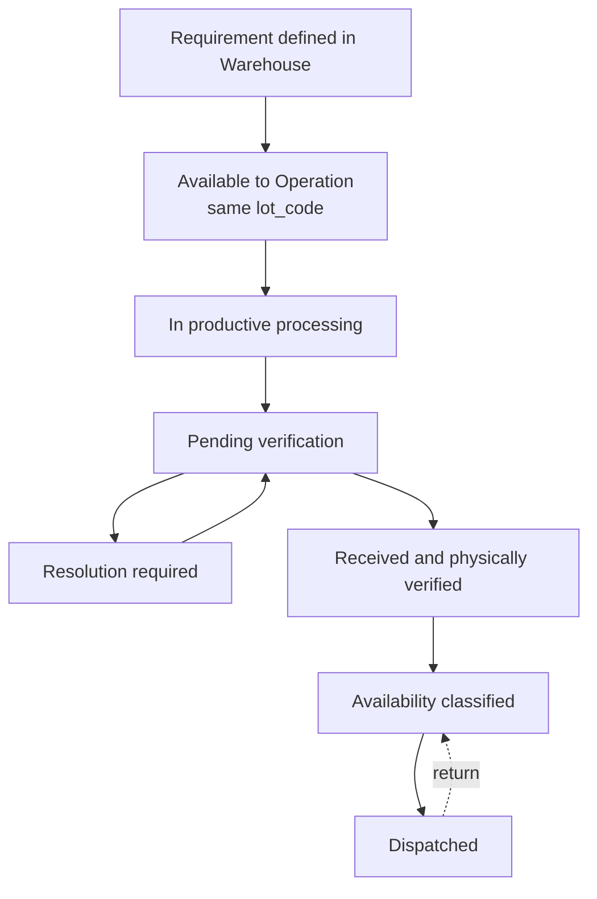

# Finished Product (PT) Management - Normative PRD

> **Authority:** This is the single normative source for finished-product business rules within Warehouse.
> Technical specifications derive from this PRD and may not redefine business rules documented here.

## 1. Business Scope

This PRD defines the complete **Finished Product (PT)** lifecycle within the Warehouse context of Colibri Hub:

- **Requirement definition** before productive processing begins.
- **Handoff to Operation**, where the same lot is represented as `Production Identity` and processed through Lot Processing.
- **Lifecycle consultation** while the lot is under Operation responsibility.
- **Reception and physical verification** when Operation returns the completed lot.
- **Availability classification** for distribution.
- **Dispatch** through sales or internal transfer.
- **Returns** of product that previously left Warehouse.
- **Dashboard and filtered queries** covering the authorized Warehouse portion of the lifecycle.

Warehouse owns one `Finished Product` record throughout this lifecycle. Requirement definition and physical reception are different business acts over the same product; they are not separate Warehouse capabilities.

### Relationship to Other Capabilities

| Capability | Relationship |
| --- | --- |
| Bale Management | Separate raw-material lifecycle; bale delivery does not link bales to this product or its `lot_code` |
| Production Identity (Operation) | Contextual Operation representation of the same physical lot; one-to-one relationship and the same `lot_code` |
| Lot Processing (Operation) | Records productive stages and processing facts for the same lot |
| Production Supplies | Separate stock lifecycle; supplies are not tracked as part of the finished-product identity |

## 2. Core Concept and Context Boundary

Enterprise users call the physical object **Lote** throughout the cycle. Colibri Hub uses different contextual concepts to preserve domain ownership:

| Context | System Concept | Meaning |
| --- | --- | --- |
| Warehouse | `Finished Product` | The product required, later received, classified, stored, dispatched, and possibly returned |
| Operation | `Production Identity` | The representation that allows Operation to process that same product through Lot Processing |

These concepts do not represent two physical products. Their invariants are:

1. There is exactly one physical lot for the flow.
2. There is one globally unique `lot_code` shared across both contextual representations.
3. A Warehouse `Finished Product` maps to exactly one Operation `Production Identity`, and vice versa.
4. Crossing the context boundary does not create, replace, or reassign the business identity.
5. Each context writes only the data under its responsibility.

## 3. Problem Statement

Warehouse must define what is required before production starts and then maintain custody and distribution traceability after Operation completes the work. The business needs:

1. A unique requirement containing client or destination, color, title, classification, and observations.
2. Continuity of the same `lot_code` while Operation physically processes the lot.
3. Visibility into the lot's current phase without duplicating Operation records.
4. Controlled physical verification and reception when the completed product returns.
5. Visibility into availability and condition for distribution decisions.
6. Traceable dispatches and returns.

Without one continuous Finished Product lifecycle, the system may create parallel identities, split the history of the same physical lot, or lose the relationship between the requested and completed product.

## 4. Stakeholders and Business Actors

| Actor | Business Role | Interaction |
| --- | --- | --- |
| Warehouse Personnel | Operational executor | Registers authorized requirements, receptions, classifications, dispatches, and returns |
| Warehouse Unit Manager | Operational supervisor | Oversees Warehouse lifecycle and stock consistency |
| Production Manager | Coordinator or authorizer | Coordinates requirements and performs authorizations assigned by current policy |
| Operations Supervisor | Origin responsible | Coordinates processing and delivery of the completed product to Warehouse |
| System | Automated | Enforces constraints, generates timestamps, and preserves traceability |

These are business actors, not fixed RBAC roles. The assignment of `Read`, `Write`, `Edit`, `Edit Outside the Operational Window`, and authorization permissions is configurable under [`docs/prd/access-control.md`](../access-control.md).

## 5. Finished-Product Requirement

### 5.1 Business Act

Warehouse creates the Finished Product requirement before Operation begins productive processing. This act defines what must be produced and reserves the unique `lot_code` that identifies the physical lot throughout the complete cycle.

Creating the requirement does not mean that a finished physical product already exists in Warehouse stock. It establishes the Warehouse record and the specifications that Operation must process.

### 5.2 Requirement Data

| Attribute | Required | Description |
| --- | --- | --- |
| Lot code | Yes | Globally unique business identifier for the product and its cross-context representations |
| Target title | Yes | Objective yarn title for production |
| Required color | Yes | Color specification |
| Client or destination | Yes | Client or intended destination of the output |
| Type, variant, or classification | When applicable | Additional product classification |
| Requirements or order observations | No | Free-text production requirements |
| Business date of definition | Yes | Calendar date on which Warehouse defines the requirement |
| Responsible actor | Yes | Business actor who performs or authorizes the definition under current policy |

### 5.3 Identity and Requirement Rules

| ID | Rule |
| --- | --- |
| PT-REQ-01 | The `lot_code` is globally unique across the system. |
| PT-REQ-02 | A Finished Product requirement maps to exactly one Operation Production Identity. |
| PT-REQ-03 | The identity cannot be reassigned to a different physical lot or productive flow. |
| PT-REQ-04 | Operation must continue the supplied `lot_code`; it must not create a parallel business identifier. |
| PT-REQ-05 | Requirement definition is independent from bale reception and delivery. |
| PT-REQ-06 | No bale assignment or bale-to-lot relationship is recorded by this capability. |
| PT-REQ-07 | Requirement definition and physical PT reception are two acts over the same Finished Product. |

### 5.4 Handoff to Operation

Completing the requirement makes it available to Operation automatically. No
separate send, approval, or acceptance is required at this boundary. From that
moment:

1. Operation receives the specifications and unique `lot_code`.
2. Operation establishes or resolves its contextual `Production Identity` for the same product.
3. Lot Processing records productive activity under that representation.
4. Warehouse may consult the transversal phase and authorized data, but it does not write Operation processing records.
5. Operation does not overwrite Warehouse requirement data.

## 6. PT Reception from Operation

### 6.1 Business Act

Reception is Warehouse's record that the completed physical product returned by Operation has passed physical verification and entered Warehouse custody. It completes the finished-product handoff and enables classification and distribution.

### 6.2 Boundary Rules

1. Warehouse receives the same Finished Product under the original `lot_code`.
2. Reception does not create a new Finished Product or a new identity.
3. Warehouse does not recreate the productive history; it references the authorized Operation facts.
4. Only one completed-product reception is permitted per Finished Product under the current business rule.
5. Release for reception places the product in pending verification.
6. If Warehouse finds a discrepancy, it records a handoff issue instead of reception. This is not rejection; the product must still be delivered to Warehouse.
7. Operation records a correction, remedy, or clarification through an issue response, after which Warehouse verifies the same product again.
8. Issue and response cycles may repeat until Warehouse records reception.
9. Reception may display data inherited from Operation alongside Warehouse's physical verification.

### 6.3 Data Referenced from Operation

| Attribute | Source | Description |
| --- | --- | --- |
| Lot code | Production Identity | Same unique code originally defined by Warehouse |
| Requirement fields | Warehouse Finished Product | Title, color, client or destination, and classification |
| Productive completion | Lot Processing | Evidence that Operation completed the applicable process |
| Quality state | Lot Processing | Read-only context owned by Operation |
| Route-sheet facts | Lot Processing | Weight, bag count, unit count, and other facts already recorded by Operation |

### 6.4 Data Verified Locally by Warehouse

| Attribute | Description |
| --- | --- |
| Physical presentation received | How the completed product is physically presented |
| Physical consistency | Verification against the authorized Operation facts |
| Visible incidents | Differences or damage observed at reception |

Warehouse does not re-enter Operation-owned route-sheet facts. Before reception,
it compares those facts with the physical product. It records either a handoff
issue or the reception and physical presentation.

### 6.5 Reception Data

| Attribute | Required | Description |
| --- | --- | --- |
| Reception number | Yes | Unique identifier for the reception event |
| Business date of reception | Yes | Calendar date on which Warehouse records physical reception |
| Responsible who receives | Yes | Warehouse actor recording receipt of the product |
| Origin responsible | Yes | Operation actor delivering it |
| Observations or detected differences | No | Free-text notes on discrepancies |

### 6.6 Handoff Issue and Response Cycle

Warehouse records a handoff issue when the physical product does not agree with
the authorized information or when a condition must be corrected, remedied, or
clarified before reception. The issue contains:

- the discrepancy or required clarification;
- the Warehouse actor who reports it;
- the exact reporting time;
- supporting evidence when business policy requires it.

The handoff then requires resolution by Operation. The authorized Operation
actor records an issue response describing the correction, remedy, or
clarification and the exact response time. The response returns the handoff to
pending verification; it does not mean Warehouse has confirmed resolution.

Warehouse performs a new verification. If the product and information agree,
Warehouse records reception. Otherwise, Warehouse records another issue. Every
issue and response is appended to the same chronological handoff history and
retains the same Finished Product, Production Identity relationship, and lot
code.

There is no business outcome named rejection or non-approval in this handoff.
Failure to complete verification leaves the product outside Warehouse stock and
the handoff unresolved; it does not terminate the mandatory delivery.

## 7. PT Availability Classification

### 7.1 Business Act

After reception, Warehouse decides the product's operational disposition for storage, reservation, or distribution.

### 7.2 Boundary Rules

1. Classification occurs only after Warehouse reception.
2. It does not replace the quality assessment owned by Operation.
3. It explicitly separates quality, Warehouse availability, physical presentation, and operational destination.

### 7.3 Availability Catalog

| Status | Meaning |
| --- | --- |
| Disponible | Available for dispatch without conditions |
| Observado | Under Warehouse observation; not immediately available |
| Disponible con condicion | Available with documented conditions |
| Defectuoso | Defective; normally terminal within Warehouse |
| Entregado / Despachado | Already dispatched from Warehouse |

### 7.4 Functional Dimensions

| Dimension | Owner | Examples |
| --- | --- | --- |
| Quality state | Operation | standard / with nomenclature / observed |
| Availability or disposition | Warehouse | available / observed / conditionally available / defective / dispatched |
| Physical presentation | Warehouse | bagged / loose / other relevant presentation |
| Operational modality or destination | Warehouse | industrial / balled / other commercial or operational classification |

### 7.5 Classification Data

| Attribute | Required | Description |
| --- | --- | --- |
| Lot code | Yes | Unique identity of the Finished Product |
| Business date of classification | Yes | Calendar date of the decision |
| Quality state | Read-only context | Operation-owned information used as authorized context |
| Availability condition | Yes | Warehouse-owned operational disposition |
| Physical presentation | When applicable | Storage modality |
| Intended destination | When known | Planned product destination |
| Warehouse observations | No | Free-text notes |
| Reason for change | When correcting | Justification for a revised classification |

`Defectuoso` is a terminal Warehouse disposition under the current rule. It is not treated as waste and does not normally return to an available state.

## 8. PT Dispatch

### 8.1 Business Act

Dispatch is the exit of finished product from Warehouse custody.

### 8.2 Dispatch Types

| Type | Description |
| --- | --- |
| Direct sale to client | Product leaves Warehouse for the client |
| Transfer to Marketing/Sales | Product leaves Warehouse through an internal transfer |

### 8.3 Dispatch Data

| Attribute | Required | Description |
| --- | --- | --- |
| Dispatch number | Yes | Unique identifier for the dispatch |
| Dispatch type | Yes | One of the functional types above |
| Business date of dispatch | Yes | Calendar date of the dispatch |
| Affected product(s) | Yes | Finished Products identified by `lot_code` |
| Quantity dispatched | Yes | Quantity and applicable unit |
| Destination | Yes | Client or internal area |
| Commercial reference | When applicable | Invoice, order, or related reference |
| Responsible who delivers | Yes | Warehouse actor executing the dispatch |
| Operational authorization | Yes | Authorization required by current policy |
| Observations | No | Free-text notes |

## 9. PT Returns

### 9.1 Business Act

A return is the total or partial reentry of a Finished Product that was previously dispatched from Warehouse.

### 9.2 Boundary Rules

1. A return reintroduces stock into Warehouse custody.
2. It references the original dispatch.
3. It keeps the original Finished Product and `lot_code`.
4. It does not create a new Production Identity or Finished Product requirement.

### 9.3 Return Data

| Attribute | Required | Description |
| --- | --- | --- |
| Return number | Yes | Unique identifier for the return |
| Business date of return | Yes | Calendar date of the return |
| Original dispatch | Yes | Reference to the dispatch that caused the exit |
| Returned product(s) | Yes | Finished Products identified by `lot_code` |
| Quantity returned | Yes | Quantity and applicable unit |
| Reason or condition | Yes | Reason for the return |
| Responsible who receives | Yes | Warehouse actor accepting the return |
| Physical-state observations | No | Condition or claim notes |

## 10. Lifecycle and Phases

The following phases describe the business lifecycle without prescribing a
technical state representation.

| ID | Rule |
| --- | --- |
| PT-ST-01 | Productive processing requires an existing Finished Product requirement and its `lot_code`. |
| PT-ST-02 | Operation continues the same lot through its Production Identity representation. |
| PT-ST-03 | Warehouse reception requires the applicable Operation completion or delivery fact. |
| PT-ST-04 | A handoff issue places the product in resolution required without ending the mandatory handoff. |
| PT-ST-05 | An Operation issue response returns the same product to pending verification. |
| PT-ST-06 | Issue and response cycles may repeat until reception is recorded. |
| PT-ST-07 | Availability classification requires Warehouse reception. |
| PT-ST-08 | Dispatch requires a dispatchable Warehouse availability condition. |
| PT-ST-09 | A return requires a prior dispatch and reintroduces stock under the same `lot_code`. |
| PT-ST-10 | Only one completed-product reception is permitted per Finished Product under the current rule. |

## 11. Dashboard and Query Capabilities

### 11.1 Purpose

The Finished Products workspace provides a dashboard and filtered records so authorized users can consult the Warehouse lifecycle without navigating through independent requirement and reception modules.

### 11.2 Minimum Query Views

- Products grouped or filtered by lifecycle phase.
- Requirements pending handoff or productive processing.
- Products in processing, pending verification, or requiring resolution, using only authorized transversal Operation data.
- Received products awaiting availability classification.
- Available, observed, conditionally available, defective, or dispatched products.
- Dispatch and return history.
- Detail by unique `lot_code`.

The exact dashboard indicators and technical projections are defined by derived specifications. Date, phase, client, title, color, availability, and destination are query filters, not permissions.

### 11.3 Permission Behavior

- `Read` permits dashboard, detail, and history consultation for the authorized scope.
- `Write` permits only the registration acts authorized for the scope.
- `Edit` and `Edit Outside the Operational Window` govern corrections.
- These actions are independent; `Write` does not grant `Read` implicitly.
- Operation-owned information is visible only with the corresponding effective
  read permission. Otherwise, the Warehouse view contains only the transversal
  lifecycle information authorized for consultation.

## 12. Cross-Cutting Rules

1. **Business date vs system timestamp:** Each business act records a calendar date entered by the actor. The system registration timestamp is separate and automatic.
2. **Correction with audit:** Corrections preserve actor, timestamp, reason, and before/after values.
3. **Operational window:** Correction rights follow the independent `Edit` and `Edit Outside the Operational Window` actions defined by access policy.
4. **Configurable permissions:** Business actors do not imply fixed technical roles or permissions.
5. **Domain write separation:** Warehouse writes Finished Product requirement and inventory facts. Operation writes Production Identity, processing, and quality facts. Neither overwrites the other.
6. **Enforced visibility:** Scope-specific Operation information is not disclosed
   to an unauthorized user merely because the interface could hide it.

## 13. Acceptance Criteria

| ID | Criterion |
| --- | --- |
| AC-PT-01 | Warehouse can create a Finished Product requirement with all required fields in one operation. |
| AC-PT-02 | A duplicate `lot_code` is rejected with a clear conflict result. |
| AC-PT-03 | Operation receives or resolves one Production Identity for the same Finished Product and `lot_code`. |
| AC-PT-04 | Requirement creation does not require or record bale linkage. |
| AC-PT-05 | Warehouse can consult the authorized transversal phase while the product is in Operation. |
| AC-PT-06 | Release for reception places the completed product in pending verification under the original Finished Product and `lot_code`. |
| AC-PT-07 | Warehouse can record a handoff issue instead of reception when a discrepancy requires correction, remedy, or clarification. |
| AC-PT-08 | Operation can record an issue response that returns the same handoff to pending verification. |
| AC-PT-09 | Issue and response cycles can repeat without creating another release, identity, or Finished Product. |
| AC-PT-10 | Completed product can be received once after successful verification under the original Finished Product and `lot_code`. |
| AC-PT-11 | Reception records custody and physical presentation without re-entering Operation-owned route-sheet data. |
| AC-PT-12 | Classification requires prior Warehouse reception. |
| AC-PT-13 | Dispatch requires a dispatchable availability condition and records type, quantity, destination, and authorization. |
| AC-PT-14 | A return references the original dispatch and preserves the original Finished Product and `lot_code`. |
| AC-PT-15 | `Read` provides authorized dashboard and query access without granting registration rights. |
| AC-PT-16 | Unauthorized context-specific information is not disclosed, regardless of interface visibility. |
| AC-PT-17 | All business dates are calendar dates and all registration timestamps are system-generated. |

## References

- [Bale Management PRD](./bale-management.md) - separate raw-material lifecycle
- [Production Supplies PRD](./production-supplies.md) - separate supplies lifecycle
- [Warehouse Area PRD](./overview.md) - area-level overview
- [Access Control](../access-control.md) - permission policies
- [Operation Overview](../operation/overview.md) - contextual Production Identity and productive responsibility
- [Lot Processing Records](../operation/lot-processing-records.md) - Operation-owned production data
