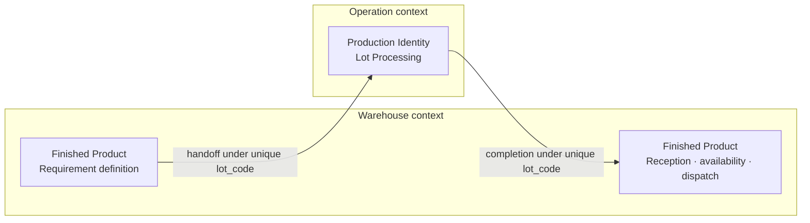

# Warehouse Area Overview

> **Part of:** Production Directorate - Colibri Hub
> **Dependencies:** [`docs/prd/product-overview.md`](../product-overview.md) (Master PRD)
> **Domain model:** [`docs/domain/warehouse.md`](../../domain/warehouse.md)

## 1. Purpose

The Warehouse unit manages the physical custody and traceability of raw materials, finished products, and production supplies. It records stock movements, maintains inventory accuracy, defines finished-product requirements, receives completed production, and supports operational queries for each Warehouse area.

This document defines the area-level scope, responsibilities, and capabilities. Detailed business rules for each capability are maintained in their own PRDs.

## 2. Scope

Warehouse is organized into three business areas:

1. **Raw Materials** - reception, custody, query, and delivery of raw-material bales to Production.
2. **Finished Products** - definition of the product requirement, continuity of the same lot through Operations, reception of the completed product, availability, storage, dispatch, and returns.
3. **Supplies** - reception, custody, consumption exits, supplier returns, and stock visibility for production supplies.

Warehouse also covers:

- Stock movement history and auditability.
- Dashboard and filtered queries for each of the three business areas.
- Periodic stock closings (monthly, annual, and extraordinary).

### Out of scope

- The six productive stages and their state machine (see [Operation Overview](../operation/overview.md)).
- Internal Operation records for lot processing, process quality, and real waste.
- Invoicing, accounting, and fiscal books.
- Detailed data model and API design (see `docs/domain/` and technical specifications).

## 3. Organizational Context

The Warehouse unit reports to the **Production Directorate** through the **Production Manager**.

```text
Production Directorate
|- Production Manager
   |- Warehouse Unit
   |  |- Warehouse Unit Manager
   |     |- Operational Assistants
   |- Operations Unit
      |- Supervisors (1 per shift)
```

### Business Actors

| Actor | Business Responsibilities |
| --- | --- |
| **Warehouse Unit Manager** | Supervises raw-material reception and delivery, finished-product requirements and custody, supply movements, and stock control. |
| **Operational Assistant** | Executes authorized physical and registration activities such as reception, verification, delivery, classification, and dispatch. |
| **Production Manager** | Coordinates production requirements and performs the authorizations assigned by current operational policy. |

These are business actors, not fixed RBAC roles. Permission assignment is cross-cutting and defined in [`docs/prd/access-control.md`](../access-control.md).

## 4. Capabilities

| Business Area | Capability | Description | PRD |
| --- | --- | --- | --- |
| **Raw Materials** | **Bale Management** | Dashboard and queries, supplier reception, bale custody, and delivery to Production | [`bale-management.md`](bale-management.md) |
| **Finished Products** | **Finished Product Management** | Dashboard and queries, requirement definition, handoff to Operations, reception, availability, dispatch, and returns | [`finished-product.md`](finished-product.md) |
| **Supplies** | **Production Supplies** | Dashboard and queries, reception, consumption exits, supplier returns, and stock by item and unit | [`production-supplies.md`](production-supplies.md) |

`Production Identity` is not an independent Warehouse capability. Warehouse owns the `Finished Product` from requirement definition onward. When the requirement crosses into Operation, Operation uses its contextual representation, `Production Identity`, to process the same physical lot. The two representations have a one-to-one relationship and share the same unique `lot_code`.

### Query and Registration Model

Each business area provides a dashboard or equivalent query workspace in addition to its registration flows:

- `Read` permits consultation of the authorized area's dashboard, records, and history.
- `Write` permits the authorized registration operations for that area.
- `Edit` and `Edit Outside the Operational Window` govern corrections according to policy.
- Actions are independent. `Write` does not implicitly grant `Read`.
- Filters such as date, status, category, or destination refine a permitted query; they are not permissions.
- The UI is derived from the union of the user's effective permissions and does not infer access from business titles or role names.

### Cross-Cutting Concerns

- **Movement history and change tracking** - every correction preserves actor, timestamp, reason, and before/after values.
- **Stock closings** - monthly, annual, and extraordinary closings freeze movements and compute balances using `(Previous Balance + Entries) - Exits = Balance`.
- **Configurable permissions** - registration, authorization, consultation, and correction permissions can be reassigned without altering functional flows.

## 5. Operating Principles

1. **One Warehouse finished-product lifecycle.** Requirement definition, return from Operations, availability, dispatch, and possible return are phases of the same Warehouse `Finished Product`; they are not separate Warehouse capabilities.
2. **One physical lot and one lot code.** Warehouse `Finished Product` and Operation `Production Identity` are contextual representations of the same physical lot, related one to one through a single globally unique `lot_code`.
3. **Raw-material delivery remains independent.** Bale reception and delivery do not assign bales to a finished-product requirement or `lot_code` unless a future explicit requirement introduces that association.
4. **Mandatory traceability.** The lot keeps an auditable history from Warehouse requirement definition through Operation processing and subsequent Warehouse movements.
5. **Each context writes its own history.** Warehouse writes requirement and inventory facts; Operation writes processing and quality facts. Neither context overwrites the other's data.
6. **Balance consistency.** System stock must match physical stock; discrepancies require documented adjustments.
7. **Two finished-product exit channels.** Finished product exits either through direct sale to a client or transfer to Marketing/Sales.
8. **Configurable permissions.** Authorization assignments can change by organizational policy without redesigning Warehouse processes.

## 6. Finished-Product Continuity Across Contexts



| Phase | Owning Context | Contextual Representation | Responsibility |
| --- | --- | --- | --- |
| Requirement definition | Warehouse | Finished Product | Defines `lot_code`, client or destination, color, title, classification, and requirements |
| Productive processing | Operation | Production Identity and Lot Processing | Continues the same `lot_code` and records the productive stages |
| Physical reception | Warehouse | Same Finished Product | Accepts the completed lot and records physical verification and differences |
| Inventory and distribution | Warehouse | Same Finished Product | Manages availability, custody, dispatch, and returns |

The change of representation at a context boundary does not create a second product, a second lot, or a second business identity.

## 7. Dependencies

### Warehouse Depends On

| Dependency | Reason |
| --- | --- |
| [Operation Overview](../operation/overview.md) | Sends the finished-product requirement to Operation and receives productive completion data under the same `lot_code` |
| [`docs/prd/access-control.md`](../access-control.md) | Effective actions, scopes, and authorization model |
| [Master PRD](../product-overview.md) | Product-wide actors, data capture, dashboard, and traceability principles |

### Other Areas Depend On Warehouse

| Dependent | Reason |
| --- | --- |
| **Operation** | Receives raw-material bales and the finished-product requirement to be processed under a contextual Production Identity |
| **Marketing/Sales** | Receives finished-product transfers for unit sales |
| **Production Manager** | Consults stock and lifecycle information and performs currently assigned authorizations |

## 8. Domain Boundary

| Context | Writes | May Read When Authorized | Does Not Own |
| --- | --- | --- | --- |
| **Warehouse** | Bale reception and delivery; finished-product requirement, reception, availability, dispatch, and returns; supply movements | Operation completion and quality context required for Warehouse decisions | Productive-stage records, process quality, real waste |
| **Operation** | Production Identity representation, six lot stages, process quality, and real waste | Finished-product requirement and raw-material delivery information required for processing | Internal Warehouse balances and inventory movements |

The lot history is unified for consultation, but access to its data remains constrained by effective permissions. Each context writes only the portion under its responsibility.
