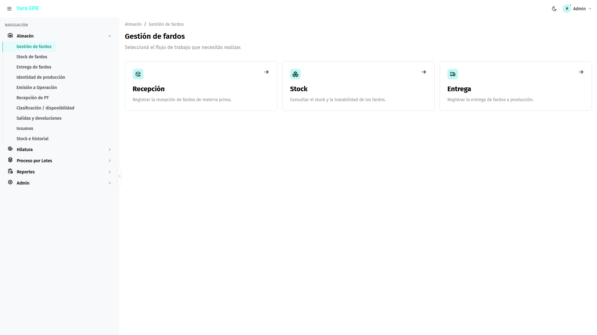
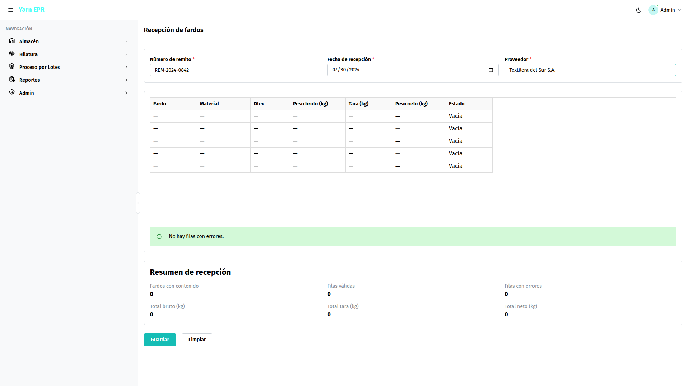
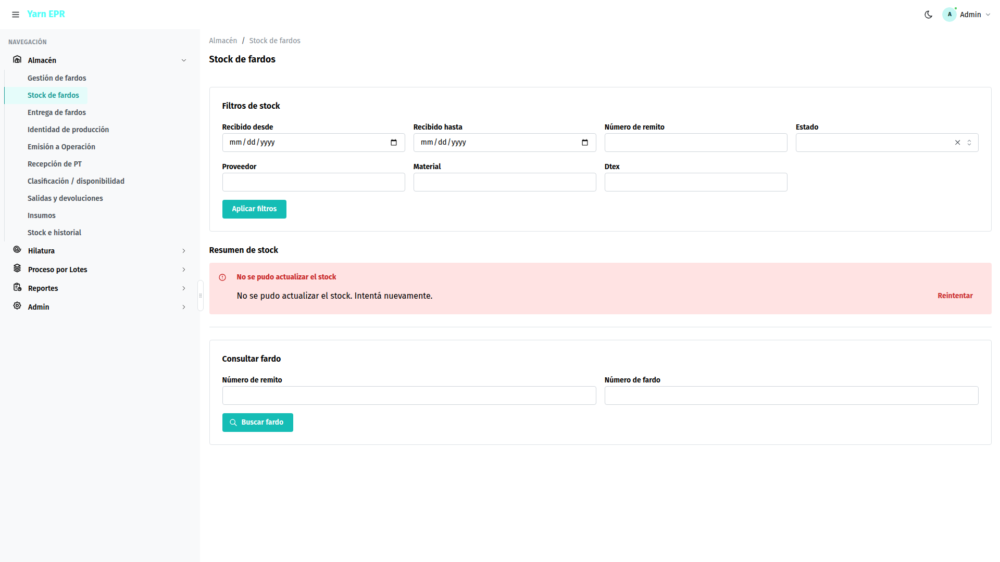
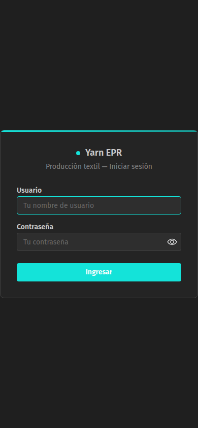
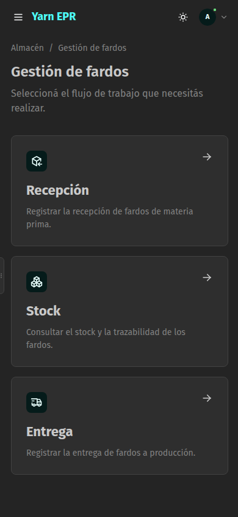
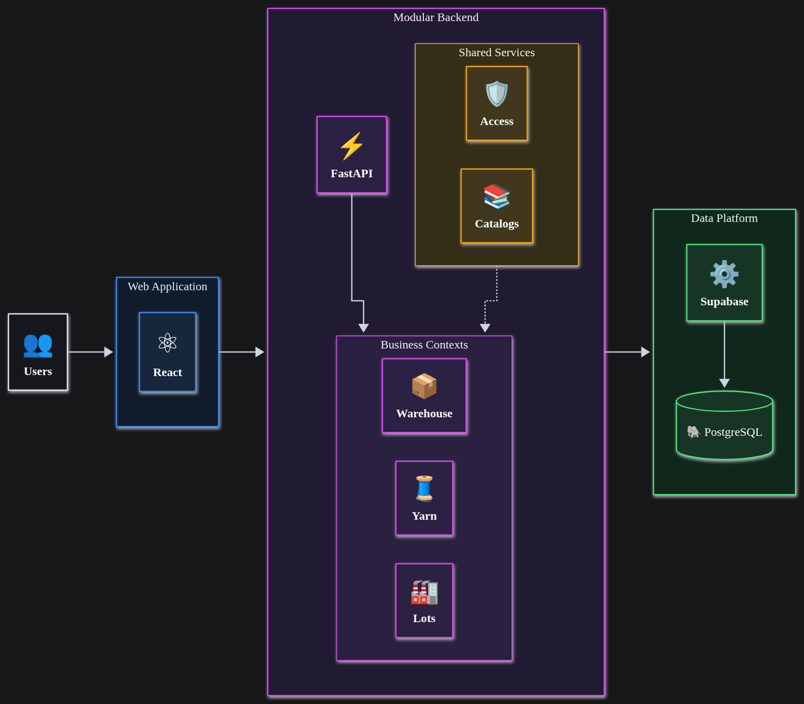

# Colibri Hub — Reporte 1

**Fecha de corte:** 30 de julio de 2026
**Estado:** Primer módulo empresarial integrado
**Área funcional implementada:** Gestión de materia prima en Almacén

---

## 1. Avance alcanzado

Colibri Hub ya cuenta con un módulo funcional que permite controlar el ciclo de los fardos de materia prima, desde su ingreso al almacén hasta su entrega a producción.

El avance integra en una misma solución:

* interfaz web para el personal operativo;
* procesamiento y validación de las operaciones;
* almacenamiento estructurado de la información;
* consultas de inventario y trazabilidad;
* pruebas automáticas;
* documentación funcional y tecnológica;
* diseño adaptable a escritorio, tablet y dispositivos móviles.

Los componentes de frontend y backend fueron incorporados a la rama principal del proyecto mediante entregas independientes y posteriormente integradas.

*Vista principal de Gestión de fardos, mostrando los accesos a Recepción, Stock y Entrega.*

---

## 2. Funcionalidades disponibles

### Recepción masiva de materia prima

El sistema permite registrar una partida completa mediante una tabla similar a una hoja de cálculo.

Incluye:

* número de remito o partida;
* fecha de recepción;
* proveedor;
* identificación individual de cada fardo;
* tipo de material y Dtex;
* peso bruto y peso del envase;
* cálculo automático del peso neto;
* carga de hasta 100 fardos por operación;
* validación de datos antes de guardar;
* identificación visual de filas y campos con errores;
* confirmación del resultado de la recepción.

Este diseño reduce el tiempo de registro y evita crear formularios separados para cada fardo.

### Control de inventario y trazabilidad

La consulta de stock permite:

* conocer la cantidad total de fardos;
* diferenciar material disponible y entregado;
* visualizar pesos netos acumulados;
* filtrar por fechas, estado, proveedor, material y Dtex;
* buscar un fardo por remito y número;
* consultar su información y estado actual;
* identificar su fecha de recepción y, cuando corresponde, su fecha de entrega.

### Entrega de fardos a producción

La operación de entrega permite:

* seleccionar varios fardos en una sola acción;
* registrar la fecha efectiva de salida;
* verificar existencia y disponibilidad;
* impedir entregas duplicadas;
* actualizar automáticamente el inventario;
* mostrar el resultado individual de cada fardo;
* conservar los casos exitosos aunque otro registro presente un error.

*Pantalla de recepción con una partida cargada y el resumen de pesos.*

*Pantalla de stock con filtros e indicadores consolidados.*

| Tema claro (mobile) | Tema oscuro (mobile) |
|:-:|:-:|
|  |  |
*Vistas responsive en dispositivo móvil con tema oscuro (login) y claro (gestión de fardos).*

---

## 3. Arquitectura tecnológica

Colibri Hub fue construido como una plataforma modular. La interfaz utilizada por el personal se mantiene separada de las reglas operativas y del almacenamiento de datos.

Esta separación permite modificar la presentación, incorporar nuevos módulos o cambiar servicios tecnológicos sin reconstruir el sistema completo.

El diagrama utiliza la sintaxis de arquitectura de Mermaid, diseñada para representar servicios, recursos, agrupaciones y sus relaciones.

### Tecnologías aplicadas

| Componente                   | Aplicación en el proyecto                     |
| ---------------------------- | --------------------------------------------- |
| React y TypeScript           | Interfaz web y experiencia de usuario         |
| Mantine UI                   | Componentes visuales, temas y responsive      |
| React Data Grid              | Registro masivo similar a una hoja de cálculo |
| FastAPI y Python             | Procesamiento de las operaciones              |
| PostgreSQL y Supabase        | Persistencia y administración de datos        |
| Arquitectura Hexagonal y DDD | Organización de reglas y módulos              |
| Pruebas automáticas          | Verificación de operaciones y contratos       |
| GitHub y Pull Requests       | Control de cambios y revisión del desarrollo  |

La estructura general del repositorio separa frontend, backend, base de datos y documentación, facilitando el mantenimiento y la evolución del producto.

---

## 4. Calidad del desarrollo

El módulo incorpora controles para proteger la consistencia de la información:

* validación de pesos y fechas;
* prevención de identificadores repetidos;
* cálculo centralizado del peso neto;
* protección contra entregas duplicadas;
* actualización segura del estado de los fardos;
* manejo uniforme de errores;
* optimización de consultas por fecha, estado y material;
* validación de las operaciones publicadas por el backend.

Las pruebas automáticas cubren las cuatro funciones principales: recepción, resumen de stock, consulta individual y entrega. También verifican contratos de información, fechas y almacenamiento.

---

## 5. Documentación y preparación para crecimiento

El proyecto dispone de documentación sobre:

* alcance del producto;
* procesos de Almacén y Producción;
* actores y responsabilidades;
* reglas de trazabilidad;
* permisos y control de acceso;
* arquitectura del sistema;
* modelo de datos;
* diseño de interfaz y accesibilidad;
* convenciones de desarrollo;
* requerimientos de gestión de fardos.

La documentación ya contempla la incorporación progresiva de producción por turnos, procesamiento de lotes, calidad, desperdicios, producto terminado y reportes consolidados.

---

## 6. Resultado

Colibri Hub ha superado la etapa de prototipo y dispone de un **primer módulo empresarial integrado**, con interfaz operativa, reglas de negocio, base de datos, trazabilidad, validaciones, pruebas y documentación.

La plataforma queda preparada para ampliar sus capacidades hacia Producción, Calidad, Lotes y Producto Terminado sin reconstruir las funcionalidades existentes.

---
