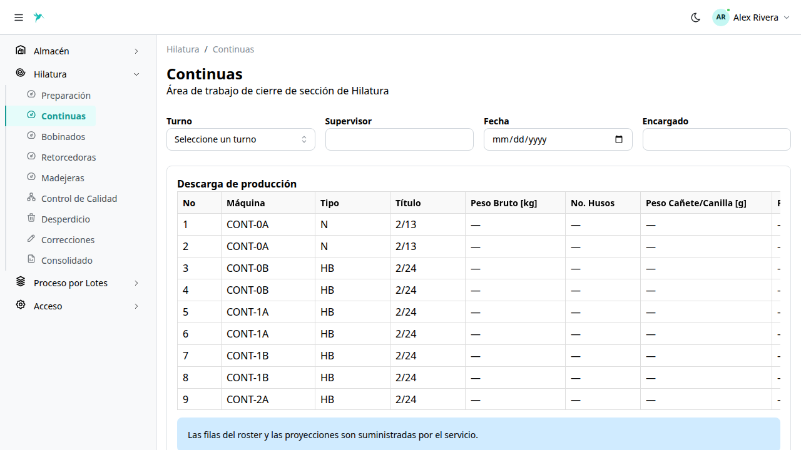
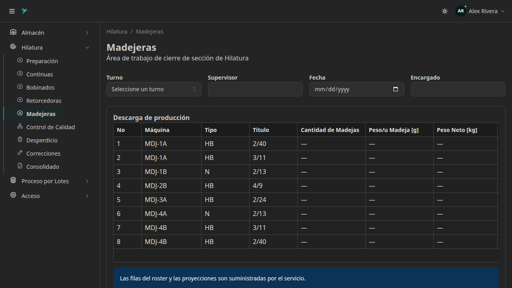
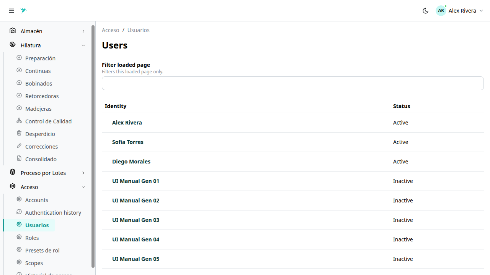
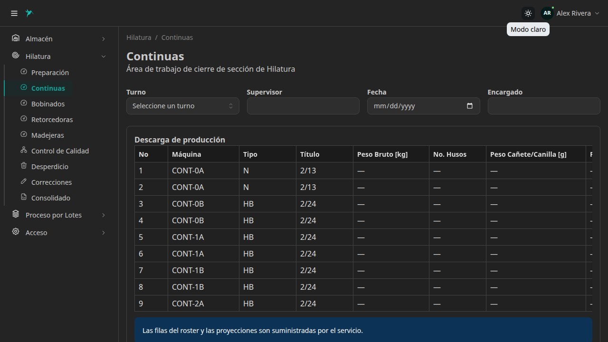
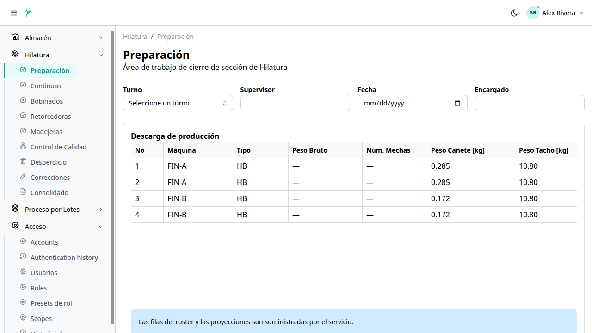
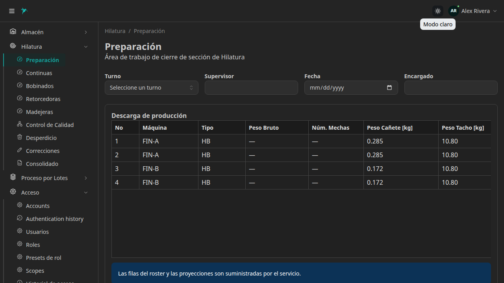

# Colibri Hub — Reporte 2

**Fecha de corte:** 1 de septiembre de 2026
**Estado:** Módulo de Hilatura integrado y sistema de control de acceso mejorado
**Áreas funcionales implementadas:** Hilatura (producción por turnos) y Control de Acceso

---

## 1. Avance alcanzado

Colibri Hub incorpora un nuevo módulo de producción para la industria hilandera y mejora significativamente el sistema de control de acceso. El avance extiende la plataforma con capacidades para gestionar el ciclo completo de hilatura, desde la preparación de materia prima hasta el producto terminado, mientras se fortalece la administración de usuarios y permisos.

El nuevo período integra:

* módulo de Hilatura con nueve secciones de producción;
* formularios de captura por sección con campos específicos;
* grillas de datos para descarga de producción y avance;
* sistema de correcciones para registros históricos;
* administración de usuarios, roles y permisos;
* historial de autenticación y acceso;
* mejoras en la experiencia de usuario y navegación;
* diseño adaptable a escritorio, tablet y dispositivos móviles.

*Vista de la sección Continuas, mostrando la grilla de descarga de producción con las máquinas del turno.*

---

## 2. Funcionalidades disponibles

### Módulo de Hilatura

Las secciones operan actualmente con datos de demostración para presentación. La integración con el backend está en fase de preparación.

El sistema permite gestionar las nueve secciones del proceso de hilatura:

* **Preparación:** control de máquinas de preparación de materia prima;
* **Continuas (Anillado):** gestión de máquinas de anillado con datos de producción por turno;
* **Bobinados:** control de máquinas de bobinado;
* **Retorcedoras:** gestión de máquinas de retorcido;
* **Madejeras:** control de máquinas de madejado con datos de producción;
* **Control de Calidad:** captura de perfiles y muestras de calidad;
* **Desperdicio:** registro de desperdicio por sección y máquina;
* **Correcciones:** búsqueda y corrección de registros históricos;
* **Consolidado:** vista consolidada de producción por turno.

Cada sección incluye:

* formulario de captura con turno, supervisor, fecha y encargado;
* grilla de descarga de producción con datos de máquinas y tipos de hilo;
* grilla de avance con pesos de entrada, salida y descarga;
* filtros por fecha, turno, máquina y título de hilo;
* indicadores de producción consolidados.

*Vista de la sección Madejeras, mostrando la grilla de producción con las máquinas del turno.*

### Control de Acceso mejorado

El sistema de administración de acceso incorpora:

* gestión de usuarios con información de cuenta y roles;
* administración de roles y permisos por contexto;
* presets de rol para asignación rápida;
* scopes de permisos por módulo;
* historial de autenticación con registros de inicio de sesión;
* historial de acceso con seguimiento de operaciones.

*Panel de administración de usuarios, mostrando la lista de usuarios del sistema y sus roles asignados.*

### Mejoras de experiencia de usuario

Las mejoras implementadas incluyen:

* sidebar colapsable con secciones organizadas por módulo;
* navegación mejorada con breadcrumbs;
* formularios con validación y estados de carga;
* tablas con scroll horizontal para datos extensos;
* toggle de tema claro y oscuro funcional;
* diseño responsive para tablet y dispositivos móviles.

*Vista de la sección Continuas con tema oscuro aplicado.*

---

## 3. Arquitectura y diseño

Colibri Hub mantiene su arquitectura modular, donde la interfaz de usuario se separa de las reglas de negocio y del almacenamiento de datos. El módulo de Hilatura sigue esta misma estructura, permitiendo modificar la presentación o incorporar nuevas secciones sin reconstruir el sistema completo.

El diseño responsive garantiza que el sistema sea utilizable en diferentes dispositivos:

* **Escritorio:** vista completa con sidebar y grillas amplias;
* **Tablet:** adaptación del layout para pantallas intermedias;
* **Móvil:** diseño optimizado para operaciones en campo.

| Tema claro (desktop) | Tema oscuro (desktop) |
|:-:|:-:|
|  |  |
*Vistas de Hilatura con temas claro y oscuro en dispositivo de escritorio.*

---

## 4. Calidad del desarrollo

El módulo de Hilatura incorpora controles para proteger la consistencia de la información:

* validación de datos de producción por sección;
* prevención de registros duplicados;
* manejo uniforme de errores;
* optimización de consultas por fecha, turno y máquina;
* validación de datos en la interfaz.

El sistema de control de acceso incluye:

* autenticación segura con tokens;
* control de permisos por contexto y rol;
* registro de operaciones para auditoría;
* protección de rutas según permisos del usuario.

---

## 5. Documentación y preparación para crecimiento

El proyecto dispone de documentación actualizada sobre:

* alcance del producto y módulos implementados;
* procesos de Hilatura y Producción;
* actores y responsabilidades por sección;
* reglas de trazabilidad de producción;
* permisos y control de acceso por contexto;
* arquitectura del sistema y componentes;
* modelo de datos por módulo;
* diseño de interfaz y patrones de usuario;
* convenciones de desarrollo.

La documentación ya contempla la incorporación progresiva de procesamiento de hilatura, calidad, desperdicios.

---

## 6. Resultado

Colibri Hub ha completado la integración del **módulo de Hilatura**, con nueve secciones de producción que cubren el ciclo completo de hilandería, y ha fortalecido el **sistema de control de acceso** con herramientas administrativas completas.

La plataforma cuenta ahora con dos módulos empresariales funcionales — Almacén y Hilatura — preparados para ampliar sus capacidades hacia Lotes y Producto Terminado sin reconstruir las funcionalidades existentes.

### Próximos pasos

* **Backend de Hilatura:** integración de la lógica de negocio y persistencia de datos para las cinco secciones productivas, calidad y desperdicio.
* **Trazabilidad de lotes:** implementación de las seis etapas del proceso de lotes (Inventario → Tintorería → Secado → Devanado → Embolsado → Calidad).
* **Gestión de Producto Terminado en Almacén:** recepción, clasificación de disponibilidad y despacho de producto terminado.

---
