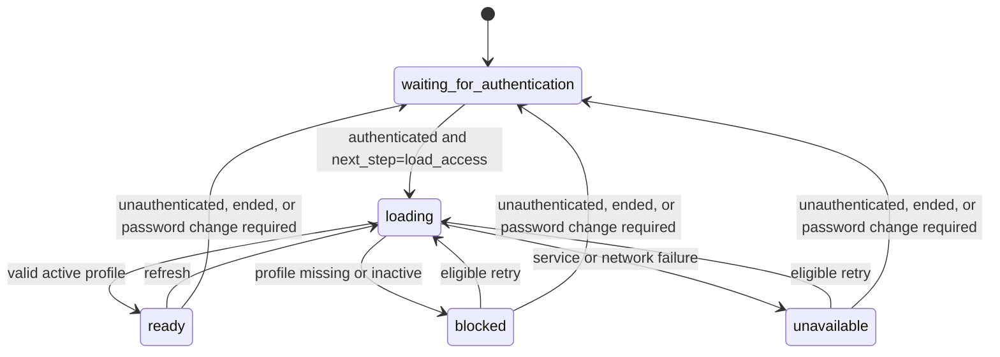

# Technical Specification - Frontend Access Control

> **Normative PRDs:** [Access Control](../../../docs/prd/access-control.md) and
> [Authentication](../../../docs/prd/auth.md)
>
> The PRDs are authoritative for business behavior. This specification defines
> the frontend consequences of those rules and the backend contracts it consumes.

## 1. Purpose and boundary

The Access Control frontend consumes backend-resolved effective authorization to
shape navigation, protect client routes, control action availability, and present
Access administration. These controls improve the experience; the backend still
authorizes every protected request against the authenticated identity and actual
business scope.

Access Control owns the presentation of effective authorization, access profiles,
roles, presets, scopes, assignments, and access history. Authentication separately
owns entry, credentials, account state, and sessions. The unified account
experience consumes both capability contracts without transferring ownership
between them.

The authorization foundation is responsible for bootstrap, effective Access
state, exact permission checks, navigation, routes, and protected actions. Access
administration is responsible for profile lifecycle, assignments, roles, presets,
scopes, previews, concurrency feedback, and access history. Neither responsibility
changes the other's authority or creates a frontend authorization source of truth.

Implementation follows the [Frontend Architecture Overview](../architecture/overview.md).
Technology families are owned by the
[Technology Baseline](../../../docs/architecture/technology-baseline.md), exact
dependencies by repository manifests, styling by
[Frontend Styling](../../../docs/dev-guide/frontend-styling.md) and
[Visual Identity](../design-system/visual-identity.md), accessibility by the
[Accessibility Guidelines](../accessibility.md), and verification levels by the
[Frontend Testing Strategy](../testing/strategy.md).

## 2. Authorization contract

### 2.1 Frontend model and contract adaptation

The supported action values are exactly:

- `read`
- `write`
- `edit`
- `edit_outside_window`
- `manage_access`

An action comes from the backend contract and business operation. It is not
inferred from an HTTP method, control label, route name, or job title.

The stable frontend authorization model contains:

- permissions expressed as an action and an exact scope identifier;
- assigned-role summaries containing identity, stable code, and display name;
- either an ordinary grant containing permissions and an authorization version,
  or a global grant containing supported actions and an authorization version;
- current Access identity and profile state, assigned-role summaries, and the
  authorization grant.

The Access API adapter consumes the backend authorization indicator and scope
identifier, validates the complete ordinary or global variant, and normalizes it
into this model. Exact transport fields and endpoint shapes are owned by the
backend contract and OpenAPI; contract tests protect their adaptation. Raw
transport objects and transport naming do not reach presentation behavior.

### 2.2 Authorization decision

Every check receives an action and exact scope identifier:

- for a global grant, the action is allowed in every scope only when it appears
  in the backend-supplied supported-action list;
- for an ordinary grant, the action is allowed only when `permissions` contains
  the exact action and scope pair;
- every other result is denied.

No prefix, parent, child, punctuation-based hierarchy, wildcard, role code, or
role label participates in the decision. `write` does not imply `read`, and no
action implies another action.

Roles are additive. The backend supplies the distinct effective union from all
assigned active roles; the frontend neither recomputes role grants nor applies
denials or precedence. Role summaries are explanatory data only. A global grant
does not fabricate wildcard permission rows or depend on a cached scope catalog.

## 3. Access state machine

### 3.1 States

Access state is exactly one of:

| State | Carries | Meaning |
| --- | --- | --- |
| `waiting-for-authentication` | none | Authentication has not supplied an eligible condition |
| `loading` | none | Current Access is being requested |
| `ready` | `access` | Effective authorization is available |
| `blocked` | `profile-not-found` or `inactive` | The authenticated identity has no usable Access profile |
| `unavailable` | `retryable` | Access could not be resolved because of a service or network failure |

These states must not collapse into a nullable user. Only `ready` may drive
protected navigation, routes, and actions.

### 3.2 Authentication semantic contract

Access consumes these Authentication conditions without depending on
Authentication's internal representation:

| Authentication condition | Access transition and behavior |
| --- | --- |
| Unresolved | Enter or remain `waiting-for-authentication`; do not request Access |
| Unauthenticated or ended | Enter `waiting-for-authentication`, clear any prior Access snapshot, and do not request Access |
| Password change required | Enter `waiting-for-authentication`, clear any prior Access snapshot, and do not expose protected capabilities |
| Authenticated and eligible with `next_step=load_access` | Enter `loading` and bootstrap Access |
| Authentication unavailable | Enter `unavailable`; do not request Access |

A provider session alone is not eligibility to bootstrap Access. Login, logout,
credential handling, password replacement, token issuance, and session renewal
remain Authentication responsibilities.

### 3.3 Access transitions



The Mermaid identifiers use underscores only for diagram syntax; the frontend
state values remain the hyphenated values defined above.

### 3.4 Bootstrap and blocked results

Bootstrap calls `GET /api/v1/access/me` through the authenticated HTTP boundary,
maps and validates the complete response, then atomically publishes `ready`.
Protected content must not render from a prior or unresolved snapshot.

| Backend result | Access outcome |
| --- | --- |
| `404` with `detail=profile_not_found` | `blocked/profile-not-found` |
| `403` with `detail=profile_inactive` | `blocked/inactive` |
| Equivalent stable domain code | The corresponding blocked result after transport normalization |
| Other `403` | Denied or unavailable according to its normalized error; never infer profile absence from status alone |
| Network or service failure | `unavailable` with retryability derived from the failure |

Blocked presentation states explain that no active access is available, provide
the Authentication-owned sign-out interaction, and direct the user to an
administrator without revealing role or permission configuration.

### 3.5 Refresh

Refresh current Access:

- after initial eligible Authentication;
- after an administrative mutation affecting the current user;
- once after an unexpected `403` from a protected request; and
- after explicit retry.

A refresh replaces the complete snapshot atomically. `authorization.version` may
identify a changed grant but never authorizes an operation. An unexpected `403`
causes at most one Access refresh and reevaluation; the original mutation is not
automatically repeated.

## 4. Protected experience

### 4.1 Navigation and routes

Each protected destination declares one or more exact action and scope
requirements. `anyOf` allows when at least one requirement is satisfied; `allOf`
allows only when every requirement is satisfied. Use `allOf` only when the page
itself genuinely requires every listed capability.

| Access state | Observable route behavior |
| --- | --- |
| Waiting or loading | Show the protected-shell loading state without protected content |
| Ready and allowed | Render the destination |
| Ready and denied | Render Access Denied |
| Blocked | Render the matching blocked-profile state |
| Unavailable | Render a retryable unavailable state |

Direct URL entry, browser history, and in-application navigation use the same
requirements. Access Denied offers a permitted destination, does not identify a
missing role, and does not imply that client denial is the security boundary.

Navigation is derived from the current Access snapshot. Unauthorized leaves and
empty groups are omitted; a parent is visible when at least one child is visible.
The derived navigation is not persisted as a separate authorization cache.

The Access Control navigation group and all its destinations require exactly:

```text
manage_access + access_control
```

The group presents unified Users, Roles, Role Presets, Scopes, and Access Audit.
Its gate never depends on a role name.

### 4.2 Protected actions and backend denial

An unavailable action is hidden when irrelevant to the task, or shown disabled
with an explanation when discoverability or layout matters. The same action uses
a consistent presentation within a page.

When a visible protected request returns `403`:

1. Preserve safe unsaved input.
2. Refresh Access once.
3. Reevaluate the route and action.
4. Explain that access changed or is unavailable.
5. Do not automatically repeat a mutation.

For corrections, the owning business context supplies editability or otherwise
determines the correction window. Within-window correction requires `edit`;
outside-window correction requires `edit_outside_window`. Browser time is not an
authoritative correction-window decision.

### 4.3 Business capability mapping

Scope codes are backend catalog identifiers, not values derived from URLs,
presentation labels, organizational roles, or source organization.

#### Warehouse

| UI capability | Action | Exact scope |
| --- | --- | --- |
| Raw Materials dashboard, stock, and bale detail | `read` | `warehouse.raw_materials` |
| Raw-material reception and bale delivery | `write` | `warehouse.raw_materials` |
| Finished Products dashboard, detail, and history | `read` | `warehouse.finished_products` |
| Finished-product requirement, handoff issue, reception, availability, dispatch, and return records | `write` | `warehouse.finished_products` |
| Production Supplies dashboard, stock, and history | `read` | `warehouse.production_supplies` |
| Production-supply reception, exit, and return records | `write` | `warehouse.production_supplies` |

Bale Management uses exact `read` or `write` requirements in
`warehouse.raw_materials`; no shared resource-category check is authoritative.

#### Yarn Spinning

| UI capability | Action | Exact scope |
| --- | --- | --- |
| Preparation dashboard | `read` | `yarn_spinning.section.preparation` |
| Preparation production and progress | `write` | `yarn_spinning.section.preparation` |
| Ring Spinning dashboard | `read` | `yarn_spinning.section.ring_spinning` |
| Ring Spinning production and progress | `write` | `yarn_spinning.section.ring_spinning` |
| Bobbin Winding dashboard | `read` | `yarn_spinning.section.bobbin_winding` |
| Bobbin Winding production and progress | `write` | `yarn_spinning.section.bobbin_winding` |
| Twisting dashboard | `read` | `yarn_spinning.section.twisting` |
| Twisting production and progress | `write` | `yarn_spinning.section.twisting` |
| Skeining dashboard | `read` | `yarn_spinning.section.skeining` |
| Skeining production | `write` | `yarn_spinning.section.skeining` |
| Process Quality query or record | `read` or `write` | `yarn_spinning.process_quality` |
| Waste query or record | `read` or `write` | `yarn_spinning.waste` |

Process Quality and Waste remain independently authorizable. Skein Availability
has no independent route or scope; workflows that need it present it within their
own authorization boundary.

#### Lot Processing

| UI capability | Action | Exact scope |
| --- | --- | --- |
| Dashboard, queue, lot detail, and transversal lifecycle information | `read` | `lot_processing` |
| Inventory technical information or intervention | `read` or `write` | `lot_processing.stage.inventory` |
| Dyeing technical information or intervention | `read` or `write` | `lot_processing.stage.dyeing` |
| Drying technical information or intervention | `read` or `write` | `lot_processing.stage.drying` |
| Winding technical information or intervention | `read` or `write` | `lot_processing.stage.winding` |
| Bagging technical information or intervention | `read` or `write` | `lot_processing.stage.bagging` |
| Quality technical information, release for reception, or handoff response | `read` or `write` | `lot_processing.stage.quality` |

The detail experience may present transversal lot fields with `read +
lot_processing` while omitting stage details for which stage `read` is absent.

#### Transversal consultation

| UI capability | Action | Exact scope |
| --- | --- | --- |
| Consolidated dashboard | `read` | `transversal.consolidated_dashboard` |

This scope is independent of Yarn Spinning sections and grants no operation in
the contexts represented. Date, shift, section, yarn count, and period selectors
filter results but never change authorization.

## 5. HTTP contracts consumed

### 5.1 Authorization foundation

| Method | Path | Success | Frontend consequence |
| --- | --- | --- | --- |
| `GET` | `/api/v1/access/me` | `200` | Load, normalize, and replace the complete current Access snapshot |

### 5.2 Administration

| Capability | Method | Path | Success |
| --- | --- | --- | --- |
| List users | `GET` | `/api/v1/access/users` | `200` paginated profiles |
| Get user | `GET` | `/api/v1/access/users/{user_id}` | `200` profile detail |
| Change profile status | `PATCH` | `/api/v1/access/users/{user_id}/status` | `200` |
| Preview role replacement | `POST` | `/api/v1/access/users/{user_id}/roles/preview` | `200` impact preview |
| Replace user roles | `PUT` | `/api/v1/access/users/{user_id}/roles` | `200` |
| List roles | `GET` | `/api/v1/access/roles` | `200` paginated roles |
| Create role | `POST` | `/api/v1/access/roles` | `201` role |
| Get role | `GET` | `/api/v1/access/roles/{role_id}` | `200` role |
| Preview role update | `POST` | `/api/v1/access/roles/{role_id}/preview` | `200` impact preview |
| Replace role | `PUT` | `/api/v1/access/roles/{role_id}` | `200` role |
| Change role status | `PATCH` | `/api/v1/access/roles/{role_id}/status` | `200` |
| List presets | `GET` | `/api/v1/access/role-presets` | `200` paginated presets |
| Create preset | `POST` | `/api/v1/access/role-presets` | `201` preset |
| Get preset | `GET` | `/api/v1/access/role-presets/{preset_id}` | `200` preset |
| Replace preset | `PUT` | `/api/v1/access/role-presets/{preset_id}` | `200` preset |
| Change preset status | `PATCH` | `/api/v1/access/role-presets/{preset_id}/status` | `200` |
| Create exact preset copy | `POST` | `/api/v1/access/role-presets/{preset_id}/roles` | `201` role |
| List scopes | `GET` | `/api/v1/access/scopes` | `200` paginated scopes |
| List recognized scope definitions | `GET` | `/api/v1/access/scope-definitions` | `200` definitions |
| Register recognized scope | `POST` | `/api/v1/access/scopes` | `201` scope |
| Change scope status | `PATCH` | `/api/v1/access/scopes/{scope_id}/status` | `200` |
| Query access audit | `GET` | `/api/v1/access/audits` | `200` paginated metadata |

The backend technical contract and OpenAPI own request fields, response fields,
strict validation, pagination envelopes, and error envelopes. The Access API
adapter validates required variants, supports cancellation and stale-response
rejection, and normalizes known outcomes for presentation.

## 6. Administration experience

### 6.1 Information architecture and transitions

Access administration exposes five related destinations under one permitted
navigation group:

| Destination | Primary purpose | Observable relationships and transitions |
| --- | --- | --- |
| Users | Consult profiles and govern profile state and assigned roles | Collection to addressable detail; detail to role edit, preview, confirmation, and back to the originating collection |
| Roles | Consult, create, and change reusable authorization configurations | Collection to addressable detail, create, or edit; create may begin from a preset; edit proceeds through preview and confirmation |
| Role Presets | Consult, create, change, and copy starting configurations | Collection to addressable detail, create, or edit; detail can start exact-copy or adjustable role creation |
| Scopes | Consult registered scopes and recognized definitions | Collection to an addressable scope context; unregistered definitions can proceed to registration confirmation, while registered scopes can proceed to lifecycle confirmation |
| Access History | Consult immutable access-change metadata | Filtered collection only; subjects may link to an available permitted detail destination, but no audit detail is implied |

Addressable detail, create, and edit destinations preserve enough identity and
interaction context for refresh and direct navigation where the operation can be
resumed safely. They do not rely on a collection row remaining mounted.

Cancel or Back returns to the originating collection when that origin is known,
restoring its criteria and valid page. Otherwise it returns to the related
collection's default state. A dirty interaction first follows the discard rules
in Section 7. Browser history must not restore an unauthorized or stale subject
as current.

If entry is denied, or refreshed Access no longer permits the current destination,
the experience clears authorization-dependent state and moves to the nearest
permitted destination: first a permitted parent collection, then another
permitted administration destination, then the general permitted application
destination. It never loops back to the denied destination or reveals the
missing grant.

### 6.2 Collection behavior

All five collections use backend pagination. Users, Roles, Role Presets, and
Scopes have no implemented server search or filter contract; any search,
filtering, or grouping for them is explicitly local to the currently loaded page
and is labeled so it cannot be mistaken for a whole-collection result. Access
History sends only the implemented `subject_type`, `change_kind`, `date_from`,
and `date_to` criteria. No collection promises an initial order that the backend
does not guarantee.

Collection criteria and page are restorable across collection-detail navigation
and meaningful refresh or direct navigation. Changing criteria resets to the
first page or reconciles to a valid page before displaying results. Only the
latest response for the current criteria and page may replace visible content;
an earlier response cannot overwrite a later selection.

Every collection distinguishes:

- initial loading from a non-destructive refresh that keeps current content
  identifiable as such;
- a collection with no records from a loaded page with no local matches or no
  History results for the selected criteria;
- a valid loaded page from a page made invalid by changed criteria or total; and
- retryable failure from a successful empty result.

After a mutation, refresh the affected collection and detail snapshots. If the
current page becomes empty while earlier pages exist, move to the nearest valid
page; if no records remain, present the collection-empty state. Pagination never
strands the administrator on an out-of-range page.

### 6.3 Users and role assignment

The unified account collection, provisioning flow, and account detail consume
Authentication and Access Control without merging ownership. Access Control
contributes profile state, assigned roles, effective permissions, authorization
version, and permitted profile interactions. It neither provides independent
profile creation nor treats role assignment as shift assignment. Profile status
changes require a reason and affect only the Access profile; coordinated account
lifecycle remains Authentication-owned.

Role replacement is a searchable multiple selection of active roles. Each option
combines its display name with stable distinguishing data so similarly named roles
remain unambiguous. Existing inactive assignments remain visible and read-only
outside the selectable desired set; they cannot be newly selected, and the
preview makes their resulting removal explicit. Removal of a selectable role
remains keyboard operable and is announced with the role identity and resulting
selection state.

The selector distinguishes loading, available results, search with no local
matches, and selected values. Search-result count and selection or removal changes
are available to assistive technology without moving focus unexpectedly. Before
preview, the complete desired role set, including unchanged active assignments,
is communicated as the replacement intent; duplicate role identity is impossible.

### 6.4 Roles, presets, and permission matrix

Role detail presents name, stable code, responsibility, lifecycle state,
reserved state, permissions, and version. The permission matrix locates scopes
through backend metadata such as owning capability, display name, stable code,
supported actions, and active state. Search, filter, and presentational grouping
do not imply scope ancestry, inheritance, or wildcard behavior.

Action and scope headers remain perceivable while navigating the matrix. Every
pair exposes selected, unselected, unsupported, and reserved or read-only states
without relying on color alone. Only active, backend-supported pairs available to
the edited ordinary configuration are selectable; the resulting set cannot
contain duplicates. Pending additions and removals remain visibly distinct from
the loaded configuration until preview or discard.

The matrix is fully keyboard operable. On narrow viewports it remains consultable
and editable through controlled horizontal overflow or reflow while retaining
action, scope, and state context. The transversal editable-batch-grid pattern does
not govern this permission matrix because this interaction edits one exact set of
action-and-scope pairs rather than independent business records.

`manage_access` and `edit_outside_window` remain unavailable to ordinary roles and
presets. The reserved System Administrator is presented as global, and its
protected semantics are read-only. Backend validation remains authoritative.

Preset detail and editing use the same ordinary permission semantics. Adjustable
role creation first loads the selected preset, then initializes an isolated role
draft whose name, stable code, description, and permissions may change before an
atomic role creation through `POST /api/v1/access/roles`. Exact-copy creation uses
`POST /api/v1/access/role-presets/{preset_id}/roles` only when the administrator
confirms the preset permissions unchanged. Both flows produce independent roles;
later preset changes do not alter them.

### 6.5 Scopes

Scope consultation combines registered scopes and recognized definitions to
present stable code, display name, owning capability, supported actions,
description, registration state, and lifecycle state. Dot-separated grouping is
presentation only and never establishes hierarchy.

Registration selects an unregistered backend-recognized definition and collects
a reason; it does not accept free-form scope semantics. New scopes grant no
ordinary role access automatically, while global authorization needs no generated
permission rows. Scope lifecycle changes use the loaded version and reason. No
assignment-impact preview is presented because none is supplied for this change.

### 6.6 Access History

Access History is a read-only, paginated metadata collection. It supports only
`subject_type`, `change_kind`, `date_from`, and `date_to`; invalid date ranges are
resolved before querying. It presents the actor user identifier when supplied,
occurrence time, affected subject type and identifier, change category, reason,
and operation correlation identifier. It neither invents an actor name nor
offers configuration snapshots or audit detail. Access configuration history
remains separate from operational history owned by business contexts.

### 6.7 Responsive information priority

Viewport constraints may change presentation density, not capability:

| Experience | Information that remains primary |
| --- | --- |
| Collections | Destination heading, active criteria, subject identity, lifecycle state, and available primary action |
| Detail | Destination and subject context, stable identity, current state, permissions or assignments, and available transition |
| Forms | Subject or creation context, required values, validation, pending changes, reason, and continue/cancel actions |
| Permission matrix | Scope identity, action identity, pair state, pending difference, and edit controls |
| Preview | Subject, requested change, impact summary, detailed differences, reason, and return/confirm actions |

No critical action is hidden solely because of viewport size. Dense collections
and matrices remain consultable and editable through reflow or controlled
overflow. Secondary details may use progressive disclosure without hiding state,
validation, impact, or recovery information needed for a safe decision.

## 7. Draft, preview, and confirmation

### 7.1 Draft lifecycle

A draft is isolated to its subject and operation. It contains only safe,
non-secret administrative input and is not an authorization source.

| Event | Required result |
| --- | --- |
| Recoverable validation failure | Preserve draft and reason; associate actionable feedback with the affected input |
| Authorization failure or access change | Preserve only safe draft and reason long enough to explain and reevaluate; clear them before moving outside a still-permitted administration boundary |
| Concurrency conflict | Preserve the draft separately, invalidate preview, load current server state for comparison, and require a new preview |
| Network or server failure | Preserve safe draft and reason; present retry without implying success |
| Preview generation | Preserve the draft unchanged |
| Edit after preview | Invalidate preview and confirmation whenever a relevant value changes |
| Cancel, Back, entity switch, or leave while dirty | Require explicit discard confirmation; staying returns focus to the dirty interaction |
| Successful mutation | Clear the draft, preview, stale confirmation, and pending submission state |
| Logout, expiration, or other Authentication end | Clear sensitive and authorization-dependent drafts immediately |
| Full page reload | Do not preserve drafts across reload; reload authoritative destination state |

Switching entities never applies or displays one subject's draft as another
subject's state. A conflict comparison keeps the proposed draft visually separate
from newly loaded server state; accepting server state or editing the proposal
still requires a fresh preview where preview is supported.

### 7.2 Preview and confirmation

Role changes and user-role replacements require the backend-calculated preview.
Preview is an explicit reversible review stage and performs no mutation. The
frontend does not infer affected users or effective permission differences.

Preview distinguishes loading, no impact, impact, large impact, and error states.
Its summary identifies the subject and relates affected-user counts, affected
users, role changes, and permission additions or removals to their detailed
content. Long results remain reviewable without losing the summary, current
position, or confirmation context.

Entering preview moves focus to its heading or impact summary. Returning to edit
restores the draft and focus to the initiating context. Changing relevant content
invalidates the preview before confirmation. Confirmation exposes progress,
accepts only one identical pending submission, and returns focus after an outcome
to the result or to the first recovery action. These semantics do not prescribe
whether preview is presented inline or in a separate surface.

For previewed mutations, the version returned by preview becomes the mutation's
expected version. Role, preset, and scope updates and lifecycle changes use the
loaded version. Profile status keeps submitted intent and reason on failure but
does not present version-conflict recovery because that operation does not
enforce the version contract.

On `409 access_version_conflict`, keep the draft and reason, invalidate preview,
load current state for comparison, and require a new preview before submission.
Never silently place a new server version into an old confirmation. A change that
could reduce System Administrator coverage carries a strong warning;
`last_system_administrator_required` keeps the safe draft available and explains
the invariant without claiming that client checks can decide it.

## 8. Async behavior, feedback, and security

### 8.1 Loading, races, and responsiveness

- Only the latest relevant query for the current criteria, page, or entity may
  update the view.
- An abandoned request produces no visible error and cannot overwrite current
  content.
- Changing subjects clears or marks the prior subject as non-current before the
  next result; prior details never flash as the new subject.
- Initial load replaces no prior content; non-destructive refresh retains current
  content with an explicit refreshing state.
- An identical pending mutation cannot be submitted twice.
- Access administration code and content are not required during the initial
  application path for a user who lacks its permission; entering a newly
  permitted administration destination may therefore have its own loading state.
- Collections and matrices remain responsive at backend-supported page sizes.
  This contract does not require speculative volume thresholds or a particular
  request, caching, rendering, or cancellation technique.

### 8.2 Errors and security

| HTTP or condition | Stable code or meaning | Frontend outcome |
| --- | --- | --- |
| `401` | `authentication_required` | Consume the Authentication session-ended outcome |
| Unexpected protected `403` | `access_denied` | Preserve safe work, refresh Access once, and reevaluate |
| `/access/me` blocked result | `profile_inactive` or `profile_not_found` | Present the exact blocked state |
| Missing Access subject | `404` | Keep context and present not-found feedback |
| Coordinated provisioning conflict | duplicate user code | Present the mapped field error in the unified account flow |
| `409` | `access_version_conflict` | Preserve draft and require reload plus new preview |
| `409` | `last_system_administrator_required` | Keep confirmation open and explain the invariant |
| `422` | validation failure | Associate field feedback and preserve safe draft data |
| Network or timeout | unavailable | Present retry where safe and preserve safe state |
| Server failure | unavailable | Present generic failure and a supplied correlation ID |

Access administration may present explicit configuration errors to an authorized
administrator. Ordinary denied states do not reveal missing roles or permission
configuration. Tokens, credentials, raw identity claims, stack traces, SQL
details, secret audit values, and authentication subjects in general analytics
or logs are prohibited.

Client state, local persistence, URLs, and editable form data are never sources
of identity or authorization. A denied mutation is never automatically retried.
When Authentication ends, prior Access authorization is cleared immediately.

All interactions distinguish initial loading, non-destructive refresh, empty,
validation, confirmation progress, success, retryable failure, and authorization
transition outcomes as applicable. Duplicate submission prevention is
presentation behavior, not concurrency control.

### 8.3 Adopted technology consequences

React publishes Authentication eligibility, Access identity, profile state,
assigned-role summaries, and effective authorization as one coherent snapshot.
Navigation, route allowance, and action availability are derived from that current
snapshot rather than duplicated as competing authorization state. Subscription
cleanup and request identity prevent abandoned or stale bootstrap, refresh,
filter, page, preview, or detail results from publishing. Deferring non-urgent
search, filter, or dense-result rendering may preserve responsiveness, but it
never changes request ordering, mutation correctness, or the authoritative
selection and preview state.

Mantine's higher-level searchable multiple-selection capability is sufficient for
ordinary role selection, including clear search and custom option presentation.
A lower-level custom selection interaction is justified only when required role
semantics cannot be met otherwise, and then the application must supply all
missing labels, states, announcements, focus behavior, and keyboard interaction.

Mantine can support dense tabular presentation with controlled overflow, but the
permission matrix remains an application-owned exact-set interaction. It must
provide accessible row and column headers, cell labels and states, focus behavior,
and reduced-motion behavior; neither the theme nor table primitives guarantee
these outcomes. An editable batch-data grid is not introduced for this matrix
because it does not edit independent business records.

Privileged Access administration is not required in the initial application path
or content load for users without `manage_access + access_control`. Loading it
after permission is established may introduce a distinct loading state, but must
not weaken direct-route checks, snapshot coherence, or stale-result rejection.

## 9. Feature-specific accessibility

In addition to the transversal [Accessibility Guidelines](../accessibility.md):

- permission matrices expose row and column headers, and every selectable cell is
  named by both action and scope, including selection, support, and read-only state;
- global and reserved semantics use explicit text rather than color alone;
- a displayed disabled protected action has programmatically associated
  explanatory text;
- role options expose display and stable distinguishing identity, active or
  inactive state, selection state, and keyboard-operable selection or removal;
- role search announces loading, result count, no results, selection, and removal
  without replacing the current destination heading or context;
- preview headings and summaries identify their subject and programmatically
  relate impact totals to affected users, roles, and permission differences;
- impact changes and authorization or concurrency failures are announced without
  losing safe draft context;
- access-history metadata uses semantic tabular relationships; and
- each addressable destination provides a heading and subject or collection
  context, while preview, discard, denial, and conflict focus movements preserve
  a reversible path to the initiating interaction when still permitted.

## 10. Observable verification scenarios

Verification follows the [Frontend Testing Strategy](../testing/strategy.md).
The implementation must prove these observable contracts at justified levels:

### Authorization foundation

- Access is not requested for unresolved, unauthenticated/ended,
  password-change-required, or unavailable Authentication conditions.
- Only authenticated eligibility with `next_step=load_access` starts bootstrap.
- Waiting, loading, ready, blocked, and unavailable remain distinct, and
  unresolved Access never exposes protected content.
- Ordinary and global `/access/me` variants normalize the backend authorization
  indicator and scope identifier; missing required discriminators fail mapping.
- Exact pairs allow; similar prefixes, different actions, role names, and absent
  grants deny by default.
- Multiple roles yield the backend-returned additive union, while global actions
  apply to newly encountered scopes.
- Refresh atomically replaces authorization; an unexpected `403` refreshes once
  and never repeats a mutation.

### Protected experience

- Navigation omits denied leaves and empty groups and updates from the current
  snapshot without a separate persisted permission cache.
- Direct entry and browser history cannot render a denied protected destination.
- `anyOf` and `allOf` produce their declared outcomes.
- Protected actions hide or disable consistently and preserve safe input when a
  backend denial follows prior visibility.
- Process Quality, Waste, Yarn Spinning sections, Lot Processing stages,
  Warehouse areas, and the consolidated dashboard remain independently
  authorizable; shift and filters never change authorization.

### Administration

- Each administration destination exposes its specified collection and
  addressable transitions; Back restores valid originating criteria and denial
  moves to the nearest permitted destination.
- Every collection paginates through the backend, distinguishes initial empty
  from no-match results, rejects stale criteria responses, and reconciles an
  empty page after mutation. Users, Roles, Presets, and Scopes make page-local
  search or filtering explicit; History sends only its four implemented filters.
- Direct entry and refresh load the addressed subject without requiring a mounted
  collection and never restore a denied or different subject as current.
- Role selection exposes unambiguous active options, preserves existing inactive
  assignments as read-only, communicates the complete replacement set, prevents
  duplicates, and announces search, selection, no-results, and removal states.
- Permission editing locates scopes without hierarchy, exposes every matrix state
  without color alone, permits only supported pairs, displays pending differences,
  remains keyboard operable, and remains usable at narrow widths.
- Role and assignment preview is reversible and covers loading, no-impact,
  large-impact, error, long-result review, return-to-edit, focus, duplicate-submit,
  and content-invalidation behavior.
- Draft lifecycle preserves safe work for recoverable failures, confirms dirty
  departure, isolates entity changes, clears after success or Authentication end,
  does not promise reload persistence, and compares conflict state before a new
  preview.
- Adjustable preset-derived roles are created atomically from an editable loaded
  preset; exact-copy creation preserves unchanged permissions and neither flow
  creates a live dependency.
- Scope registration accepts only recognized definitions, grants no ordinary
  access automatically, and does not claim unsupported impact preview.
- Access History is limited to filtered paginated metadata and does not fabricate
  actor names, snapshots, or detail views.
- Profile status does not present version-conflict handling.
- Responsive lists, details, forms, matrices, and previews retain their primary
  information and critical actions without prescribing a viewport breakpoint.

### Async, accessibility, and security

- Rapid criteria, page, and subject changes allow only the latest relevant result
  to update the view; abandoned requests produce no visible failure or stale
  overwrite, and prior subject data never flashes as current.
- Initial loading and non-destructive refresh are observably distinct, identical
  pending mutations submit once, and supported page sizes remain interactive.
- Users without administration permission do not require administration code or
  content on the initial application path.
- Matrix, selector, preview, destination-context, announcement, and reversible
  focus semantics satisfy Section 9 and the transversal accessibility contract.
- Session end clears Access and authorization-dependent drafts; denied states and
  ordinary telemetry reveal no permission configuration or secret material.

## 11. Completion criteria

### Authorization foundation

1. The exact state machine and Authentication semantic conditions govern Access
   bootstrap and clearing.
2. The API adapter normalizes backend authorization variants and scope
   identifiers without exposing transport naming to presentation behavior.
3. Navigation, routes, and actions use exact backend-defined action and scope
   pairs, additive grants, global actions, and default deny.
4. Direct navigation cannot expose a denied protected page, while the backend
   remains authoritative for every operation.
5. Business capability boundaries in Section 4 remain independently
   authorizable, with no role-name, job-title, shift, filter, or inferred scope
   authorization.

### Administration

1. Unified account interactions consume both capability contracts while
   Authentication and Access Control retain their ownership.
2. Role and assignment changes use backend previews and enforced concurrency
   contracts without inferred impact.
3. Roles, presets, scopes, profile lifecycle, and access history use only the
   operations and information defined in Sections 5 through 7.
4. Administration navigation, collections, selectors, matrices, drafts, previews,
   responsive adaptation, and async recovery satisfy Sections 6 through 9 using
   only the consumed capabilities in Section 5.
5. The observable verification scenarios and applicable transversal completion
   criteria pass without relying on a prescribed component or state-management
   implementation.
