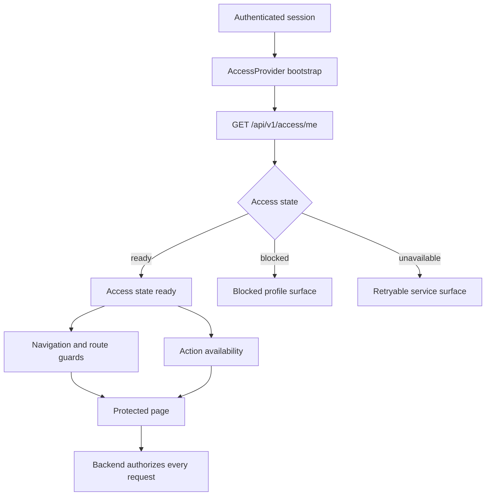

# Technical Specification - Frontend Access Control

> **Normative PRD:** [Access Control](../../../docs/prd/access-control.md)
>
> This document is a frontend technical specification. The linked PRD is
> authoritative for business concepts, rules, and acceptance criteria.

**Product:** Colibri Hub  
**Context:** Access Control  
**Type:** Technical Specification - Frontend  
**Complementary specification:** [Backend Access Control](../../../backend/docs/features/access-control.md)  

---

## 1. Executive summary

The frontend consumes the authenticated user's effective authorization from the
backend and uses it to shape navigation, protect client routes, enable or hide
actions, and provide Access Control administration screens.

The frontend does not decide whether an operation is authorized. It improves the
user experience by avoiding unavailable paths, while the backend evaluates every
protected request using the authenticated identity and the actual business scope.

Authentication is a separate capability. The frontend Access Control feature
starts after the authentication layer has established a session. It does not
implement login, logout, credentials, password recovery, MFA, token issuance, or
session renewal.

Only the `ready` Access state drives navigation and action availability. Blocked
and unavailable states stop the flow before any protected content renders:



Ordinary authorization is additive and uses exact `action + scope` pairs. The
reserved System Administrator is represented by a global authorization flag.
Frontend code never branches on role names such as Director, Operator, or
Supervisor.

## 2. Related documents and authority

- [Access Control PRD](../../../docs/prd/access-control.md) - normative business rules.
- [Backend Access Control](../../../backend/docs/features/access-control.md) - API, errors, and authorization contract.
- [UI Requirements](../../../docs/prd/ui-requirements.md) - global navigation and interaction rules.
- [Frontend Architecture Overview](../architecture/overview.md) - feature and state boundaries.
- [Frontend Accessibility Guidelines](../accessibility.md) - accessibility requirements.
- [Frontend Testing Strategy](../testing/strategy.md) - test layers and tools.

When documents conflict:

1. The Access Control PRD prevails for business behavior.
2. The backend specification prevails for the consumed API contract.
3. This specification prevails for frontend implementation details.

## 3. Design boundary

The Access frontend consumes backend-resolved profiles and effective
permissions. It applies default-deny presentation rules through the application
provider, navigation, route guards, and protected actions. It does not create a
frontend-only authorization source of truth or a parallel account lifecycle.

## 4. Objectives

### 4.1 Functional objectives

- Load the current Access profile after authentication succeeds.
- Represent loading, active, blocked, and unavailable Access states explicitly.
- Build navigation from effective permissions rather than role names.
- Prevent direct client navigation to unauthorized routes.
- Hide or disable protected actions consistently.
- Support users with multiple simultaneous roles.
- Treat permissions from multiple roles as one effective additive set.
- Support global System Administrator authorization without enumerating scopes.
- Provide access-profile consultation and lifecycle, plus administration of roles, presets, scopes, and assignments.
- Preview shared-role and user-assignment impact before confirmation.
- Display access-change audit history.
- Refresh authorization after changes that may affect the current session.
- Preserve form work across validation, concurrency, and network failures.

### 4.2 Technical objectives

- Keep authorization state at the application boundary.
- Keep role and permission administration inside the Access feature.
- Centralize exact permission checks in one pure authorization utility.
- Declare route requirements as metadata near route definitions.
- Keep protected feature modules independent of role codes and role labels.
- Reuse the shared HTTP and error-handling boundary.
- Avoid duplicating backend permission calculation or scope hierarchy logic.
- Make authorization transitions deterministic and testable.

## 5. Scope

### 5.1 Included

- Current Access bootstrap using `GET /api/v1/access/me`.
- App-level Access provider and hooks.
- Exact action-and-scope permission checks.
- Global System Administrator handling.
- Capability-driven sidebar and nested navigation.
- Protected route boundaries and unauthorized-page behavior.
- Protected action components and action-state conventions.
- User administration and role assignment.
- Role administration and permission selection.
- Role preset administration and role creation from presets.
- Scope registry administration.
- Access-change audit query and detail views.
- Impact preview and optimistic-concurrency workflows.
- Authentication, authorization, API, and network error presentation.
- Accessibility and automated test requirements.

### 5.2 Excluded

- Login, logout, credentials, password recovery, MFA, tokens, and session renewal.
- Selection or configuration of the authentication provider.
- Editing authentication-provider identities or credentials.
- Direct permissions assigned to individual users.
- Explicit deny rules.
- Role or scope inheritance.
- Wildcard permission interpretation.
- Shift-based route or action authorization.
- Job-title-based authorization.
- Domain-specific correction forms and correction-window decisions.
- Operational audit pages owned by business contexts.
- Skein Availability as an independent page or capability.

## 6. Technology and constraints

The implementation uses the current frontend baseline:

| Area | Technology |
| --- | --- |
| Framework | React 19 |
| Language | TypeScript 6 |
| Build | Vite 8 |
| UI | Mantine 9 |
| Navigation | React Router 7 |
| Icons | Tabler Icons React |
| Styling | CSS Modules and Mantine tokens |
| Quality | TypeScript build and ESLint |

No additional global state library is required. Access state is app-level session
state and fits a React context plus focused hooks. Tests use Vitest, Testing
Library, user-event, and automated
accessibility checks.

The Access API layer may use the globally approved server-cache library. This
does not change the state model or authorization rules defined here.

## 7. Frontend authorization model

### 7.1 Supported actions

```typescript
export type AccessAction =
  | 'read'
  | 'write'
  | 'edit'
  | 'edit_outside_window'
  | 'manage_access'
```

The frontend uses these values exactly as supplied by the backend. It does not
infer an action from an HTTP method, button caption, or route name.

### 7.2 Access state

```typescript
export interface Permission {
  action: AccessAction
  scope: string
}

export interface AssignedRoleSummary {
  roleId: string
  code: string
  name: string
}

export type AuthorizationGrant =
  | {
      global: false
      permissions: Permission[]
      version: number
    }
  | {
      global: true
      actions: AccessAction[]
      permissions: []
      version: number
    }

export interface CurrentAccess {
  userId: string
  userCode: string
  displayName: string
  isActive: true
  roles: AssignedRoleSummary[]
  authorization: AuthorizationGrant
}
```

API snake-case payloads are mapped to frontend camel-case models at the feature
API boundary. Protected components do not consume raw response objects.

### 7.3 Exact permission check

```typescript
export function can(
  authorization: AuthorizationGrant,
  action: AccessAction,
  scope: string,
): boolean {
  if (authorization.global) return authorization.actions.includes(action)

  return authorization.permissions.some(
    (permission) =>
      permission.action === action && permission.scope === scope,
  )
}
```

For efficient repeated checks, the provider may build an internal `Set` keyed by
an unambiguous tuple encoding. That representation remains private and must not
introduce prefix, parent, child, or wildcard matching.

The role list is explanatory UI data only. Authorization checks never inspect a
role code or display name.

### 7.4 Additive roles

The backend already returns the effective distinct permission union. The
frontend does not merge role permission sets independently and does not resolve
conflicts. There are no explicit denials or precedence rules.

### 7.5 Global authorization

When `authorization.global` is true, `can` accepts every supported action listed
by the backend in every scope. The UI does not fabricate wildcard permission rows
or cache the current list of scopes as the limit of global access.

## 8. Application state and bootstrap

### 8.1 Provider state machine

```typescript
export type AccessProviderState =
  | { status: 'waiting-for-authentication' }
  | { status: 'loading' }
  | { status: 'ready'; access: CurrentAccess }
  | { status: 'blocked'; reason: 'profile-not-found' | 'inactive' }
  | { status: 'unavailable'; retryable: boolean }
```

The provider does not collapse these states into `currentUser | null`. A null
value cannot distinguish an unauthenticated session, an Access profile denial,
and a network failure.

### 8.2 Bootstrap flow

1. Wait until authentication resolves.
2. If no authenticated session exists, do not call Access Control.
3. If a session exists, call `GET /api/v1/access/me` through the authenticated
   HTTP client.
4. Map and validate the response.
5. Store the ready Access state and derived permission index.
6. Render protected application routes only after the request resolves.

The loading surface uses the normal application shell loading pattern. It must
not briefly render unauthorized content while Access state is unresolved.

### 8.3 Blocked profiles

| Backend result | Frontend state | Surface |
| --- | --- | --- |
| `403 access_profile_not_found` | `blocked/profile-not-found` | Account lacks an Access profile |
| `403 access_user_inactive` | `blocked/inactive` | Access profile is inactive |
| Other `403` from `/access/me` | `blocked/profile-not-found` | Generic unavailable-access message |

Blocked surfaces provide a sign-out action owned by authentication and a contact
administrator message. They do not expose role, permission, or backend policy
details.

### 8.4 Refresh policy

The provider refreshes current Access:

- after initial authentication;
- after an administrative mutation affecting the current user;
- when the application returns to the foreground after a configurable stale
  interval;
- once after an unexpected `403` from a protected request;
- after explicit user retry.

The frontend compares `authorization.version` to detect a changed grant, but the
version never authorizes an operation. A refresh replaces the complete Access
snapshot atomically.

An unexpected `403` triggers at most one Access refresh and one UI reevaluation.
The original mutating request is not automatically repeated because it may not be
safe or idempotent.

## 9. Navigation and route protection

### 9.1 Route requirements

Protected route metadata declares one or more exact requirements:

```typescript
export interface RouteRequirement {
  action: AccessAction
  scope: string
}

export interface ProtectedRouteMeta {
  anyOf?: RouteRequirement[]
  allOf?: RouteRequirement[]
}
```

Most routes use one requirement. A context landing page may use `anyOf` to appear
when at least one child capability is visible. `allOf` is used only when the page
itself genuinely needs every listed capability.

### 9.2 Route guard behavior

The route guard evaluates only ready Access state:

| State | Behavior |
| --- | --- |
| Waiting/loading | Show protected-shell loading state |
| Ready and allowed | Render route |
| Ready and denied | Render Access Denied page |
| Blocked | Render blocked-profile surface |
| Unavailable | Render retryable service-unavailable surface |

Direct URL entry and browser history navigation use the same guard as sidebar
navigation.

The Access Denied page:

- uses HTTP-independent user language;
- provides a route to the nearest permitted context or home;
- does not list missing roles;
- may state the unavailable action and business area in display language;
- never claims that frontend denial is the security boundary.

### 9.3 Navigation filtering

Every navigation item declares route requirements. Parent items are visible when
at least one child is visible. Empty groups are omitted.

```typescript
interface NavigationItem {
  label: string
  path?: string
  requirement?: ProtectedRouteMeta
  children?: NavigationItem[]
}
```

Navigation is recomputed from the current Access snapshot. It is not persisted as
a separate permission cache.

### 9.4 Business capability mapping

The frontend uses the backend scope catalog. It does not derive scopes from URL
segments, feature-directory names, navigation labels, or organizational roles.

#### Warehouse

| UI capability | Action | Exact scope |
| --- | --- | --- |
| Raw Materials dashboard, stock, and bale detail | `read` | `warehouse.raw_materials` |
| Raw-material reception and bale delivery | `write` | `warehouse.raw_materials` |
| Finished Products dashboard, detail, and history | `read` | `warehouse.finished_products` |
| Finished-product requirement, handoff issue, reception, availability, dispatch, and return records | `write` | `warehouse.finished_products` |
| Production Supplies dashboard, stock, and history | `read` | `warehouse.production_supplies` |
| Production-supply reception, exit, and return records | `write` | `warehouse.production_supplies` |

Bale Management routes use exact `read` or `write` requirements in
`warehouse.raw_materials`; no shared resource-category check is authoritative.

#### Yarn Spinning

| UI capability | Action | Exact scope |
| --- | --- | --- |
| Preparation dashboard | `read` | `yarn_spinning.section.preparation` |
| Preparation production and progress | `write` | `yarn_spinning.section.preparation` |
| Ring Spinning dashboard | `read` | `yarn_spinning.section.ring_spinning` |
| Ring Spinning production and progress | `write` | `yarn_spinning.section.ring_spinning` |
| Bobbin Winding dashboard | `read` | `yarn_spinning.section.bobbin_winding` |
| Bobbin Winding production and progress | `write` | `yarn_spinning.section.bobbin_winding` |
| Twisting dashboard | `read` | `yarn_spinning.section.twisting` |
| Twisting production and progress | `write` | `yarn_spinning.section.twisting` |
| Skeining dashboard | `read` | `yarn_spinning.section.skeining` |
| Skeining production | `write` | `yarn_spinning.section.skeining` |
| Process Quality query or record | `read` or `write` | `yarn_spinning.process_quality` |
| Waste query or record | `read` or `write` | `yarn_spinning.waste` |

Process Quality and Waste remain independent navigation items because they are
cross-section responsibilities that may belong to different roles. There is no
independent Skein Availability route or scope; availability needed during lot
assembly is presented within that authorized workflow.

#### Lot Processing

| UI capability | Action | Exact scope |
| --- | --- | --- |
| Dashboard, queue, lot detail, and transversal lifecycle information | `read` | `lot_processing` |
| Inventory technical information or intervention | `read` or `write` | `lot_processing.stage.inventory` |
| Dyeing technical information or intervention | `read` or `write` | `lot_processing.stage.dyeing` |
| Drying technical information or intervention | `read` or `write` | `lot_processing.stage.drying` |
| Winding technical information or intervention | `read` or `write` | `lot_processing.stage.winding` |
| Bagging technical information or intervention | `read` or `write` | `lot_processing.stage.bagging` |
| Quality technical information, release for reception, or handoff response | `read` or `write` | `lot_processing.stage.quality` |

The detail page may render the transversal lot fields with `read +
lot_processing` while omitting technical stage fields for which the user lacks
the corresponding stage `read` permission.

#### Transversal consultation

| UI capability | Action | Exact scope |
| --- | --- | --- |
| Consolidated dashboard | `read` | `transversal.consolidated_dashboard` |

The consolidated dashboard is not nested under Yarn Spinning authorization.
Section permissions do not imply it, and it grants no operational permission in
the contexts represented by the view. Shift, business date, section, yarn
count, and period selectors are filters only and never determine visibility.

### 9.5 Access Control navigation

The Access Control group is visible only when the user can perform:

```text
manage_access + access_control
```

It contains:

- Users, routed to the unified Authentication account pages;
- Roles;
- Role Presets;
- Scopes;
- Access Audit.

All child routes use the same requirement. The UI may label the group "Access
Control" or the approved localized equivalent, but it must not use a role name as
the gate.

## 10. Protected actions

### 10.1 Action component

A shared component supports consistent action rendering:

```typescript
interface AuthorizedProps {
  action: AccessAction
  scope: string
  fallback?: React.ReactNode
  children: React.ReactNode
}
```

Use hiding when an unavailable action is irrelevant to the user's task. Use a
disabled control with an explanation when preserving layout or discoverability is
important. The choice must remain consistent for the same action across a page.

### 10.2 Correction actions

The business context determines whether a record is within its ordinary
correction window. The frontend selects the required permission from
backend-provided editability metadata or the context's documented policy:

| Record condition | Required action |
| --- | --- |
| Within ordinary correction window | `edit` |
| Outside ordinary correction window | `edit_outside_window` |

The frontend does not calculate an authoritative correction window from the
browser clock. Even when an edit control is visible, the backend may reject the
request if persisted state changed.

### 10.3 Backend denial after visible action

If a protected request returns `403` after the UI displayed the action:

1. Preserve all unsaved user input.
2. Refresh current Access once.
3. Reevaluate the route and action.
4. Explain that access changed or is unavailable.
5. Do not automatically repeat a mutation.

## 11. Access feature architecture

```text
frontend/src/features/access/
  api/
    accessApi.ts
    accessApi.types.ts
    accessApi.mappers.ts
    accessApi.errors.ts
  authorization/
    accessActions.ts
    accessScopes.ts
    can.ts
    routeRequirements.ts
  context/
    AccessProvider.tsx
  components/
    Authorized.tsx
    PermissionMatrix.tsx
    RoleSelector.tsx
    ImpactPreview.tsx
    AccessStatusBadge.tsx
  hooks/
    useAccess.ts
    useAuthorization.ts
    useAccessAdministration.ts
  pages/
    AccessRolesPage.tsx
    AccessRoleEditorPage.tsx
    AccessPresetsPage.tsx
    AccessPresetEditorPage.tsx
    AccessScopesPage.tsx
    AccessAuditPage.tsx
  types/
    access.types.ts
  index.ts

frontend/src/app/routes/
    ProtectedRoute.tsx
```

The `authorization/` directory contains pure frontend policy consumption, not
business authorization decisions. Feature pages import `useAuthorization` or
`Authorized` through the Access feature public API.

Authentication remains in its own feature and provider. `AccessProvider`
depends on the authentication session interface and is mounted inside
`AuthProvider`. Authentication does not depend on Access Control. Both features
use the shared authenticated HTTP client and app router.

## 12. API contract consumed

### 12.1 Current user

| Method | Path | Purpose |
| --- | --- | --- |
| `GET` | `/api/v1/access/me` | Load current Access profile and effective authorization |

### 12.2 Administration

| Capability | Method | Path |
| --- | --- | --- |
| List users | `GET` | `/api/v1/access/users` |
| Get user | `GET` | `/api/v1/access/users/{user_id}` |
| Change user status | `PATCH` | `/api/v1/access/users/{user_id}/status` |
| Preview role replacement | `POST` | `/api/v1/access/users/{user_id}/roles/preview` |
| Replace user roles | `PUT` | `/api/v1/access/users/{user_id}/roles` |
| List roles | `GET` | `/api/v1/access/roles` |
| Create role | `POST` | `/api/v1/access/roles` |
| Get role | `GET` | `/api/v1/access/roles/{role_id}` |
| Preview role update | `POST` | `/api/v1/access/roles/{role_id}/preview` |
| Replace role | `PUT` | `/api/v1/access/roles/{role_id}` |
| Change role status | `PATCH` | `/api/v1/access/roles/{role_id}/status` |
| List presets | `GET` | `/api/v1/access/role-presets` |
| Create preset | `POST` | `/api/v1/access/role-presets` |
| Get preset | `GET` | `/api/v1/access/role-presets/{preset_id}` |
| Replace preset | `PUT` | `/api/v1/access/role-presets/{preset_id}` |
| Change preset status | `PATCH` | `/api/v1/access/role-presets/{preset_id}/status` |
| Create role from preset | `POST` | `/api/v1/access/role-presets/{preset_id}/roles` |
| List scopes | `GET` | `/api/v1/access/scopes` |
| List recognized scope definitions | `GET` | `/api/v1/access/scope-definitions` |
| Register recognized scope | `POST` | `/api/v1/access/scopes` |
| Change scope status | `PATCH` | `/api/v1/access/scopes/{scope_id}/status` |
| Query access audit | `GET` | `/api/v1/access/audits` |

Request and response fields follow the backend specification. The frontend API
layer owns transport mapping, abort signals, and typed error translation.

## 13. Administration pages

### 13.1 Users

Authentication owns the unified account list, creation flow, and account-detail
routes. Access Control supplies typed data and components for their access
portion; it does not expose a separate access-profile creation form or a public
`POST /api/v1/access/users` request.

The access portion of the unified detail shows:

- user code and display name;
- active state;
- assigned roles;
- effective permissions;
- authorization version;
- role replacement and activation controls;
- related Access audit entries.

`PATCH /api/v1/access/users/{user_id}/status` changes only the Access profile.
It never enables, disables, resets, or otherwise mutates the Authentication
account. Unified account disablement and enablement are submitted to the
Authentication API, which coordinates profile state internally.

The UI never presents role assignment as shift assignment. Three users may share
the same role while operational records and audits distinguish their individual
identities.

### 13.2 Role assignment

Role replacement uses a multi-select containing active roles. Before saving, the
frontend calls the preview endpoint with the complete desired role set.

The confirmation displays:

- roles added and removed;
- effective permissions added and removed;
- whether the user would retain any permissions;
- the required change reason;
- current expected version.

Confirmation sends the complete role set and the same expected version. A failed
request preserves the selection and reason.

### 13.3 Roles

The role list displays name, code, lifecycle state, assigned-user count, and
whether the role is reserved.

The role editor contains:

- role name;
- stable code on creation;
- responsibility description;
- permission matrix grouped by owning context and scope;
- active-state control;
- affected-user preview;
- required change reason;
- expected version for updates.

The permission matrix uses scopes as rows and supported ordinary actions as
columns. Cells not supported by the backend scope definition are not selectable,
and duplicate pairs are impossible in UI state.

`manage_access` and `edit_outside_window` are not selectable for ordinary roles.
The reserved System Administrator role is displayed as global and its protected
semantics are read-only. The UI must still handle backend rejection because
client restrictions are not authoritative.

### 13.4 Role update workflow

1. Load role, current permission set, assigned-user count, and version.
2. Edit a local draft without mutating cached server data.
3. Validate required fields and duplicate-free pairs.
4. Request role-change preview using the complete desired configuration.
5. Show affected users and permission differences.
6. Require confirmation and reason.
7. Submit the complete configuration with `expected_version`.
8. On success, replace cached role data and invalidate affected user views.
9. On conflict, preserve the draft and offer reload plus comparison.

### 13.5 Role presets

Preset pages use the same permission matrix as ordinary roles. They explain that:

- a preset is a reusable starting configuration;
- creating a role copies the preset;
- later preset changes do not alter existing roles.

Creating a role from a preset opens a role draft populated with copied
permissions. The administrator supplies the role name, code, description, and
reason before confirmation.

### 13.6 Scopes

The scope page lists stable code, display name, owning capability, supported
actions, description, and active state. Scope codes are treated as exact
identifiers; visual grouping by dot-separated segments is presentational only
and never implies inheritance.

Registration starts from the backend-provided recognized-definition list. The
administrator selects a definition and supplies a reason; the UI provides no
free-form code, owning-context, description, or supported-action fields.
Lifecycle changes use backend validation and show impact before deactivation
when the backend provides affected assignments. A newly registered scope is not
added to ordinary roles automatically. The System Administrator's global
authorization does not require a permission-row update.

### 13.7 Access audit

The audit page is read-only and supports backend-defined pagination and filters,
including actor, subject type, subject identifier, change kind, and date range.

Each detail view shows:

- individual actor;
- occurrence timestamp;
- affected subject;
- change category;
- stated reason;
- previous and resulting non-secret values.

The page labels these records as Access configuration history. It does not mix
them with operational creation or correction history from Warehouse, Yarn
Spinning, or Lot Processing.

## 14. Preview, confirmation, and concurrency

### 14.1 Shared impact preview

`ImpactPreview` renders backend-calculated impact. The frontend may summarize but
does not independently decide affected users or effective permission deltas.

For shared-role changes, the confirmation prominently states the number of users
affected and lists them when returned by the API.

### 14.2 Optimistic concurrency

All versioned updates preserve the loaded version in the edit draft and submit it
as `expected_version`.

On `409 access_version_conflict`:

1. Keep the user's draft and reason.
2. Explain that another administrator changed the record.
3. Offer to load the current server version.
4. Present a comparison when practical.
5. Require a new preview before resubmission.

The frontend never silently overwrites the server version or substitutes the new
version into the old draft.

### 14.3 Last System Administrator protection

Before a change that could affect System Administrator coverage, the UI displays
a strong warning. If the backend returns `last_system_administrator_required`,
the modal remains open and explains that at least one active assigned System
Administrator must remain.

The frontend may preempt obvious invalid changes from the currently loaded data,
but the backend transaction remains authoritative for concurrent changes.

## 15. Error handling

### 15.1 Error mapping

| HTTP or condition | Code | Frontend behavior |
| --- | --- | --- |
| `401` | `authentication_required` | Delegate to authentication session-expired flow |
| `403` | `access_denied` | Preserve work, refresh Access once, show denied state |
| `403` | `access_user_inactive` | Show blocked inactive-profile surface |
| `403` | `access_profile_not_found` | Show blocked missing-profile surface |
| `404` | Access subject not found | Keep current page and show not-found feedback |
| `409` | Duplicate user code from coordinated provisioning | Surface the mapped field error in the unified Authentication account form |
| `409` | `access_version_conflict` | Preserve draft and require reload plus new preview |
| `409` | `last_system_administrator_required` | Keep confirmation open and explain invariant |
| `422` | Access validation error | Map field errors; preserve draft |
| Network or timeout | none | Show retryable error; preserve state |
| `500` | none | Show generic failure; preserve state and correlation ID if supplied |

### 15.2 Security-sensitive messaging

Ordinary protected pages do not reveal which role or permission is missing. Access
administration pages may show explicit configuration errors because the actor is
already authorized to manage Access Control.

Raw identity claims, tokens, stack traces, SQL details, and secret audit values
are never rendered or logged by frontend code.

## 16. Loading, empty, and feedback states

Every Access page defines:

- initial loading skeleton;
- refresh state that preserves prior data;
- empty state with an appropriate authorized action;
- inline validation state;
- confirmation progress state;
- success acknowledgement;
- retryable failure state;
- unauthorized transition state.

Buttons that submit mutations are disabled while the same request is in flight.
The UI prevents accidental double submission but does not assume that client-side
disabling provides concurrency control.

## 17. Accessibility

- Route changes update the document title and announce page context.
- Permission matrix rows and columns have accessible headers.
- Checkbox labels include both action and scope names.
- Global or reserved role state is conveyed with text, not color alone.
- Disabled protected actions explain why through associated text when shown.
- Confirmation modals trap focus and return it to the triggering control.
- Impact counts and server errors use appropriate live regions.
- Before/after audit values use semantic tables or definition lists.
- Status badges meet contrast requirements and include text labels.
- All administration workflows are keyboard operable.
- Focus moves to the first invalid field after failed local validation.

Target conformance follows the frontend accessibility guideline: WCAG 2.1 Level
AA.

## 18. Testing strategy

### 18.1 Unit tests

- Exact action-and-scope match allows.
- Similar scope prefixes do not match.
- `write` does not imply `read`.
- Multiple returned permissions are consumed without role-name checks.
- Global authorization allows supported actions in a newly seen scope.
- Route `anyOf` and `allOf` evaluation is deterministic.
- API mappers validate ordinary and global response variants.
- Error mapping produces the correct provider state.

### 18.2 Provider and hook tests

- No Access request occurs before authentication resolves.
- Authenticated session loads `/access/me` once.
- Loading does not expose protected content.
- Blocked and unavailable states remain distinct.
- Refresh atomically replaces permissions and navigation.
- Unexpected `403` refreshes once and does not repeat a mutation.
- Sign-out clears Access state.

### 18.3 Component tests

- Sidebar omits unauthorized leaves and empty parent groups.
- Direct route access renders Access Denied.
- Authorized route renders normally.
- `Authorized` hides or disables consistently.
- Permission matrix cannot create duplicate pairs.
- Permission matrix disables action-and-scope pairs not supported by the catalog.
- Scope registration cannot submit free-form or unknown definitions.
- Reserved role controls are read-only.
- Role assignment preview shows added and removed access.
- Preview is required again after a version conflict.
- Drafts survive validation, `403`, `409`, network, and server errors.
- Audit page remains read-only.

Each component test includes relevant accessibility assertions and uses semantic
queries rather than internal component structure.

### 18.4 Integration contract tests

- `/access/me` ordinary and global payloads map correctly.
- Scope definitions and registered scopes map as separate contracts.
- Every administrative route and request matches the backend specification.
- Snake-case transport fields map to camel-case UI models.
- Known error codes map to stable UI behavior.
- Authorization version changes trigger a complete Access refresh.

### 18.5 End-to-end scenarios

When the repository adopts an E2E framework, cover at minimum:

- ordinary user sees only authorized contexts and actions;
- multi-role user sees the additive union;
- Process Quality and Waste remain independent;
- section operator sees the correct section dashboard and entry actions;
- System Administrator manages roles and sees impact confirmation;
- role change affects all assigned users after refresh;
- removed access prevents direct navigation and backend mutation;
- inactive user is blocked despite an authenticated session;
- expired authentication follows the authentication flow rather than Access
  Denied.

## 19. Security requirements

- Treat client authorization only as a presentation concern.
- Send authentication through the shared trusted HTTP client only.
- Never accept identity, roles, or effective permissions from local storage as
  authoritative.
- Never construct Access state from URL parameters or editable form data.
- Never authorize by role display name or role code.
- Never infer scope hierarchy from punctuation.
- Never retry a denied mutation automatically.
- Clear Access state immediately when authentication ends.
- Avoid persisting complete Access responses unless the authentication security
  design explicitly approves it.
- Do not include authentication subjects in analytics or general client logs.

## 20. Dependencies

### 20.1 Internal dependencies

- Authentication provider exposing resolved session state.
- Shared authenticated HTTP client and error envelope mapping.
- App router and navigation configuration.
- Backend Access Control endpoints.
- Protected features declaring exact action and scope requirements.
- Frontend accessibility and testing conventions.

### 20.2 External dependencies

- React, React Router, Mantine, and the shared frontend build stack.
- A separately implemented authentication capability.

Access Control does not add an authentication-provider SDK.

## 21. Completion criteria

The frontend capability is complete when:

1. Access state loads only after authentication establishes a session.
2. Loading, ready, blocked, and unavailable states are visually distinct.
3. Sidebar items, routes, and actions use exact backend-defined authorization.
4. No frontend authorization branch depends on a role name or job title.
5. Direct route access cannot render an unauthorized protected page.
6. The backend remains authoritative for every protected operation.
7. Access profiles can be consulted and their status, roles, presets, scopes,
   assignments, and Access audit can be managed through the documented API;
   account provisioning remains in the Authentication API.
8. Role and assignment changes require backend impact preview and expected
   version confirmation.
9. Draft work survives authorization, validation, concurrency, and network
   failures.
10. Warehouse areas, Process Quality, Waste, Yarn Spinning sections, Lot
    Processing stages, and the transversal consolidated dashboard remain
    independently authorizable.
11. Shift and business date never affect route or action authorization.
12. Skein Availability is absent as an independent capability.
13. Unit, component, accessibility, and API contract tests pass.
14. The document and Mermaid blocks render without non-ASCII encoding artifacts.
