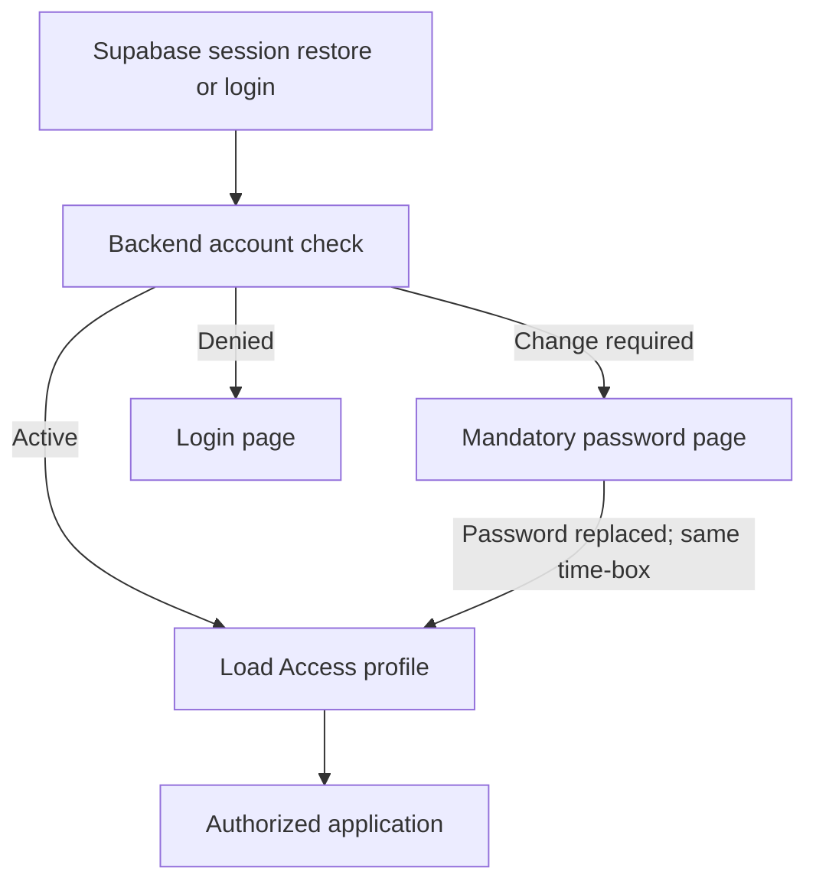

# Technical Specification - Frontend Authentication

> **Normative PRD:** [Authentication](../../../docs/prd/auth.md)
>
> This document defines frontend implementation. The PRD remains authoritative
> for account, credential, session, and audit behavior.

**Product:** Colibri Hub  
**Capability:** Authentication  
**Type:** Technical Specification - Frontend  
**Complementary specifications:** [Backend Authentication](../../../backend/docs/features/authentication.md), [Frontend Access Control](access-control.md)

## 1. Executive Summary

The frontend uses `@supabase/supabase-js` for ordinary email/password login,
provider-session persistence, token refresh, restoration, and local sign-out.
FastAPI remains the trusted application boundary for account-state validation,
mandatory password replacement, audit coordination, and all privileged account
administration.

Authentication and Access Control remain separate providers:

- The authentication provider answers whether a verified session exists and whether password replacement is required.
- The access provider loads the access profile and effective permissions only after Authentication is active.



The administrative account form is unified: it collects account information,
a provisional password, and initial Access Control roles, then submits one
backend request. Authentication screens own credentials and account lifecycle;
Access Control screens own roles, scopes, presets, permissions, and
authorization configuration.

## 2. Related Documents and Authority

- [Authentication PRD](../../../docs/prd/auth.md) - normative business rules.
- [Access Control PRD](../../../docs/prd/access-control.md) - normative authorization rules.
- [Backend Authentication](../../../backend/docs/features/authentication.md) - API, provider, and error contract.
- [Frontend Access Control](access-control.md) - authorization provider and administration contract.
- [UI Requirements](../../../docs/prd/ui-requirements.md) - global navigation and interaction requirements.
- [Frontend Architecture Overview](../architecture/overview.md) - frontend architectural baseline.
- [Frontend Accessibility](../accessibility.md) - accessibility requirements.
- [Frontend Testing Strategy](../testing/strategy.md) - test layers.
- [Supabase JavaScript client initialization](https://supabase.com/docs/reference/javascript/initializing) - browser client configuration.
- [Supabase password login](https://supabase.com/docs/reference/javascript/auth-signinwithpassword) - ordinary login.
- [Supabase sign-out](https://supabase.com/docs/reference/javascript/auth-signout) - session termination.

When documents conflict:

1. The Authentication PRD prevails for account and session behavior.
2. The Access Control PRD prevails for roles and permissions.
3. The backend Authentication specification prevails for consumed API contracts.
4. This specification prevails for frontend implementation details.

## 3. Objectives

### 3.1 Functional Objectives

- Sign in with organizational email and password.
- Restore a persisted provider session only after backend account validation.
- Route provisional accounts exclusively to mandatory password replacement.
- Prevent protected content from rendering while Authentication is unresolved.
- End the session on logout and clear Authentication and Access state.
- Respond consistently to provider expiration, refresh failure, disablement, and backend denial.
- Provide unified provisioning with initial Access roles.
- Provide account listing, detail, reset, disablement, enablement, and audit screens.
- Present generic login denial without revealing account existence or state.
- Direct active users to an actually authorized default area.

### 3.2 Technical Objectives

- Keep provider SDK calls behind one frontend Authentication adapter.
- Let the Supabase SDK own session persistence and refresh.
- Keep tokens out of React presentation models, route state, logs, and duplicate storage.
- Attach the current access token centrally to backend requests.
- Keep Authentication state separate from Access authorization state.
- Make restoration, refresh, logout, expiration, and state clearing deterministic.
- Use the established frontend architecture, components, router, error envelope, and testing conventions.

## 4. Scope

### 4.1 Included

- Supabase browser-client initialization.
- Email/password login through the provider SDK.
- Provider session restoration, refresh observation, and clearing.
- Backend account-state verification.
- Mandatory provisional-password replacement through the backend.
- Logout and expired-session handling.
- Authentication route boundaries.
- Bearer-token integration with the shared HTTP client.
- Unified account provisioning.
- Account list, detail, password reset, disablement, enablement, and audit UI.
- Integration with Access bootstrap, role selection, and authorized navigation.
- Loading, error, accessibility, and automated test requirements.

### 4.2 Excluded

- Public registration.
- Email invitations, magic links, OTP, OAuth, SSO, passkeys, phone login, or MFA.
- Forgotten-password and self-service recovery screens.
- Voluntary password change for an Active account.
- Session-duration settings.
- Mailbox administration.
- Account deletion.
- Frontend ownership of JWT validation, revocation guarantees, password policy, roles, permissions, or authorization decisions.
- Direct browser access to application database tables.
- A second custom token or session store.

## 5. Technology and Configuration

Add `@supabase/supabase-js` as the browser Authentication dependency. The
provider adapter receives only public browser configuration:

- `VITE_SUPABASE_URL`;
- `VITE_SUPABASE_PUBLISHABLE_KEY`.

Administrative secrets and service-role credentials are prohibited from
`VITE_*` variables and frontend bundles.

```typescript
createClient(supabaseUrl, publishableKey, {
  auth: {
    persistSession: true,
    autoRefreshToken: true,
    detectSessionInUrl: false,
  },
})
```

`detectSessionInUrl` is disabled because the capability has no link, OAuth, OTP,
or recovery redirect flow. Supabase persistence is the only browser token store.

## 6. Frontend Authentication Model

### 6.1 State Machine

Authentication presentation state is exactly one of:

| Status | Carries | Meaning |
| --- | --- | --- |
| `initializing` | — | Provider restore or initial check in progress |
| `unauthenticated` | reason: `logged-out` \| `expired` \| `denied` | No usable session |
| `password-change-required` | account | Verified session; mandatory replacement pending |
| `authenticated` | account | Verified session; Access bootstrap may start |
| `unavailable` | retryable: boolean | Provider or backend outage |

The account carried by the password-change and authenticated states contains
`accountId`, `email`, and `displayName`.

`initials` is not part of the backend `GET /api/v1/auth/me` contract; the UI
derives them locally from `displayName` when needed. `version` is also absent
from the session contract and belongs only to the administrative account
detail, where it supports optimistic-concurrency mutations (§13.2, §14.2).

Provider tokens, refresh tokens, session objects, role names, and permission
sets are not fields of this presentation state. The provider adapter supplies
the access token to the HTTP client through a narrow asynchronous accessor.

### 6.2 Provider Event Handling

The authentication provider subscribes once to provider authentication-state
changes. It:

- updates the token accessor after login, restoration, or refresh;
- validates the local account through `GET /api/v1/auth/me` before rendering protected content;
- never trusts the locally restored provider user as sufficient application identity;
- clears Authentication and Access state on sign-out or unrecoverable refresh failure;
- avoids navigation inside low-level provider callbacks; and
- unsubscribes during provider disposal.

### 6.3 Access Relationship

| Authentication state | Access behavior |
| --- | --- |
| `initializing` | Wait; do not request `/access/me` |
| `unauthenticated` | Clear Access state |
| `password-change-required` | Clear Access state; do not request `/access/me` |
| `authenticated` | Load `/access/me` |
| `unavailable` | Suspend Access state and expose no protected content |

No Authentication component imports role names, scope codes, or permission
evaluation logic.

## 7. Feature Architecture

### 7.1 Layer Responsibilities

The Authentication feature follows the project's frontend architecture and
conventions. File organization, naming, and splitting decisions follow that
documentation rather than this specification.

**API layer** owns the typed backend contract: request bodies, response types,
wire mapping to frontend camel-case models, and HTTP error classification for
Authentication endpoints.

**Provider adapter** owns Supabase browser-client initialization, session
restoration, refresh observation, and clearing. It exposes the access token
through a narrow asynchronous accessor and never leaks provider objects to
pages.

**Context and hooks** expose the session state and the account-administration
hooks; pages depend on the Authentication context and API layer.

**Presentation** owns the login, mandatory password replacement, and unified
account-administration screens (list, detail, create, reset, disable, enable,
audit), plus boundary components that gate rendering on Authentication state.

Provider code does not leak into pages or Access Control. Pages depend on the
Authentication context and API layer.

## 8. Session Bootstrap and Refresh

### 8.1 Application Startup

1. Initialize the authentication provider in the `initializing` state.
2. Ask the provider adapter for the persisted Supabase session.
3. If no session exists, become `unauthenticated`.
4. If a session exists, expose its access token only to the HTTP client.
5. Call `GET /api/v1/auth/me`.
6. Map `next_step=change_password` to `password-change-required`.
7. Map `next_step=load_access` to `authenticated`, then allow Access bootstrap.
8. On invalid, expired, disabled, or unmapped identity, clear the provider session and become `unauthenticated`.
9. On a retryable backend outage, become `unavailable` without rendering protected content.

### 8.2 Token Refresh

The Supabase SDK refreshes tokens and applies its configured eight-hour session
time-box. Provider events update the central token accessor. The frontend does
not calculate or extend a second application-session deadline.

Refresh failure clears provider, Authentication, and Access state and presents
an expired-session message. Backend rejection remains authoritative for local
account disablement and Access Control denial.

### 8.3 Backend `401` Handling

The HTTP client performs at most one controlled revalidation attempt when an
expired token can be refreshed safely. If refresh or revalidation fails, it:

1. clears the provider session;
2. clears Authentication and Access state;
3. redirects to login; and
4. presents a non-sensitive expiration message.

Requests are not replayed automatically when they may mutate data unless the
shared HTTP policy explicitly marks them safe and idempotent.

## 9. Login Flow

### 9.1 Form

The login form contains:

- organizational email with `autocomplete="username"`;
- password with `autocomplete="current-password"`;
- submit action;
- generic denial feedback; and
- loading state that prevents duplicate submission.

### 9.2 Submission

1. Call `supabase.auth.signInWithPassword({ email, password })` through the provider adapter.
2. On provider denial, clear the password and show the generic Authentication failure message.
3. On success, treat the resulting provider session as the start of the fixed eight-hour maximum and make its access token available only to the HTTP client.
4. Call `GET /api/v1/auth/me` to validate the Colibri Hub account state.
5. For `next_step=change_password`, keep the same session restricted to Authentication state inspection, mandatory replacement, and logout.
6. For `next_step=load_access`, begin Access bootstrap.
7. After Access loads, navigate to the first authorized destination rather than a hard-coded workspace.

The provider's error details are mapped to a stable generic UI result and do not
reveal whether the email exists, the password failed, or the account is disabled.

## 10. Mandatory Password Replacement

### 10.1 Route Boundary

`password-change-required` may access only the password-replacement page,
Authentication state inspection, and logout. Attempts to reach application or
Access Control routes redirect to the replacement page.

### 10.2 Form

The form contains:

- current provisional password;
- new password;
- new-password confirmation;
- provider-safe password-policy feedback; and
- submit action.

Passwords exist only in controlled form state, are cleared after completion or
failure, and are never placed in URLs, route state, telemetry, or persisted
storage.

### 10.3 Completion

1. Submit `POST /api/v1/auth/password-change` with current and new passwords.
2. The backend updates the provider credential and local account atomically as far as the provider boundary permits.
3. Clear all password fields.
4. Revalidate `GET /api/v1/auth/me` with the existing provider session.
5. When active, begin Access bootstrap and navigate to an authorized destination without restarting the session's original eight-hour maximum.
6. If the provider invalidated the session during the credential update, clear local Authentication and Access state and return to login; do not create or imply a renewed session automatically.

Mandatory replacement does not create a new session or restart the existing
session's eight-hour maximum. After `/auth/me` reports `next_step=load_access`,
the existing provider session may continue for the remainder of its original
maximum duration.

## 11. Logout and Expiration

Logout executes in this order:

1. Call `DELETE /api/v1/auth/session` while the token is available so the backend can revoke and audit the current provider session.
2. Call `supabase.auth.signOut({ scope: 'local' })` through the provider adapter even when the backend response is unavailable.
3. Clear the token accessor, Authentication state, Access state, sensitive caches, and protected query data.
4. Navigate to login.

Logout is idempotent. Administrative reset and disablement are backend
operations that revoke all applicable provider sessions. A subsequent API
denial clears the affected browser state even when the SDK has not yet emitted a
provider event.

## 12. Authenticated HTTP Client

The shared client:

- obtains the current provider access token asynchronously;
- adds `Authorization: Bearer <token>` only to authenticated API calls;
- never logs the header or token;
- maps shared error envelopes to typed frontend errors;
- centralizes Authentication-related `401` and `403` handling; and
- supports unauthenticated administrative-free calls without a fabricated token.

Authentication pages never read tokens directly. Account administration uses
the same authenticated client as other protected capabilities.

## 13. Backend API Contract Consumed

### 13.1 Authenticated User Endpoints

| Capability | Method | Path |
| --- | --- | --- |
| Inspect Authentication state | `GET` | `/api/v1/auth/me` |
| Replace provisional password | `POST` | `/api/v1/auth/password-change` |
| Record and terminate logout | `DELETE` | `/api/v1/auth/session` |

There is no backend login endpoint. Ordinary login, provider-session persistence,
and refresh use the Supabase browser SDK.

### 13.2 Administrative Endpoints

| Capability | Method | Path |
| --- | --- | --- |
| List accounts | `GET` | `/api/v1/auth/accounts` |
| Provision account and access | `POST` | `/api/v1/auth/accounts` |
| Get account | `GET` | `/api/v1/auth/accounts/{account_id}` |
| Reset password | `POST` | `/api/v1/auth/accounts/{account_id}/password-reset` |
| Disable account | `POST` | `/api/v1/auth/accounts/{account_id}/disable` |
| Enable account | `POST` | `/api/v1/auth/accounts/{account_id}/enable` |
| Query Authentication audits | `GET` | `/api/v1/auth/audits` |

Account detail and mutation responses include the current non-secret
`version`. Versioned administrative requests use these bodies:

```json
{
  "provisional_password": "temporary-secret",
  "reason": "Administrative reset requested.",
  "expected_version": 4
}
```

```json
{
  "reason": "The person no longer requires access.",
  "expected_version": 4
}
```

```json
{
  "provisional_password": "temporary-secret",
  "reason": "Access restored after organizational review.",
  "expected_version": 5
}
```

The bodies apply respectively to password reset, disablement, and enablement.
The role selector in provisioning consumes `GET /api/v1/access/roles`.
Subsequent authorization state comes from `/api/v1/access/me`.

## 14. Unified Account Administration

### 14.1 Navigation Ownership

Authentication account administration appears under Access Control
administration because it is one System Administrator workspace. The account
pages remain owned by the Authentication feature; role, preset, scope, and
permission pages remain owned by Access Control.

All account-administration routes require the effective `Manage Access`
permission. Route visibility does not replace backend authorization.

### 14.2 Account List and Detail

The list supports status and text filters and displays:

- organizational email;
- display name and user code;
- Authentication status;
- Access profile status;
- assigned role summaries; and
- available administrative actions.

The detail view separates Authentication information from Access Control
information visually and retains the loaded Authentication `version` for
versioned mutations. It never displays provider subjects, tokens, password
flags, private metadata, or credential history.

### 14.3 Provisioning Form

The form requires:

- organizational email;
- display name;
- user code;
- provisional password and confirmation;
- one or more initial Access roles;
- administrative reason.

The password fields are write-only UI state. On success, the UI shows no
credential value and reminds the System Administrator to communicate the
provisional password outside Colibri Hub.

### 14.4 Password Reset

Reset requires a new provisional password, confirmation, reason, and the
account's loaded `expected_version`. The confirmation dialog explains that
active sessions will end and that mandatory replacement is required at the next
login. The resulting account state is Awaiting Password Change. Reset of the
last operational System Administrator is blocked with the same invariant
message used for other changes that would leave the system without
administrative coverage.

### 14.5 Disablement and Enablement

Disablement requires a reason, the loaded `expected_version`, and explicit
confirmation. The UI explains that login, active sessions, and the Access
profile are affected while history is preserved. The
last-System-Administrator error is presented as a blocked action, not as a
recoverable validation warning.

Enablement requires review of the access profile and roles, a new provisional
password, confirmation, reason, and the loaded `expected_version`. The account
remains awaiting mandatory replacement after success.

## 15. Route Boundaries and Navigation

| Boundary | Behavior |
| --- | --- |
| Authentication boundary | Holds protected rendering until Authentication is resolved |
| Sign-in-only boundary | Shows login and redirects authenticated users appropriately |
| Password-change-only boundary | Allows only mandatory replacement for the required state |
| Authenticated-only boundary | Requires active Authentication before mounting Access |
| Access route guard | Requires the exact effective `action + scope` after Access bootstrap |

Role names are never used to build routes. After Authentication and Access
bootstrap, default navigation is the first authorized workspace or an explicit
no-active-access page.

## 16. Error Handling and Feedback

| HTTP/provider result | Stable UI behavior |
| --- | --- |
| Provider sign-in denial | Generic email-or-password message |
| `401 authentication_required` | Clear state and return to login |
| `403 password_change_required` | Route to mandatory replacement |
| `403 access_denied` | Show authorization denial without clearing a valid session |
| `409 duplicate_authentication_email` | Mark the email field |
| `409 last_system_administrator_required` | Block action and explain the invariant |
| `404 authentication_account_not_found` | Close or replace stale detail data and show that the account no longer exists |
| `409 authentication_version_conflict` | Preserve non-secret input, reload account data, and require a new confirmation |
| `409 authentication_account_state_conflict` | Preserve non-secret input, reload the current state, and reassess available actions |
| `409 authentication_identity_conflict` | Stop the administrative flow and show a non-recoverable account-identity conflict |
| `422 authentication_change_reason_required` | Mark the administrative reason field |
| `422 replacement_password_must_differ` | Mark the new-password field |
| `422 weak_password` | Show safe password-policy guidance |
| `503 authentication_provider_unavailable` | Preserve non-secret form data where safe and offer retry |

Password fields are cleared on navigation, reload, timeout, completion, and any
state transition that leaves their form. Provider error bodies and technical
details are not rendered.

Loading states cover Authentication initialization, provider login, backend
account validation, password replacement, Access bootstrap, administrative
mutation, and audit pagination. Destructive or session-ending actions use
explicit confirmation and deterministic disabled states.

## 17. Accessibility

- Authentication forms have visible labels and field-specific errors.
- Password visibility controls expose accessible names and pressed state.
- Focus moves to the first invalid field or the result summary.
- Authentication errors use live regions without disclosing secrets.
- Expiration notices receive focus and explain the next action.
- Dialogs trap focus and restore it to their triggering control.
- Keyboard operation covers login, tables, dialogs, role selection, and all account actions.
- Color is never the sole indication of Authentication or Access state.

## 18. Security Requirements

- Service-role and administrative credentials never enter the browser bundle.
- Supabase is the only browser token store; no duplicate `localStorage`, cookie, context, or Redux token copy is created.
- Tokens are not exposed through component props, presentation models, logs, analytics, or error reports.
- Restored provider sessions are validated by the backend before protected rendering.
- Backend authorization remains authoritative for every administrative action.
- Password fields never persist across route or Authentication state changes.
- Provider errors are normalized to prevent account enumeration.
- Sensitive query caches are cleared on logout, disablement response, or unrecoverable expiration.
- Frontend code never branches on business role names.

## 19. Testing Strategy

### 19.1 Unit and Provider Tests

- State-machine transitions for initialization, password replacement, active, expired, denied, and unavailable states.
- Provider login maps success and failure without exposing provider messages.
- Session restore is not trusted before `/auth/me` succeeds.
- Refresh updates only the central token accessor.
- Logout invokes provider sign-out with `scope: 'local'` and clears all Authentication and Access state.
- Mandatory replacement preserves the original session time-box and handles provider invalidation by returning to login.

### 19.2 Component and Integration Tests

- Login accessibility and generic denial.
- Mandatory replacement route isolation and password clearing.
- HTTP bearer attachment and centralized `401`/`403` behavior.
- Provisioning, reset, disablement, and enablement forms never echo secrets.
- Reset, disablement, and enablement submit the loaded `expected_version` and preserve non-secret drafts on conflict.
- Password reset and disablement both render the last-System-Administrator invariant as a blocked action.
- Every documented backend Authentication error maps to stable UI behavior.
- Account administration requires effective `Manage Access`.
- Active Authentication loads Access exactly once per resolved transition.
- Default navigation uses effective permissions rather than role names.

### 19.3 End-to-End Scenarios

- Controlled initial administrator password replacement.
- Unified provisioning rejects empty initial roles and proceeds through first access.
- Provisional login starts a restricted session whose time-box is not restarted by mandatory replacement.
- Established login, page refresh, and provider token refresh.
- Eight-hour provider session expiration.
- Logout and attempted session reuse.
- Administrative reset of an active user.
- Immediate denial after account disablement.
- Re-enablement followed by mandatory replacement.
- Authenticated identity with no active Access profile.
- Provider outage without protected-content exposure or secret leakage.

## 20. Completion Criteria

1. Email/password login uses the Supabase browser SDK.
2. Supabase owns browser session persistence, refresh, and expiration.
3. Restored and newly created provider sessions are checked through `/auth/me` before protected rendering.
4. The shared HTTP client attaches the current provider access token centrally.
5. Mandatory password replacement blocks Access bootstrap until completion.
6. Logout clears provider, Authentication, Access, and sensitive cache state.
7. Unified account administration consumes the documented backend contracts.
8. No service-role secret or duplicate token store exists in the frontend.
9. Navigation and action visibility use effective permissions rather than role names.
10. Unit, component, provider, HTTP integration, accessibility, and end-to-end tests pass.
